---
## Author
author:
  name: Нджову Нелиа
  degrees: DSc
  orcid: 0000-0002-0877-7063
  email: 1032239033@rudn.ru
  affiliation:
    - name: Российский университет дружбы народов
      country: Российская Федерация
      postal-code: 117198
      city: Москва
      address: ул. Миклухо-Маклая, д.15

## Title
title: "Отчёта по лабораторной работе1"
subtitle: "Математическое моделирование"
license: "CC BY"
---

```{julia}
#| echo: false
#| include: false
using Pkg
Pkg.activate("/home/nelianjovu/work/study/2026-1/2026-1==study--mathmod/2026-1--study--mathmod/labs/lab01/project")
```

# Цель работы

 Изучить модель экспоненциального роста, провести параметрическое исследование влияния коэффициента роста αα на динамику системы, а также освоить современные практики воспроизводимых исследований (литературное программирование, DrWatson, Git) при выполнении лабораторных работ.


# Задание

1. Настройка git

2. Рабочее пространство лабораторной работы

3. Создание проекта DrWatson для лабораторных 

4. Модель экспоненциального роста

# Выполнение лабораторной работы

## 1. Настройка git

Из моих предыдущих лабораторных работ я уже установил git и gh и выполнил базовую настройку. Итак, для этой лабораторной работы я начал с создания учетной записи на gitverse и заполнения необходимой информации(рис.1).

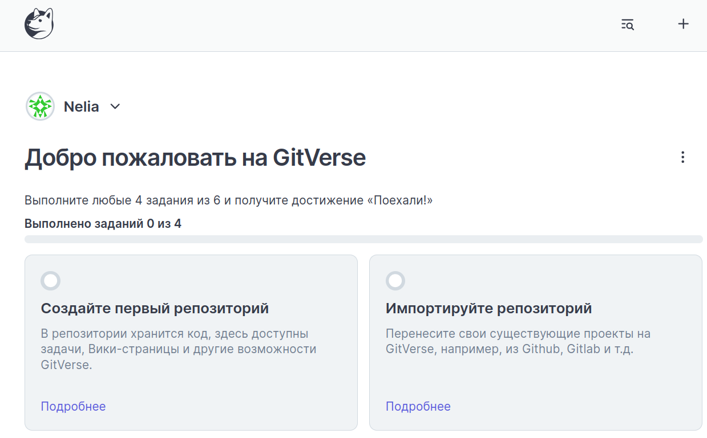{#fig-001 width=70%}

Я авторизуюсь с помощью команды gh auth login. Утилита задала мне несколько вопросов, и в итоге я авторизовался через браузер(рис.2)

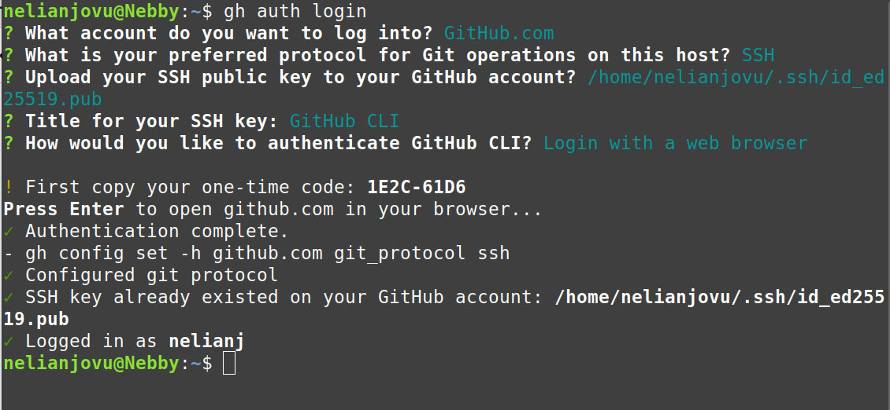{#fig-002 width=70%}

Я создаю ключ ssh для доступа к github(рис.3)

{#fig-003 width=70%}

Я добавляю ключ ssh в агента(рис. 4)

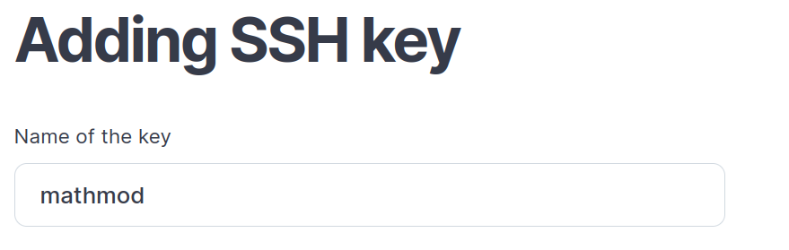{#fig-004 width=70%}

Я добавляю ключ ssh к вашей учетной записи на gitverse через веб-интерфейс. Затем используйте команду, чтобы добавить ключ ssh к вашей учетной записи на github(рис. 5 и 6)

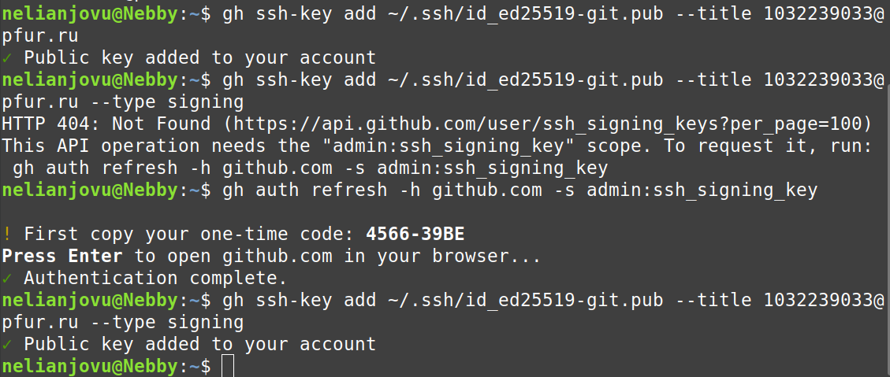{#fig-005 width=70%}

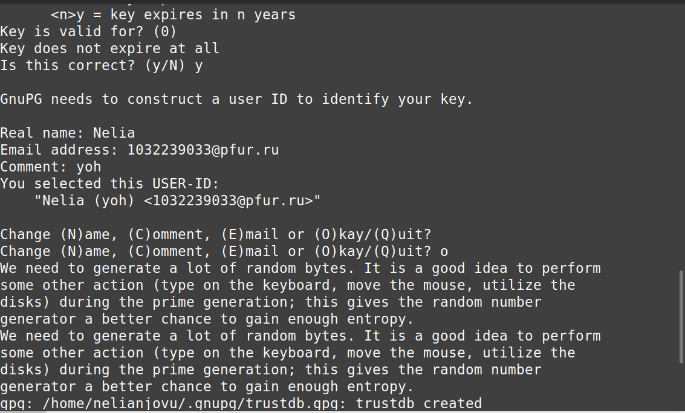{#fig-006 width=70%}

Я генерирую ключ gpg, выбирая параметры, указанные в руководстве по лабораторной работе(рис. 7)

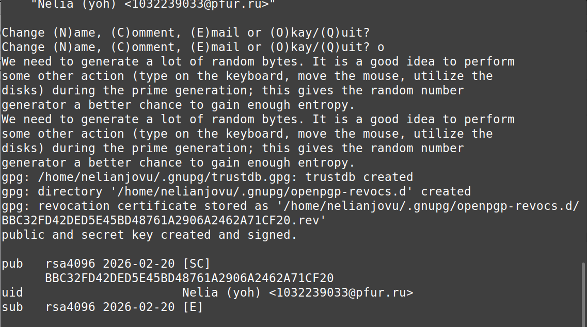{#fig-007 width=70%}

Я вывожу список ключей и копирую отпечаток пальца (который находится под строкой, начинающейся с sec) закрытого ключа.(рис. 8)

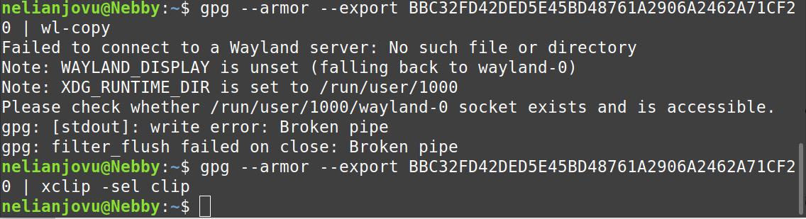{#fig-008 width=70%}

Я копирую сгенерированный PGP-ключ в буфер обмена. Я использую xclip, потому что wl-copy выдал ошибку(рис. 9)

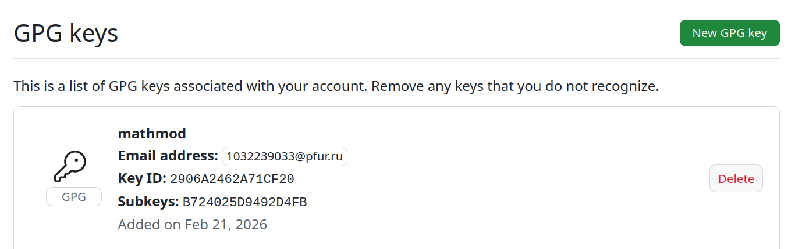{#fig-009 width=70%}

Я добавляю сгенерированный ключ gpg в github и gitverse(рис. 10 и 11)

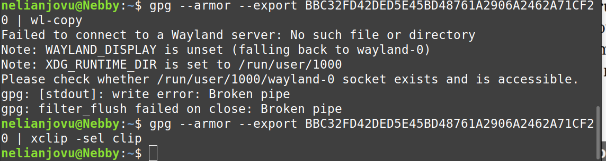{#fig-010 width=70%}

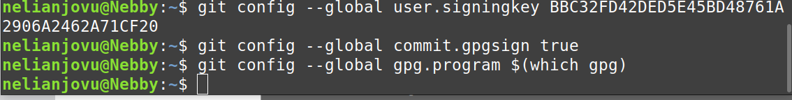{#fig-011 width=70%}

Используя электронное письмо, подключенное к моей учетной записи, я говорю Git использовать его при подписании коммитов(рис. 12)

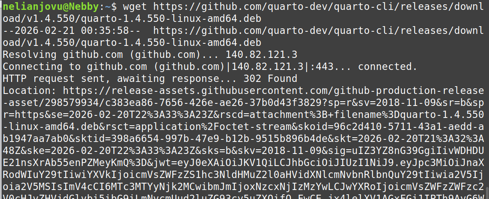{#fig-012 width=70%}

## 2. Рабочее пространство лабораторной работы

Я устанавливаю пакет, который поставляется с инструментами разработки для linux mint(рис. 13)

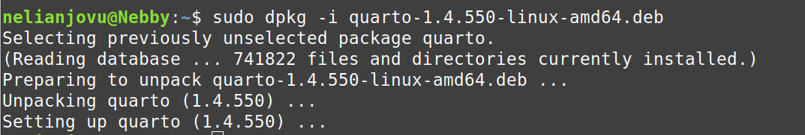{#fig-013 width=70%}

Затем я устанавливаю quarto. Quarto - это инструмент для научной публикации с открытым исходным кодом, который позволяет создавать профессиональные отчеты, объединяя текст, код и результаты в одном документе, с поддержкой Julia, Python и R(рис. 14)

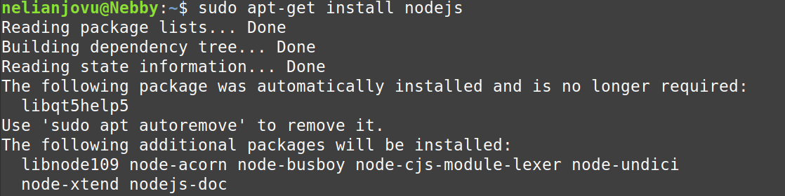{#fig-014 width=70%}

Наконец, я устанавливаю nodejs, yarn и pnpm(рис. 15, 16 и 17)

{#fig-015 width=70%}

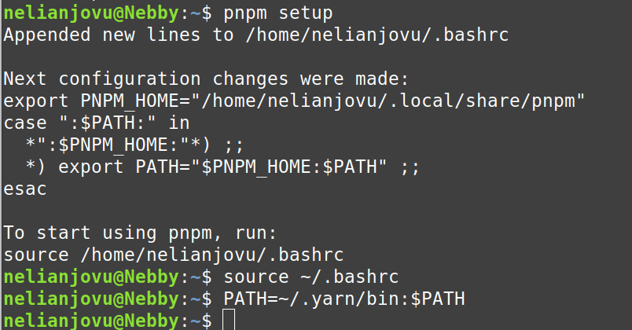{#fig-016 width=70%}

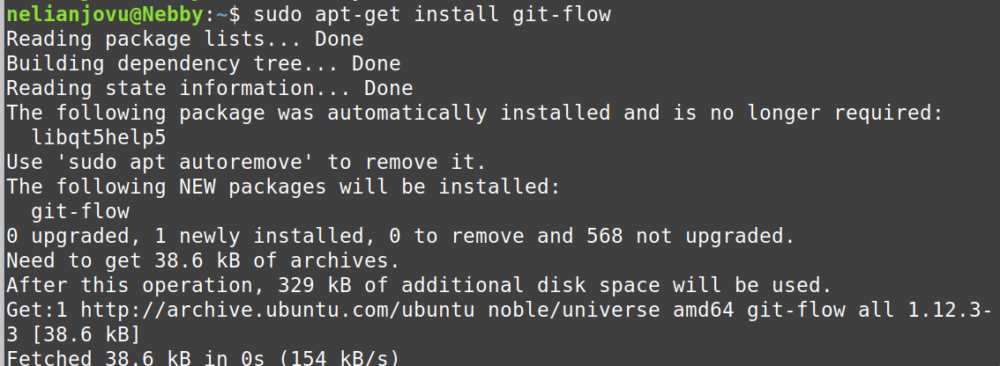{#fig-017 width=70%}

Для работы с Node.js Я добавляю каталог с исполняемыми файлами, установленными менеджером пакетов, в переменную PATH(рис. 18)

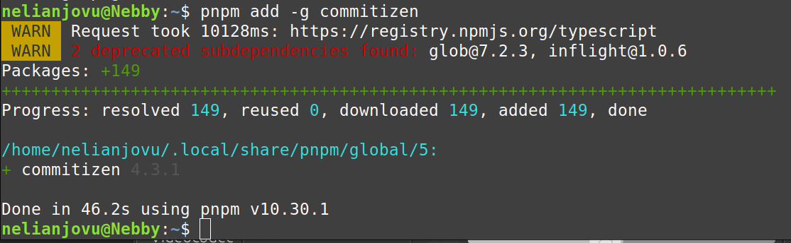{#fig-018 width=70%}

Я устанавливаю gitflow. Gitflow - это модель ветвления для Git, которая обеспечивает структурированный рабочий процесс с использованием выделенных ветвей для функций, релизов и исправлений, помогая командам управлять параллельной разработкой и поддерживать стабильный код(рис. 19)

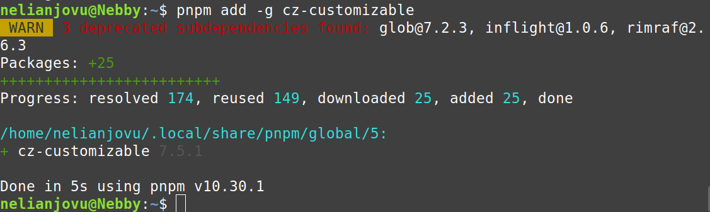{#fig-019 width=70%}

Следуя инструкциям руководства, я использую команды, которые помогают форматировать коммиты, одновременно с этим устанавливается git-cz, который мы будем использовать для коммитов(рис. 20)

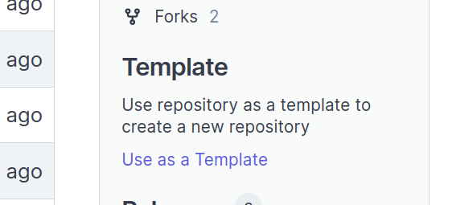{#fig-020 width=70%}

Команда на скриншоте позволяет мне более глубоко настроить форматирование коммитов(рис. 21)

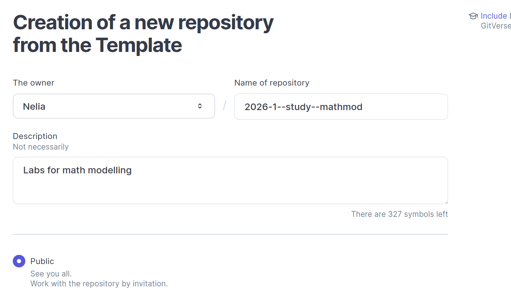{#fig-021 width=70%}

Эта команда автоматизирует изменение номера версии(рис. 22)

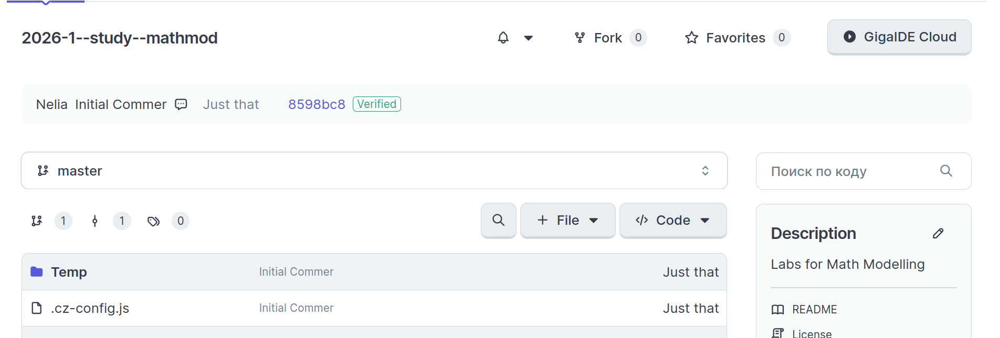{#fig-022 width=70%}

Я использую шаблон, указанный в руководстве, для создания нового репозитория на gitverse(рис. 23)

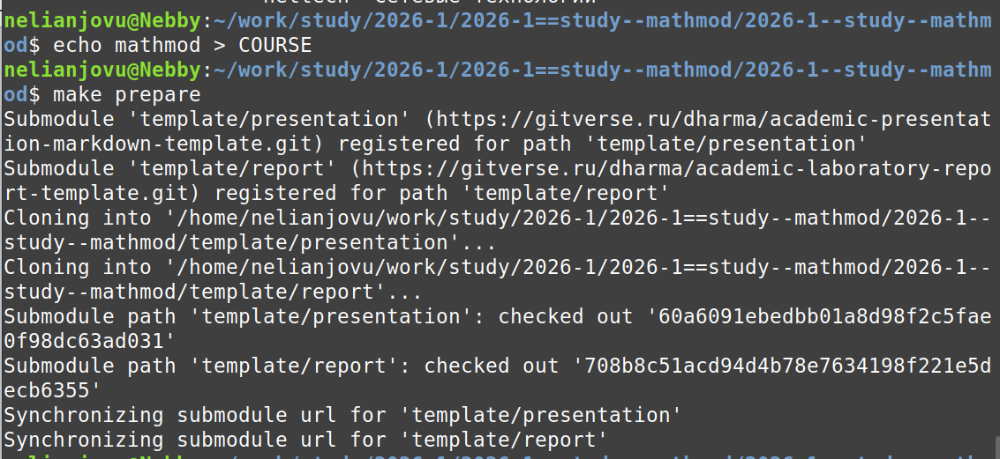{#fig-023 width=70%}

Я создаю файл для своей лабораторной работы, а затем клонирую репозиторий(рис. 24)

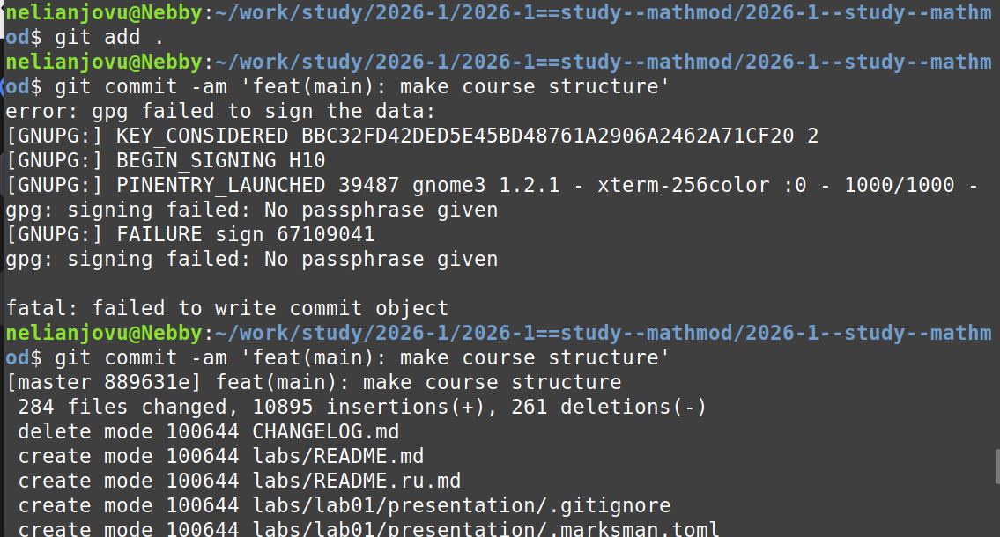{#fig-024 width=70%}

Я просматриваю доступные цели создания и список доступных курсов(рис. 25)

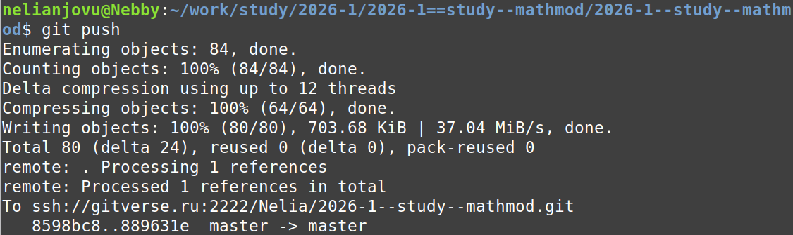{#fig-025 width=70%}

Я захожу в свой каталог лабораторных работ и инициализирую курс(рис. 26)

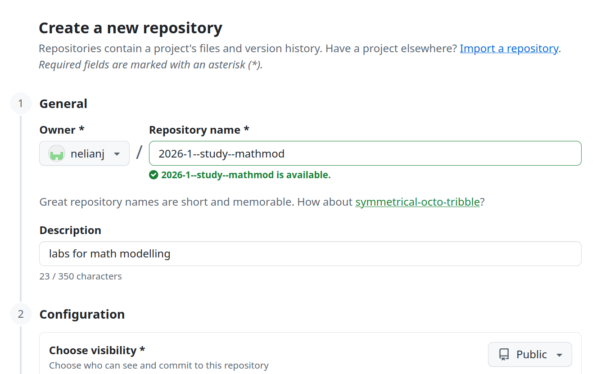{#fig-026 width=70%}

Я отправляю файлы на сервер(рис. 27)

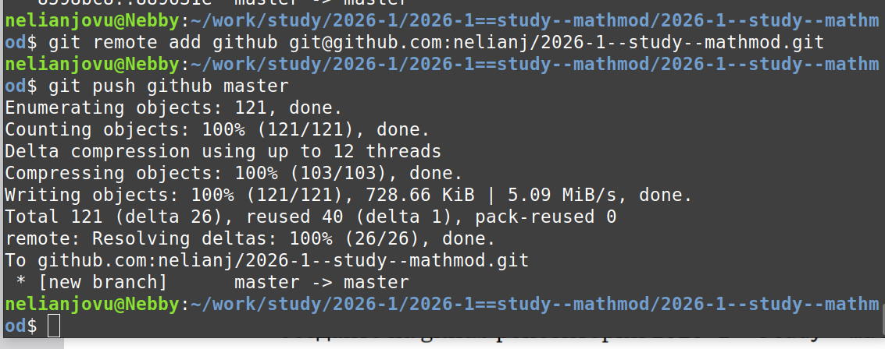{#fig-027 width=70%}

Я создаю репозиторий на github с именем 2026-1-study-mathmod(рис. 28)

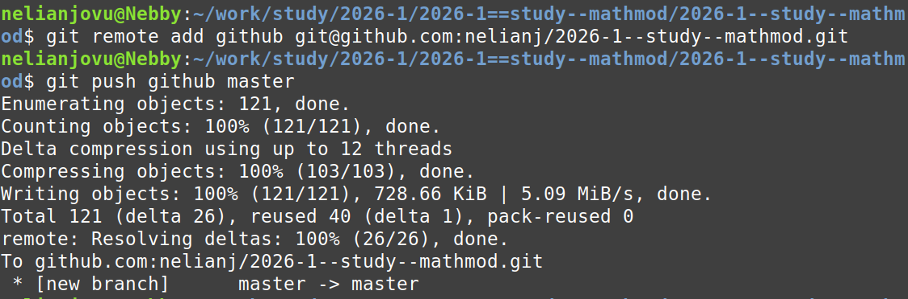{#fig-028 width=70%}

Я запускаю репозиторий на github(рис. 29)

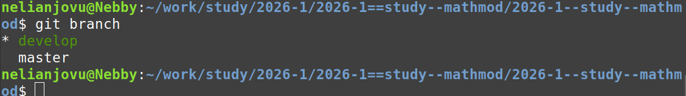{#fig-029 width=70%}

Я инициализирую git flow и отвечаю на вопрос в соответствии с инструкциями(рис. 30)

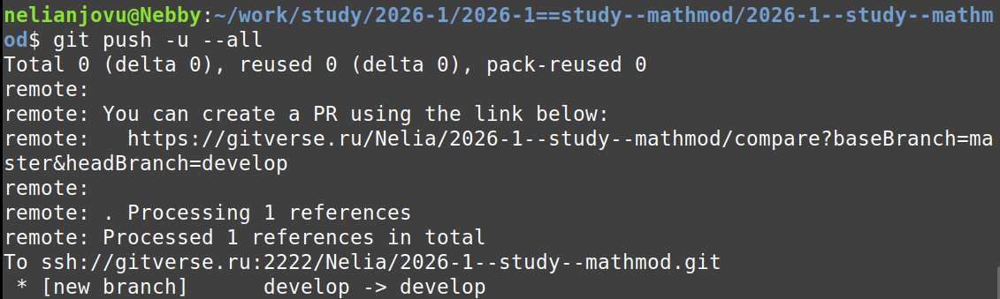{#fig-030 width=70%}

Я проверяю и вижу, что нахожусь в ветке разработки. После чего загружаю весь репозиторий на сервер(рис. 31)

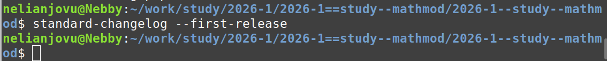{#fig-031 width=70%}

Я создаю релиз с версией 1.0.0 и создаю журнал изменений(рис. 32)

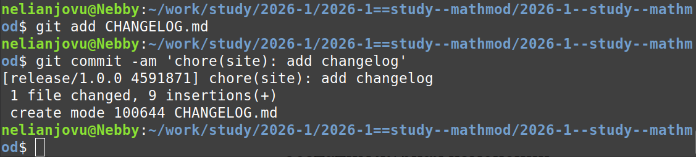{#fig-032 width=70%}

Я добавляю журнал изменений в индекс и загружаю ветку выпуска в основную ветку(рис. 33)

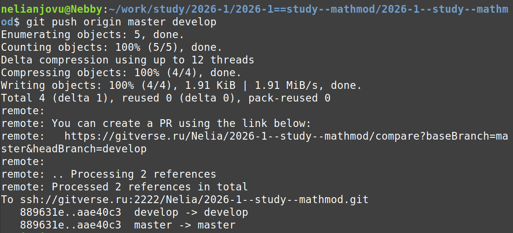{#fig-033 width=70%}

После чего я отправляю данные на github(рис. 34)

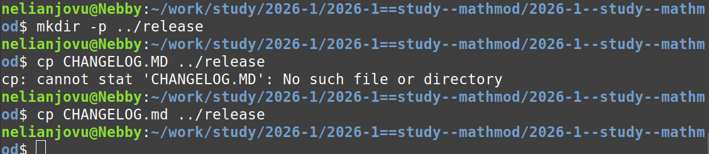{#fig-034 width=70%}

Я копирую CHANGELOG.md в каталог релизов(рис. 35)

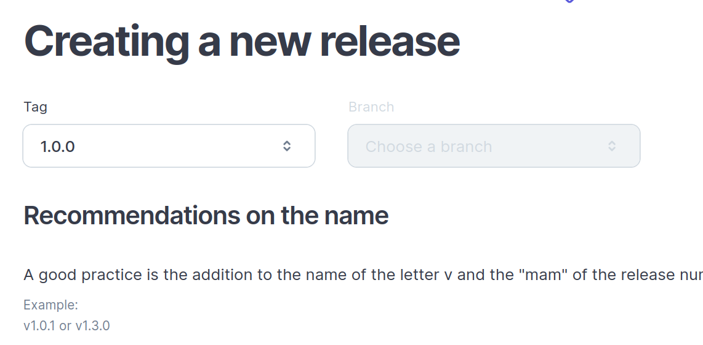{#fig-035 width=70%}

Я создаю релиз вручную на gitverse(рис. 36)

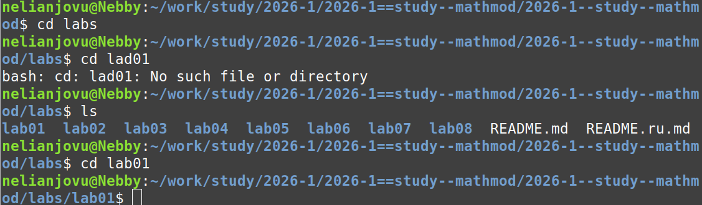{#fig-036 width=70%}

## 3. Создание проекта DrWatson для лабораторных

Я захожу в каталог lab01, устанавливаю julia и запускаю его(рис. 37)

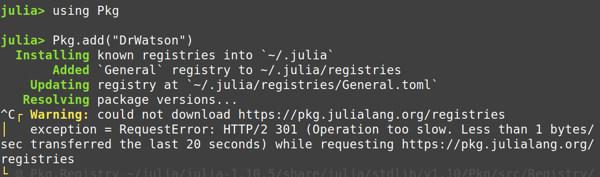{#fig-037 width=70%}

Я создаю структуру проекта, используя пакет DrWatson в Julia's REPL(рис. 38)

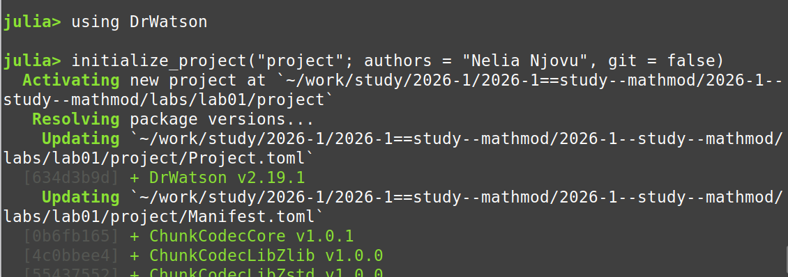{#fig-038 width=70%}

Я создаю jl-файл, копирую и вставляю скрипт из руководства пользователя. Скрипт настраивает всю структуру папок. После этого я запускаю файл(рис. 39)

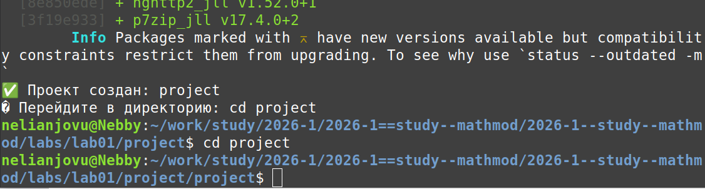{#fig-039a width=70%}

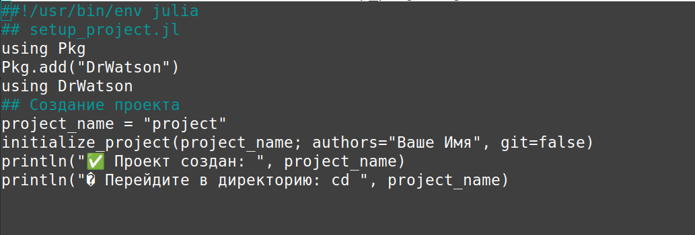{#fig-039b width=70%}

Я создаю jl-файл с именем add_packages, копирую и вставляю скрипт из руководства. Скрипт Этот скрипт устанавливает все пакеты Julia. После этого я запускаю файл(рис. 40)

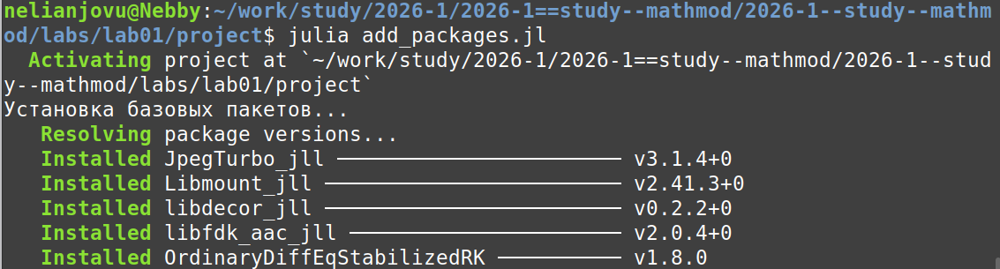{#fig-040 width=70%}

После установки я проверяю свою окончательную структуру проекта, и она выглядит точно так же, как в руководстве(рис. 41)

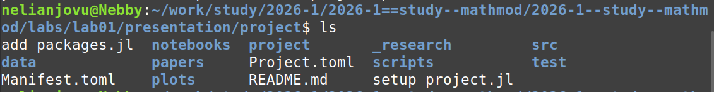{#fig-041 width=70%}

Я создаю jl-файл с именем 01_exponential_growth, копирую и вставляю скрипт из руководства. Этот скрипт решает и визуализирует модель экспоненциального роста(рис. 42)

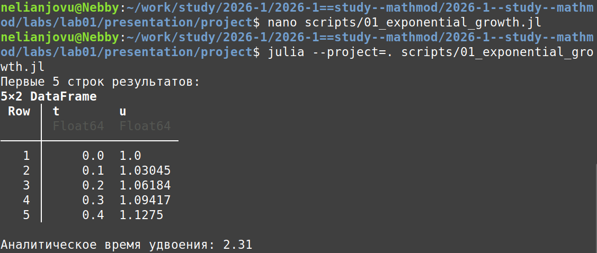{#fig-042 width=70%}

Полученные графики отображаются в каталоге plots(рис. 43)

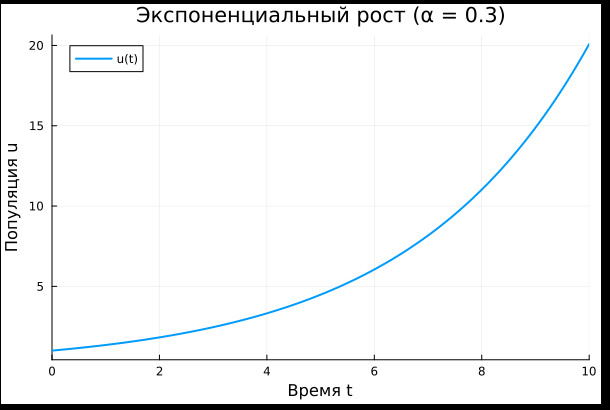{#fig-043 width=70%}

## 4. Модель экспоненциального роста

Я редактирую скрипт в файле 01_exponential_growth. Новый скрипт выполняет точно ту же математическую работу, что и предыдущий, за исключением того, что теперь он написан в грамотном стиле программирования(рис. 44)

 и автоматически генерирует три разных формата: .jl; .qmd; .ipynb(рис. 45)

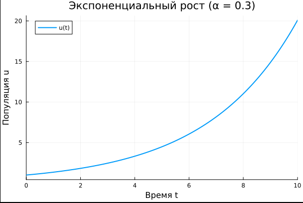{#fig-045 width=70%}

Я проверяю, был ли создан файл ipynb(рис. 46)

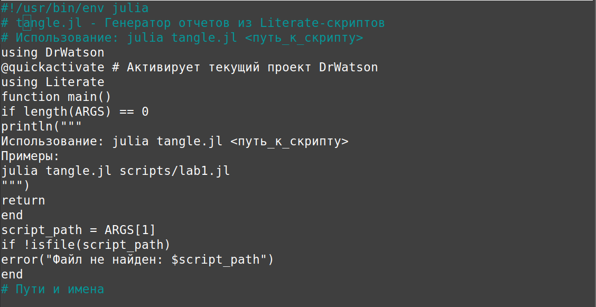{#fig-046 width=70%}

В каталоге отчетов, в файле _quarto.yml, я включаю поддержку кода julia(рис. 47)

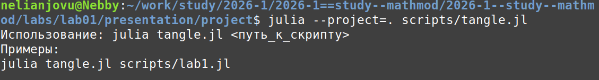{#fig-047 width=70%}

В преамбуле к preview.tex я подключаю пакет juliamono(рис. 48)

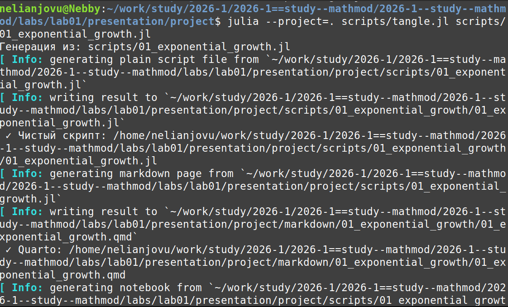{#fig-048 width=70%}

***Ниже приведен код, результаты расчетов и графики для кода в файле 01_exponential_growth.qmd***



Я создаю jl-файл с именем 02_exponential_growth, копирую и вставляю скрипт из руководства. Этот скрипт основан на предыдущей версии, но добавляет систематическую проверку параметров и сравнительный анализ производительности(рис. 49)

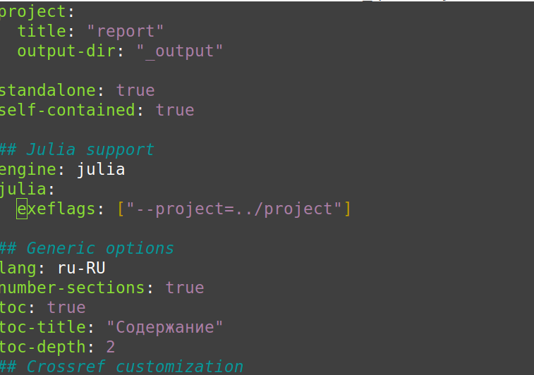{#fig-049 width=70%}

Используя tangle, я создаю три новых файла и открываю файл ipynb, чтобы проверить его(рис. 50)

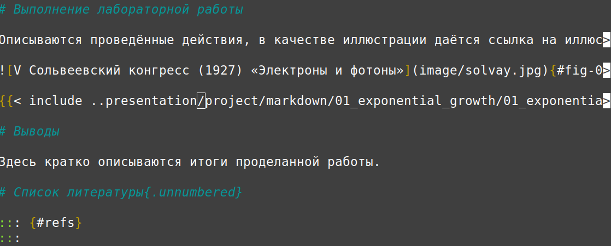{#fig-050 width=70%}

***Ниже приведен код, результаты расчетов и графики для кода в файле 02_exponential_growth.qmd***



# Выводы

Делая эту лабораторную работу, я изучила модель экспоненциального роста и проверила параметрическое исследование влияния коэффициента роста α на динамику системы, а также освоила современные практики воспроизводимых исследований (литературное программирование, DrWatson, Git).

# Список литературы{.unnumbered}

1. A Multi-Language Computing Environment for Literate Programming and Reproducible Research / E. Schulte [et al.] // Journal of Statistical Software. — 2012. — Vol. 46, no. 3. — ISSN 1548-7660. — DOI: 10.18637/jss.v046.i03.

2. Knuth D. E. Literate Programming // The Computer Journal. — 1984. — Feb. — Vol. 27, no. 2. — P. 97–111. — ISSN 1460-2067. — DOI: 10.1093/comjnl/27.2.97.

3. The Story in the Notebook / M. B. Kery [et al.] // Proceedings of the 2018 CHI Conference on Human Factors in Computing Systems. — ACM, 04/2018. — P. 1–11. — DOI: 10.1145/3173574.3173748.
