---
## Author
author:
  name: Нджову Нелиа
  degrees: DSc
  orcid: 0000-0002-0877-7063
  email: 1032239033@rudn.ru
  affiliation:
    - name: Российский университет дружбы народов
      country: Российская Федерация
      postal-code: 117198
      city: Москва
      address: ул. Миклухо-Маклая, д. 15

## Title
title: "Отчёта по лабораторной работе 2"
subtitle: "Иммитационное моделирование"
license: "CC BY"
---

```{julia}
#| echo: false
#| include: false
using Pkg
Pkg.activate("/home/nelianjovu/work/study/2026-1/2026-1==study--simulationmod/2026-1--study--simulationmod/labs/lab02/project")
```

# Цель работы

Целью данной лабораторной работы является практическое изучение моделей SIR и Лотки-Вольтерры с использованием языка Джулии.

# Задание

1. Изучить модель SIR с помощью julia

2. Изучить модель Лотки-Вольтерры с помощью julia

# Теоретическое введение

Модель SIR есть классическая и фундаментальная математическая модель эпидемиологии, описывающая распространение инфекционного заболевания в закрытой популяции. Другими словами, модель SIR является одной из самых базовых моделей для описания временной динамики инфекционного заболевания в популяции

Модель SIR делит всю популяцию на три взаимосвязанные группы (компартменты), что отражено в её названии:

— S — Susceptible (Восприимчивые): люди, которые не болели, не имеют иммунитета и могут заразиться.

— I — Infectious (Инфицированные/Заразные): люди, которые в данный момент больны и могут передавать инфекцию.

— R — Recovered (Выздоровевшие/Удаленные): люди, которые переболели и приобрели иммунитет (или умерли). Они больше не участвуют в процессе передачи.

Модель Лотки-Вольтерры — это фундаментальная математическая модель в экологии, описывающая динамику взаимодействия двух видов: хищников и жертв. Она была независимо предложена в 1920-х годах:

— Альфредом Лоткой (1925) для химических реакций

— Витторио Вольтеррой (1926) для объяснения колебаний улова рыбы в Адриатическом море.

Модель демонстрирует, как даже простая система взаимодействий может порождать сложные колебательные режимы, объясняя циклические изменения численности в природных экосистемах.

# Выполнение лабораторной работы

**1. Изучить модель SIR с помощью julia**

Я копирую папку, в которую я установил необходимые пакеты из предыдущей лабораторной работы, в каталог lab2. Затем я создаю файл sir_ode.jl и копирую и вставляю код из руководства по лабораторной работе во вновь созданный файл(рис.1).

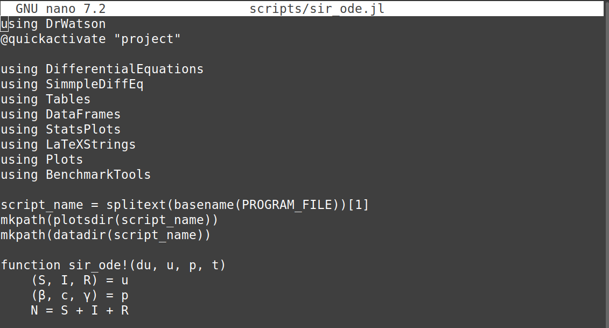{#fig-001 width=70%}

Я преобразую код в литературный стиль(рис.2)

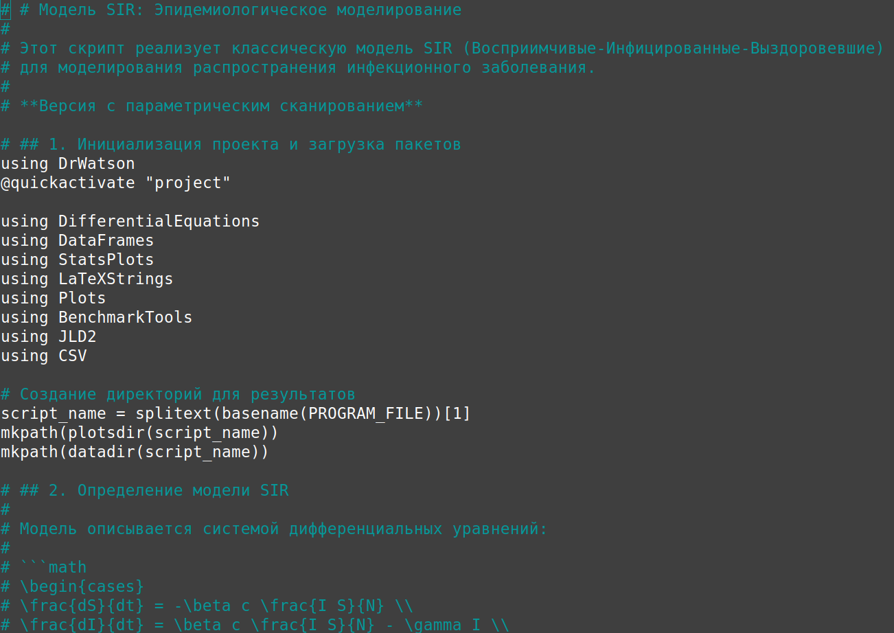{#fig-002 width=70%}

После этого я запускаю код, чтобы проверить, работает ли он без ошибок, и это так(рис.3)

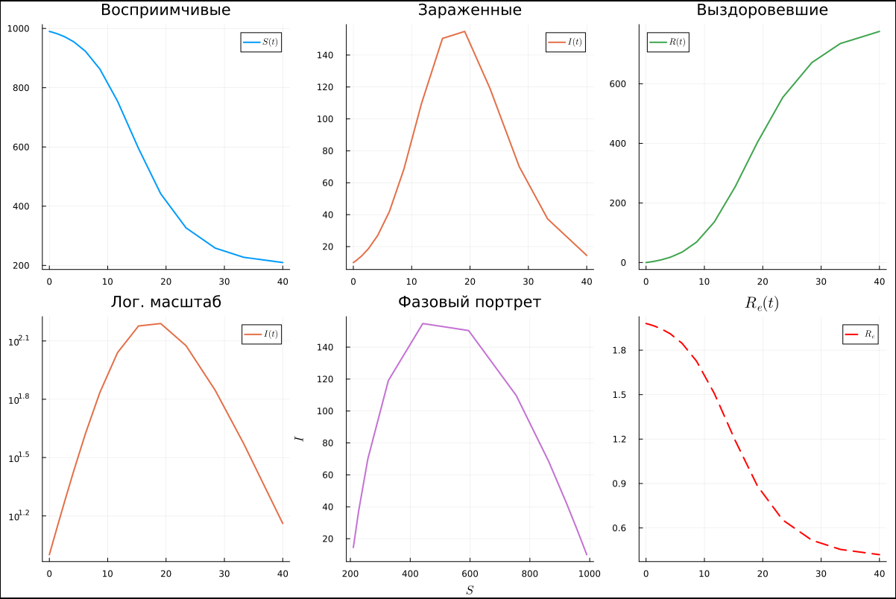{#fig-003 width=70%}

Затем я создаю файл jupyter notebook, используя файл tangle, который мы создали ранее. Я запускаю код из файла jupyter notebook, чтобы убедиться, что он работает без ошибок(рис.4)

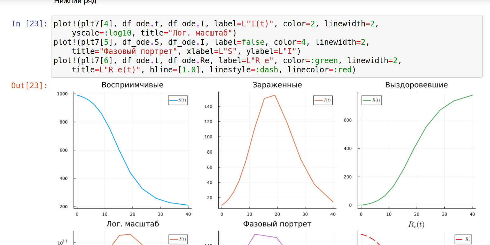{#fig-004 width=70%}

Я добавляю в код расчет для набора параметров в литературном стиле, чтобы поэкспериментировать с ним.(рис.5)

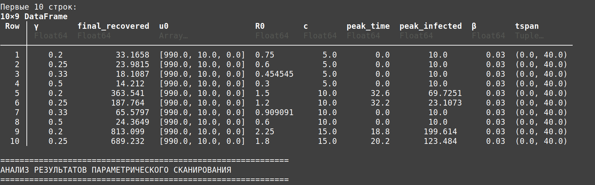{#fig-005 width=70%}

После этого я запускаю код, чтобы проверить, работает ли он без ошибок, и это так.В данных видно что при R₀ < 1 количество зараженных не растет (остается 10 человек) а при R₀ > 1 начинается вспышка, чем больше контактов (c), тем сильнее эпидемия и чем быстрее выздоровление (γ), тем слабее эпидемия.(рис.6)

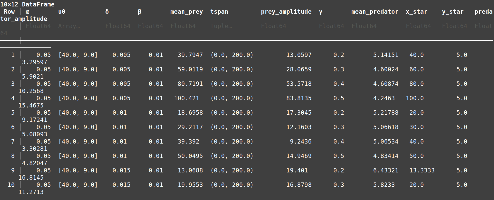{#fig-006 width=70%}

Затем я создаю файл jupyter notebook, используя файл tangle, который мы создали ранее. Я запускаю код из файла jupyter notebook, чтобы убедиться, что он работает без ошибок(рис.7)

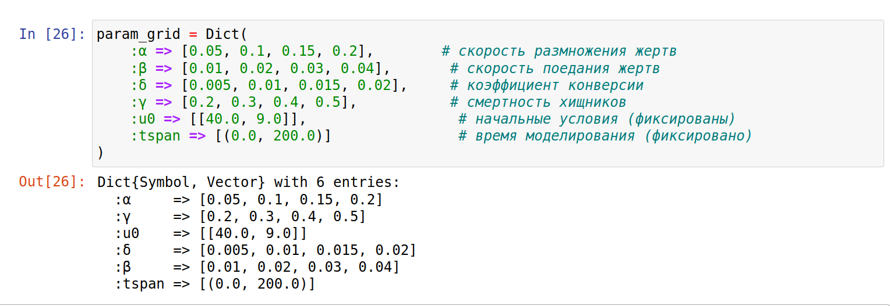{#fig-007 width=70%}

***Ниже приведен код, результаты расчетов и графики для кода в файле sir_ode1.jl.qmd***



**2. Изучить модель Лотки-Вольтерры с помощью julia**

Я создаю файл lv_ode.jl и копирую и вставляю код из руководства по лабораторной работе во вновь созданный файл(рис.8).

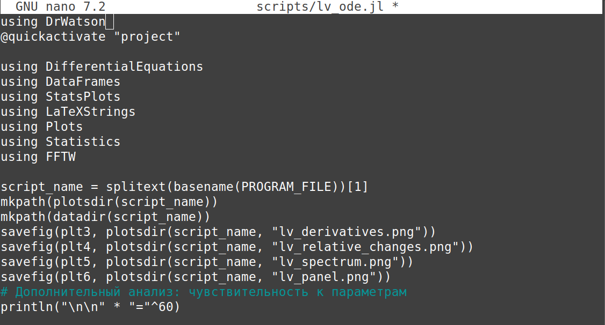{#fig-008 width=70%}

Я преобразую код в литературный стиль(рис.9)

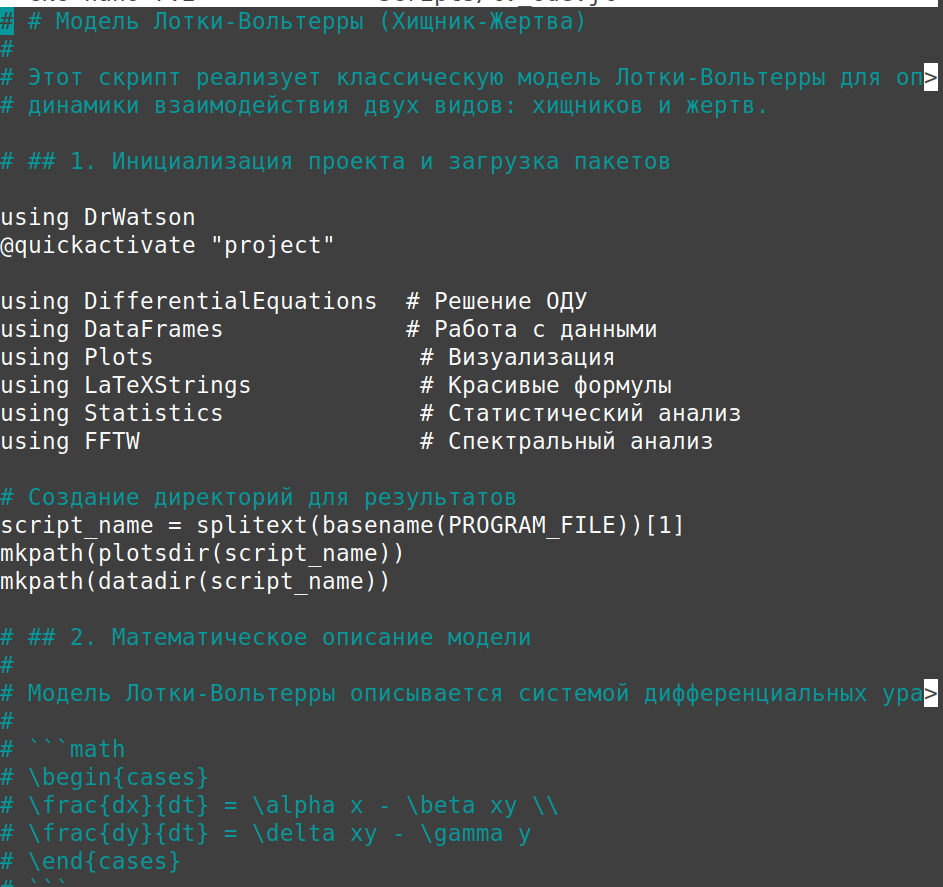{#fig-009 width=70%}

После этого я запускаю код, чтобы проверить, работает ли он без ошибок, и это так(рис.10)

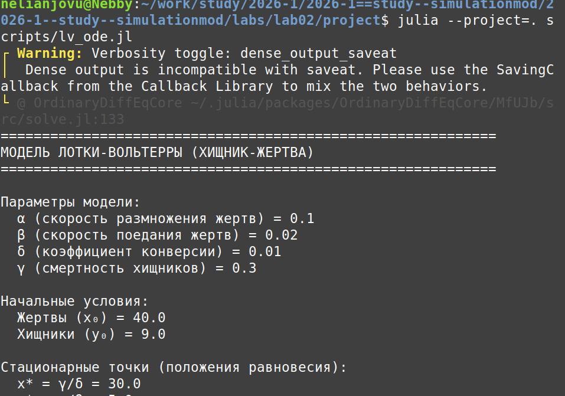{#fig-010 width=70%}

Затем я создаю файл jupyter notebook, используя файл tangle, который мы создали ранее. Я запускаю код из файла jupyter notebook, чтобы убедиться, что он работает без ошибок(рис.11)

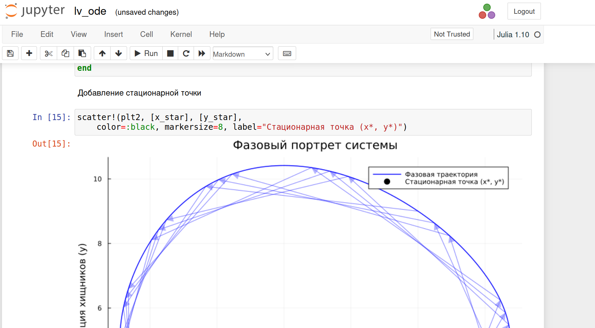{#fig-011 width=70%}

Я добавляю в код расчет для набора параметров в литературном стиле, чтобы поэкспериментировать с ним(рис.12)

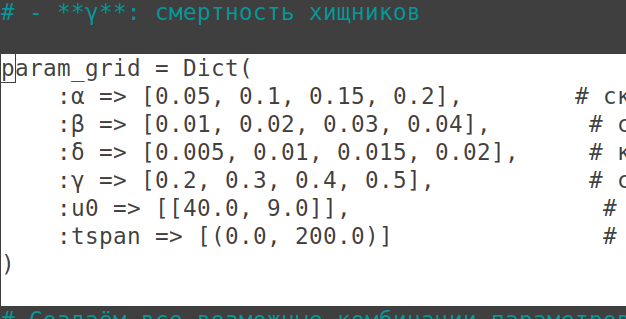{#fig-012 width=70%}

После этого я запускаю код, чтобы проверить, работает ли он без ошибок, и это так. Наблюдения: Когда γ (смертность хищников) высокая, равновесная численность жертв (x*) увеличивается. Когда δ (коэффициент конверсии) низкий, колебания становятся больше. Когда α (рождаемость жертв) низкая, система все еще может иметь большие колебания, если другие параметры позволяют. Когда β (поедание жертв) высокий, равновесная численность хищников (y*) уменьшается.

Затем я создаю файл jupyter notebook, используя файл tangle, который мы создали ранее. Я запускаю код из файла jupyter notebook, чтобы убедиться, что он работает без ошибок. (рис.13)

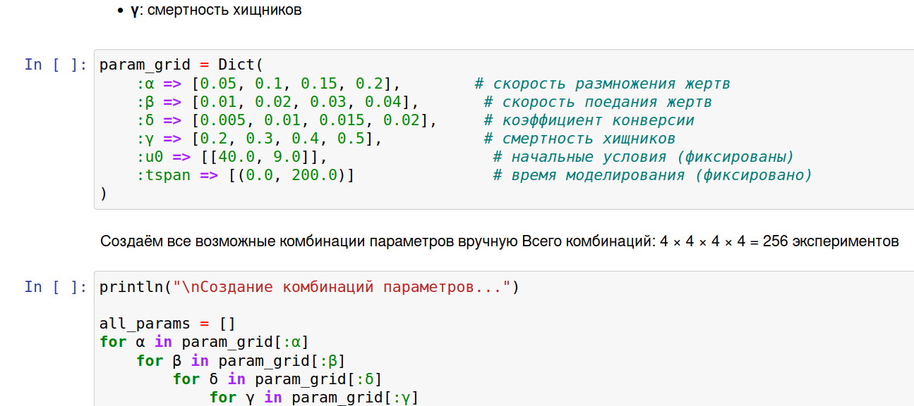{#fig-013 width=70%}

***Ниже приведен код, результаты расчетов и графики для кода в файле lv_ode.jl.qmd***




# Выводы

Выполнив эту лабораторную работу, я получила практическое знание о моделях SIR и Лотки-Вольтерры с использованием языка Джулии.

