---
author:
  name: Нджову Нелиа
  degrees: DSc
  orcid: 0000-0002-0877-7063
  email: 1032239033@rudn.ru
  affiliation:
    - name: Российский университет дружбы народов
      country: Российская Федерация
      postal-code: 117198
      city: Москва
      address: ул. Миклухо-Маклая, д.15

title: "Презентация по лабораторной работе 3"
subtitle: "Иммитационное моделирование"
license: "CC BY"
lang: ru

format:
  beamer: 
    pdf-engine: lualatex
    include-in-header: 
      - text: |
          \usepackage{fontspec}
          \setmainfont{DejaVu Serif}
          \setsansfont{DejaVu Sans}
          \setmonofont{DejaVu Sans Mono}
  revealjs: default
---

```{julia}
#| echo: false
#| include: false
using Pkg
Pkg.activate("/home/nelianjovu/work/study/2026-1/2026-1==study--simulationmod/2026-1--study--simulationmod/labs/lab03/project")
```

## Цель работы

Цель этой лабораторной работы использовать агентную модель для моделирования daisyworld.

## Задание

1. Реализация на Agents.jl

2. Базовая визуализация

3. Анимация модели

4. Динамика числа маргариток

## Задание

5. Динамика модели

6. Базовая визуализация(параметры)

7. Динамика числа маргариток(параметы)

8. Динамика модели(параметры)

## Агентный подход

Агентный подход к имитационному моделированию (Agent-Based Modeling, ABM) — это метод исследования сложных систем, в котором поведение системы возникает из взаимодействия множества автономных сущностей, называемых агентами. Вместо того чтобы описывать систему глобальными уравнениями, мы моделируем каждую индивидуальную единицу и правила её поведения, а затем наблюдаем, какие коллективные паттерны появляются снизу вверх. Этот подход особенно полезен, когда поведение системы трудно предсказать из-за нелинейностей, гетерогенности участников или адаптивных стратегий.

## Агентный подход

Любая агентная модель включает три основных элемента: 

1. Агенты — это активные сущности. Они обладают свойствами, правилами поведения, целями и способностью к обучению или одаптации

2. Среда — это пространство, в котором существуют агенты. Она может быть дискретной, непрерывной, сетевой и абстрактной. Среда также может иметь свои свойства (температура, ресурсы) и динамику (диффузия, обновление).

## Агентный подход

3. Взаимодействия — правила, определяющие, как агенты влияют друг на друга и на среду. Они могут быть локальными, глобальными и через среду.

Основные принципы агентного моделирования включает эмерджентность, автономия, генерогенность и локальность

Преимущества агентного подхода включает гибкость, учёт индивидуальных реализаций, адаптивность, наглядность и исследование

Этапы построения агентной модели: концептуализация, спецификация, реализация, верификация, валидация, анализ и интерпретация

## Модель Daisyworld

**Модель Daisyworld**, предложенная Джеймсом Лавлоком и Эндрю Уотсоном (1983), иллюстрирует гипотезу Геи — способность жизни регулировать планетарные условия.

**Основные элементы модели:**

**1. Агенты (маргаритки)**
- Два типа: **чёрные** (низкое альбедо 0.25) и **белые** (высокое альбедо 0.75)
- Свойства: тип, возраст, альбедо, позиция на сетке
- Правила: стареют, умирают при достижении max_age, размножаются в пустые соседние клетки

## Модель Daisyworld

**2. Среда (планета)**
- Дискретная сетка 30×30 клеток
- Свойства: температура каждой клетки, солнечная светимость
- Динамика: диффузия тепла между соседними клетками

**3. Взаимодействия**
- Маргаритки **влияют на среду**: чёрные поглощают тепло (нагревают), белые отражают тепло (охлаждают)
- Среда **влияет на агентов**: размножение возможно только при оптимальной температуре (~22.5°C)

## Модель Daisyworld

**Механизм саморегуляции:**

- **Слишком холодно** Чёрные маргаритки получают преимущество → распространяются → поглощают больше тепла → **планета нагревается** 

- **Слишком жарко** Белые маргаритки получают преимущество → распространяются → отражают больше тепла → **планета охлаждается** 

## Модель Daisyworld

**Ключевые параметры:**

| Параметр | Значение |
|----------|----------|
| Максимальный возраст | 25-40 шагов |
| Альбедо чёрных | 0.25 |
| Альбедо белых | 0.75 |
| Альбедо почвы | 0.4 |
| Оптимальная температура | 22.5°C |

## Модель Daisyworld

**Эмерджентное поведение:**

Несмотря на простые локальные правила, глобально система демонстрирует **поддержание стабильной температуры** в широком диапазоне солнечной активности — яркий пример саморегуляции без централизованного управления.

## Выполнение лабораторной работы

Я создала файл src/daisyworld.jl и скопировала скрипт код, который мне дали и запускала его. Этот скрипт код содержит ключевые функции например, функции обновления температуры, функция рассеивания тепла, функция воспроизведения ромашки, функция шага модели, функция солнечной активности и т.д.([рис. @fig-001])

## Выполнение лабораторной работы

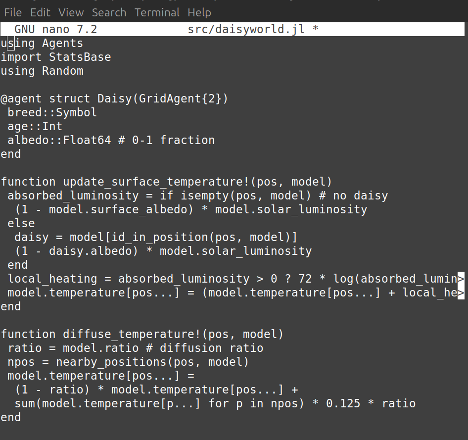{#fig-001 width=70%}

## Выполнение лабораторной работы

Я создала файл scripts/daisyworld.jl и скопировала скрипт код, который мне дали и запускала его. Это скрипт визуализации, который создает моментальные снимки моделирования Daisyworld на разных временных этапах([рис. @fig-002])

## Выполнение лабораторной работы

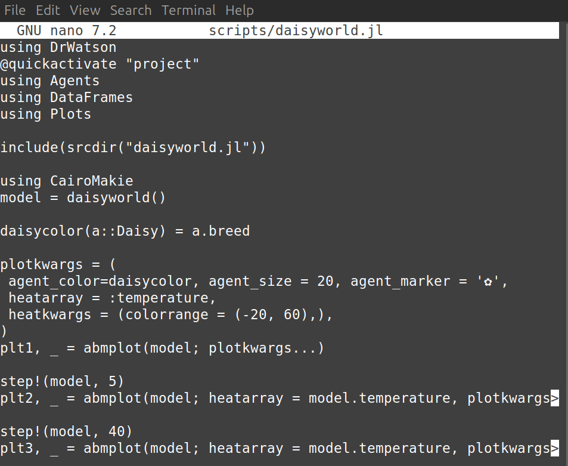{#fig-002 width=70%}

## Выполнение лабораторной работы

На полученных графиках видно, что в исходном состоянии ромашки распределены случайным образом, но температура относительно равномерная([рис. @fig-003])

## Выполнение лабораторной работы

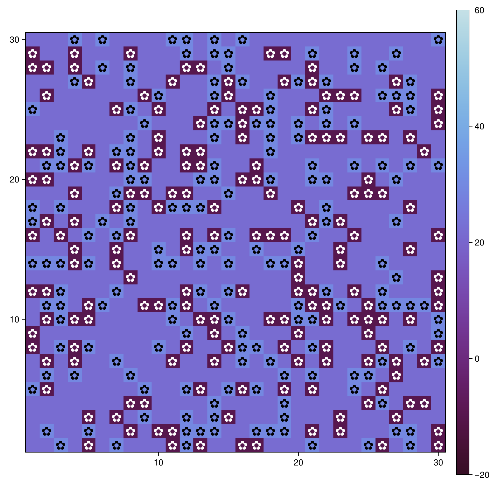{#fig-003 width=70%}

## Выполнение лабораторной работы

После 5 шагов начинают формироваться локальные зоны нагрева (где преобладают черные ромашки) и зоны охлаждения (где преобладают белые)([рис. @fig-004])

## Выполнение лабораторной работы

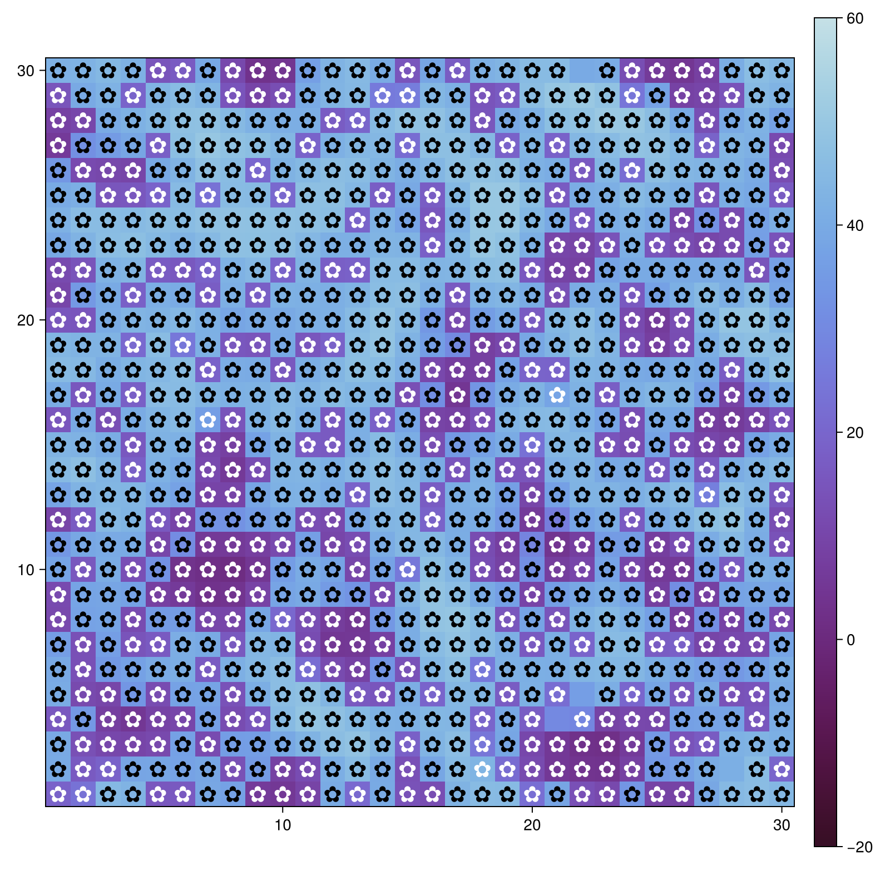{#fig-005 width=70%}

## Выполнение лабораторной работы

После 40 шагов система достигает точки динамического равновесия. Чередование черных и белых ромашек поддерживает глобальную температуру в благоприятном диапазоне([рис. @fig-005])

## Выполнение лабораторной работы

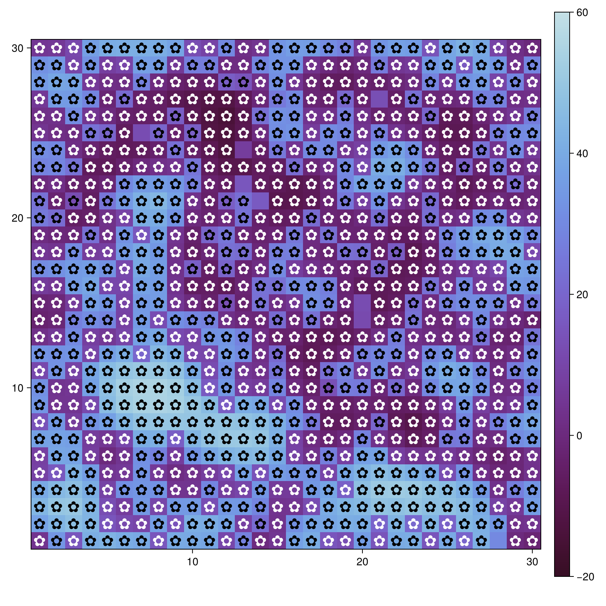{#fig-005 width=70%}

## Выполнение лабораторной работы

Запустив файл и посмотрев на результаты, я преобразовала его в литературный стиль([рис. @fig-006])

## Выполнение лабораторной работы

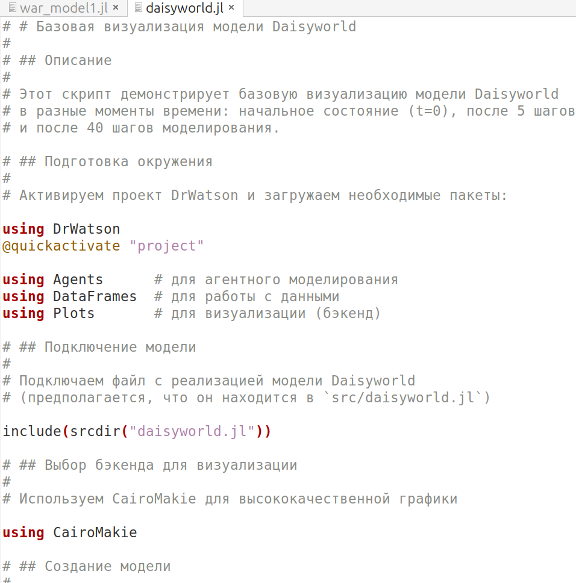{#fig-006 width=70%}

## Выполнение лабораторной работы

Я генерирую следующие файлы из литературного кода: чистый код, jupyter notebook и документация в формате Quarto. После этого я проверяю, чтобы убедиться, что все ячейки в файле jupyter notebook работают без ошибок([рис. @fig-007])

## Выполнение лабораторной работы

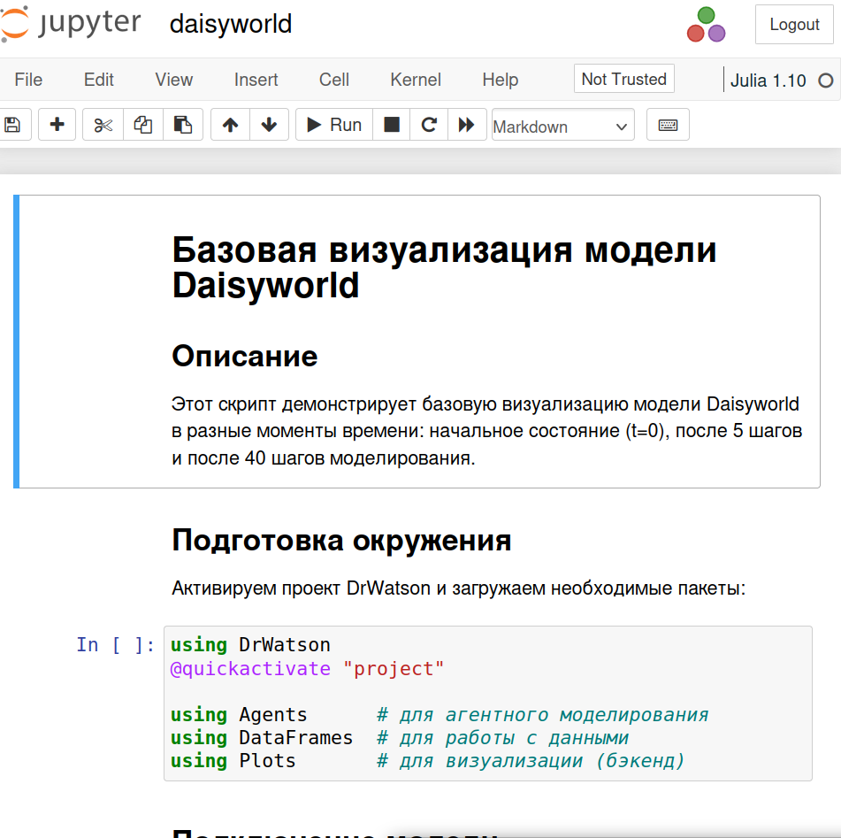{#fig-007 width=70%}

## Выполнение лабораторной работы

Я создала файл scripts/daisyworld-animate.jl и скопировала скрипт код, который мне дали и запускала его.Этот скрипт создает анимационный видеоролик о модели Daisyworld([рис. @fig-008])

## Выполнение лабораторной работы

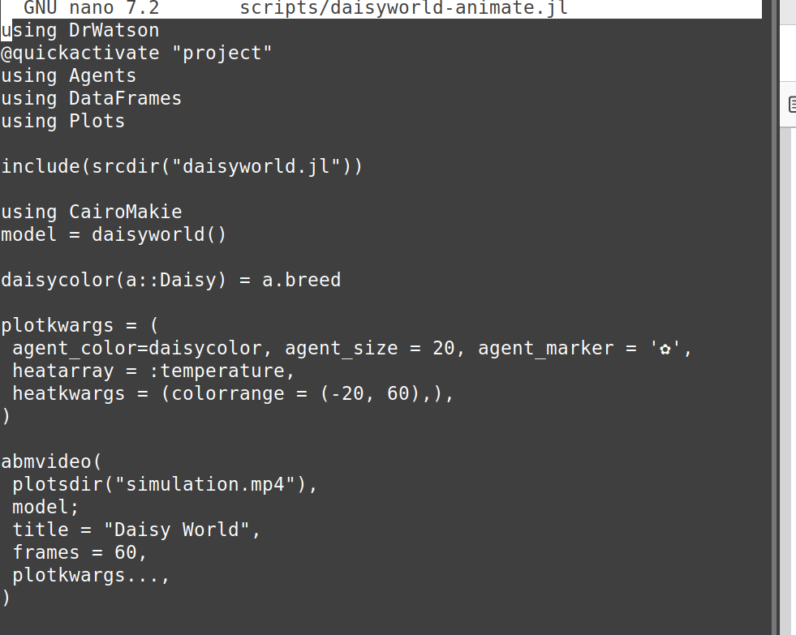{#fig-008 width=70%}

## Выполнение лабораторной работы

*На видео показано, как система Daisyworld эволюционирует с течением времени.  Вначале (t=0-50) маргаритки разбросаны случайным образом, а температура по всей планете довольно однородна. В процессе моделирования (t=50-200) вы можете отчетливо видеть, как появляются узоры — черные ромашки создают теплые пятна, поглощая тепло, в то время как белые ромашки образуют холодные пятна, отражая солнечный свет. К тому времени, когда система достигает динамического равновесия (t=200+), формируются устойчивые структуры, в которых черные и белые ромашки чередуются по всей сетке, а температура остается сбалансированной в пределах оптимального диапазона для роста. Когда черных ромашек становится больше, белых ромашек становится меньше, и наоборот. Это очень похоже на результаты для сценария daisyworld, только здесь мы видим, как меняются шаблоны*

## Выполнение лабораторной работы

Я создала файл scripts/daisyworld-count.jl и скопировала скрипт код, который мне дали и запускала его. Этот скрипт анализирует динамику популяции, отслеживая, как меняется количество черных и белых маргариток на протяжении 1000 шагов моделирования([рис. @fig-009])

## Выполнение лабораторной работы

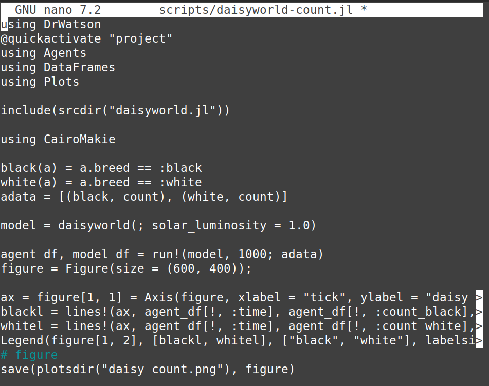{#fig-009 width=70%}

## Выполнение лабораторной работы

На графике показано, как популяции черной и белой маргариток меняются на протяжении 1000 шагов. Вначале обе популяции быстро растут по сравнению с их первоначальной численностью. Затем, примерно через 200 шагов, мы начинаем наблюдать регулярные подъемы и спады, когда черные ромашки поднимаются, белые опускаются, а затем происходит обратное. Эта закономерность сохраняется на протяжении всего моделирования. Это происходит из-за обратной связи: когда черных маргариток становится больше, они согревают планету, что затем помогает расти белым маргариткам; когда белых маргариток становится больше, они охлаждают планету, что помогает расти черным маргариткам([рис. @fig-010])

## Выполнение лабораторной работы

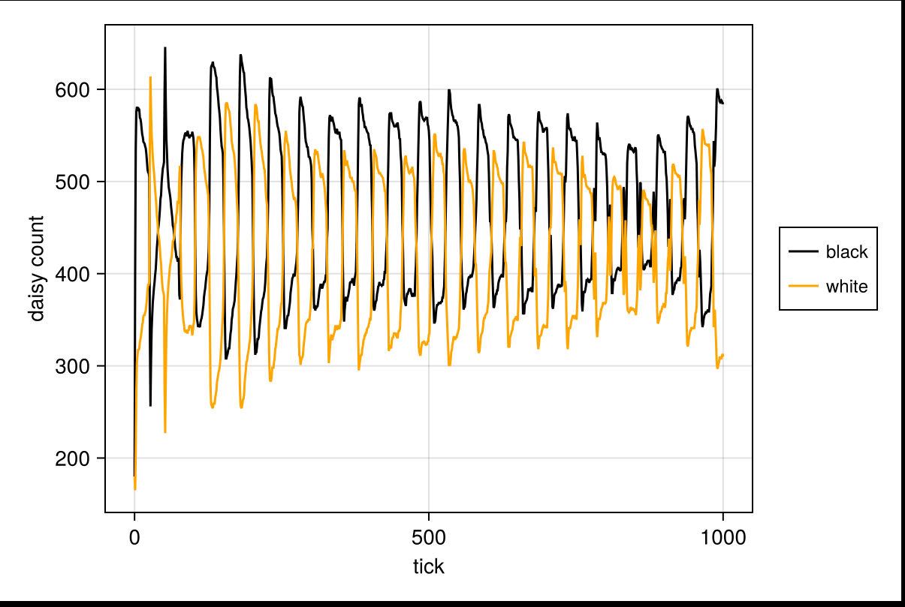{#fig-010 width=70%}

## Выполнение лабораторной работы

Запустив файл и посмотрев на результаты, я преобразовала его в литературный стиль([рис. @fig-011])

## Выполнение лабораторной работы

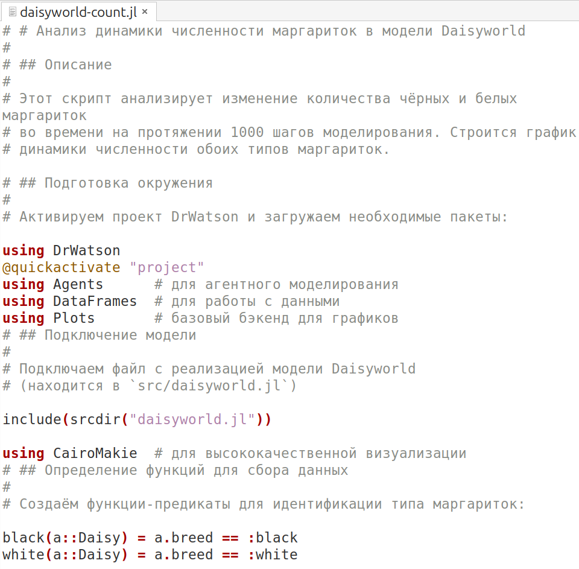{#fig-011 width=70%}

## Выполнение лабораторной работы

Я генерирую следующие файлы из литературного кода: чистый код, jupyter notebook и документация в формате Quarto. После этого я проверяю, чтобы убедиться, что все ячейки в файле jupyter notebook работают без ошибок([рис. @fig-012])

## Выполнение лабораторной работы

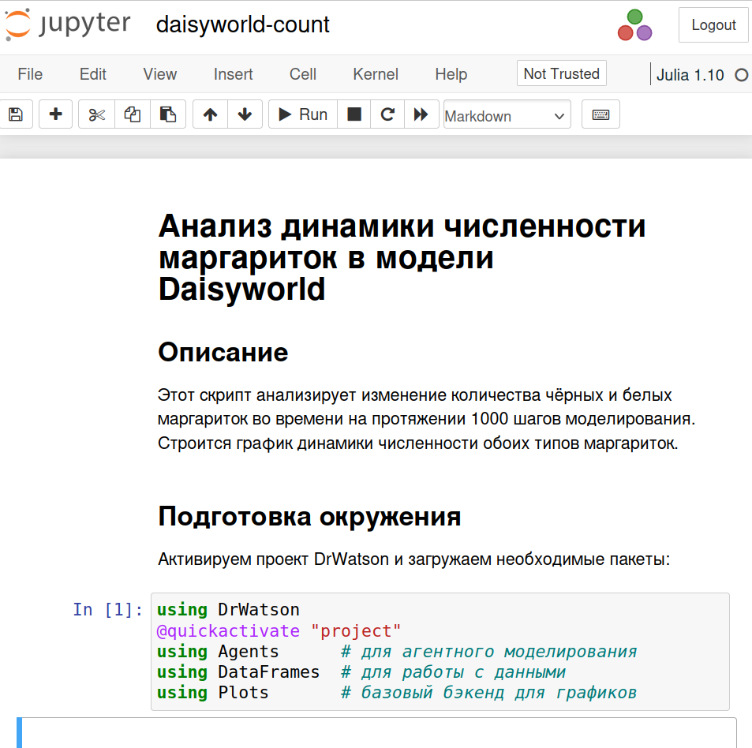{#fig-012 width=70%}

## Выполнение лабораторной работы

Я создала файл scripts/daisyworld-luminosity.jl и скопировала скрипт код, который мне дали и запускала его. Этот сценарий анализирует, как изменение яркости солнца влияет на систему Daisyworld, используя сценарий :ramp([рис. @fig-013])

## Выполнение лабораторной работы

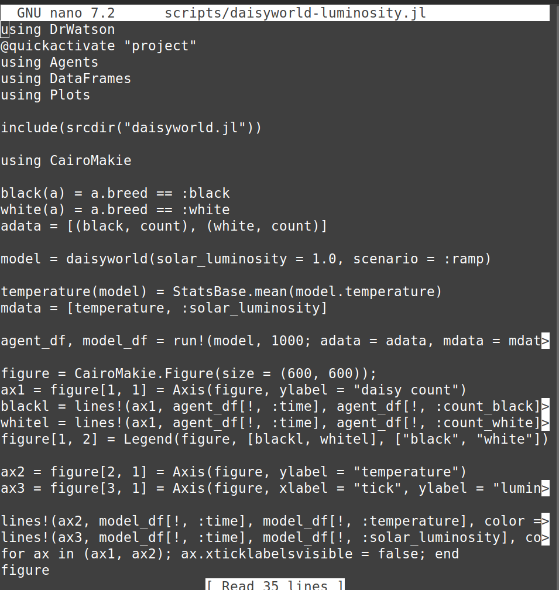{#fig-013 width=70%}

## Выполнение лабораторной работы

На графике показано, как Daisyworld реагирует, когда яркость солнца увеличивается, а затем уменьшается. На графике вверху вы можете видеть, что популяции черных и белых маргариток меняются по мере изменения солнца: когда яркость увеличивается, белые маргаритки (синяя линия) становятся более распространенными, потому что они отражают тепло и помогают охлаждать планету; когда яркость уменьшается, преобладают черные маргаритки (красная линия), потому что они поглощают тепло и разогреть обстановку. График в середине показывает температуру, которая остается довольно стабильной, несмотря на то, что на графике внизу солнце сильно меняется. Маргаритки защищают планету от резких перепадов температуры. Кроме того, если мы присмотримся повнимательнее, то увидим, что система ведет себя не совсем одинаково на подъеме и на спаде([рис. @fig-014])

## Выполнение лабораторной работы

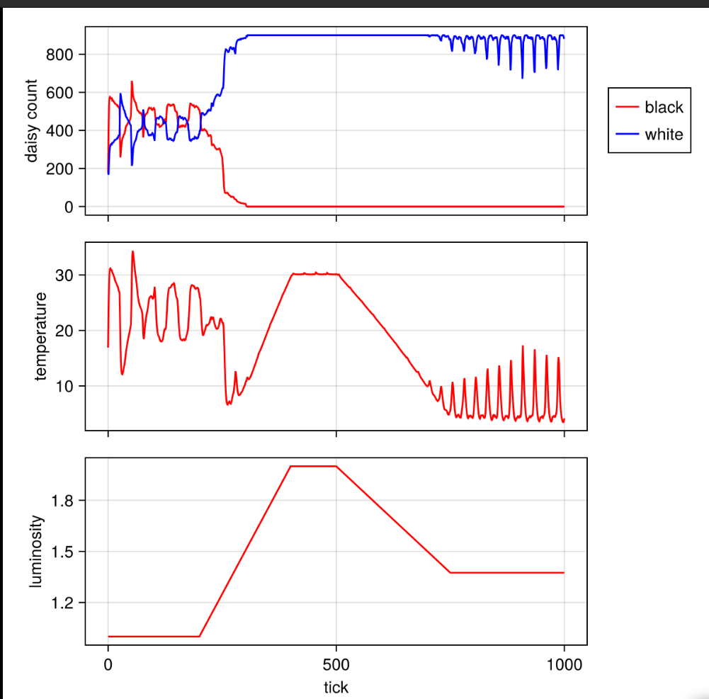{#fig-014 width=70%}

## Выполнение лабораторной работы

Запустив файл и посмотрев на результаты, я преобразовала его в литературный стиль([рис. @fig-015])

## Выполнение лабораторной работы

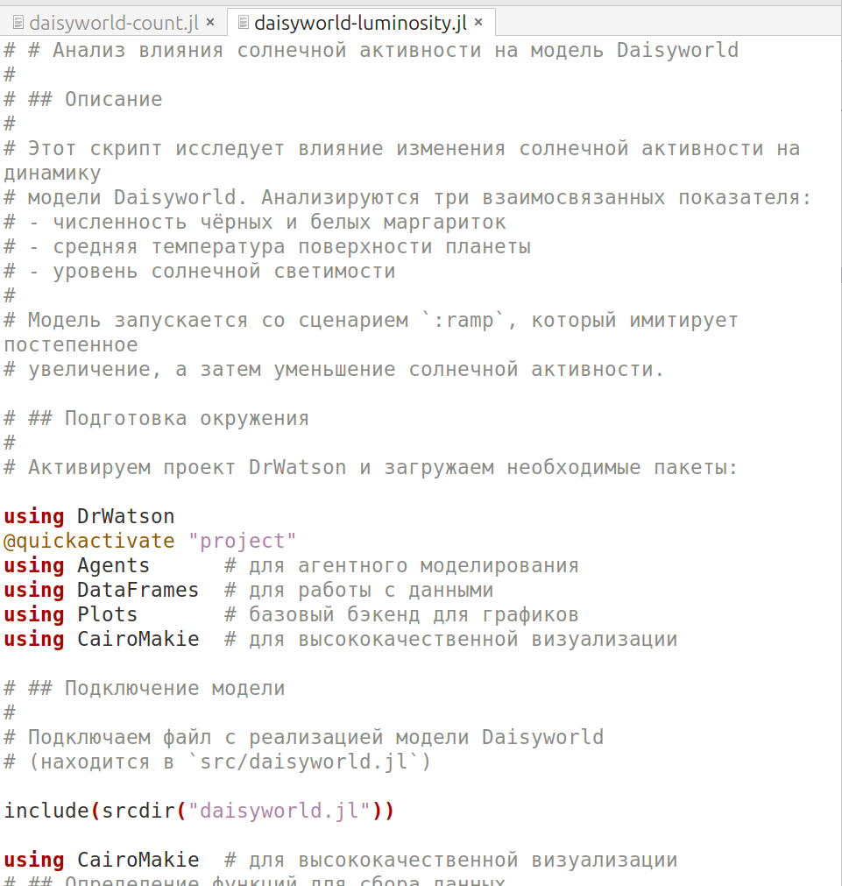{#fig-015 width=70%}

## Выполнение лабораторной работы

Я генерирую следующие файлы из литературного кода: чистый код, jupyter notebook и документация в формате Quarto. После этого я проверяю, чтобы убедиться, что все ячейки в файле jupyter notebook работают без ошибок([рис. @fig-016])

## Выполнение лабораторной работы

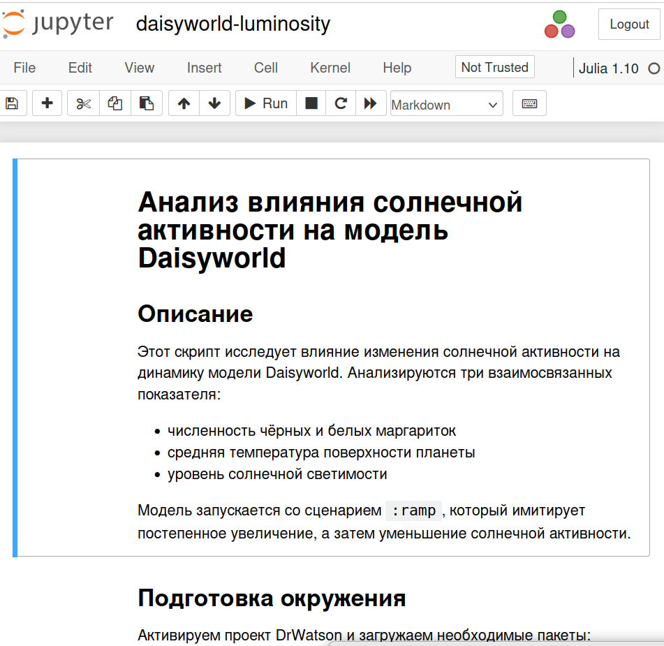{#fig-016 width=70%}

## Выполнение лабораторной работы

Я создала файл scripts/daisyworld__param.jl и скопировала скрипт код, который мне дали и запускала его. Этот скрипт выполняет параметрическое исследование, запускает симуляцию Daisyworld с различными комбинациями параметров и сохраняет визуализации для каждой из них([рис. @fig-017])

## Выполнение лабораторной работы

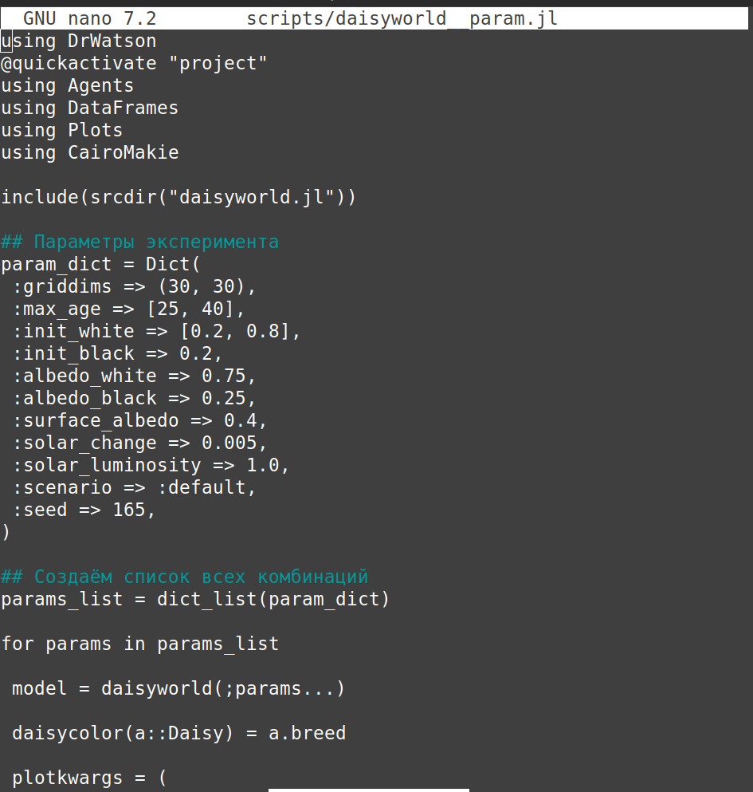{#fig-017 width=70%}

## Выполнение лабораторной работы

*Запустив моделирование с различными комбинациями максимального возраста и начального процента белых маргариток, мы можем увидеть, как эти параметры влияют на систему. Чем дольше живут маргаритки (`max_age = 40`), тем стабильнее и медленнее меняются узоры на сетке. Черные и белые ромашки остаются на месте дольше. Когда срок службы маргариток сокращается (`max_age = 25`), узоры становятся более динамичными, маргаритки постоянно отмирают и их заменяют. Начальный процент также имеет значение на ранней стадии, если мы начнем с преимущественно белых маргариток (`init_white = 0,8`), планета станет прохладнее; если мы начнем с преимущественно черных ромашек (`init_white = 0.2`), то получится теплее. Но вот что интересно: независимо от того, какие параметры мы используем, к тому времени, когда мы дойдем до 40 шагов, все симуляции достигнут одинакового равновесия. Черные и белые маргаритки располагаются чередующимися участками, а температура остается в пределах допустимой для жизни.*

## Выполнение лабораторной работы

Запустив файл и посмотрев на результаты, я преобразовала его в литературный стиль([рис. @fig-018])

## Выполнение лабораторной работы

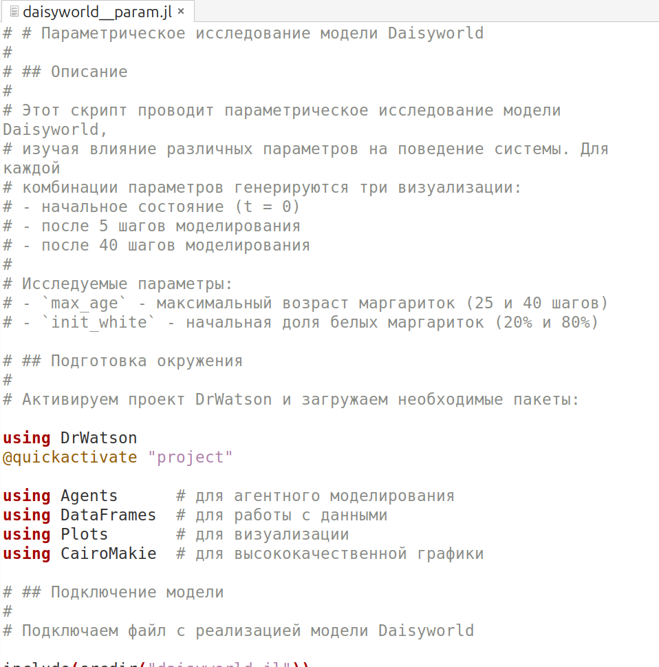{#fig-018 width=70%}

## Выполнение лабораторной работы

Я генерирую следующие файлы из литературного кода: чистый код, jupyter notebook и документация в формате Quarto. После этого я проверяю, чтобы убедиться, что все ячейки в файле jupyter notebook работают без ошибок([рис. @fig-019])

## Выполнение лабораторной работы

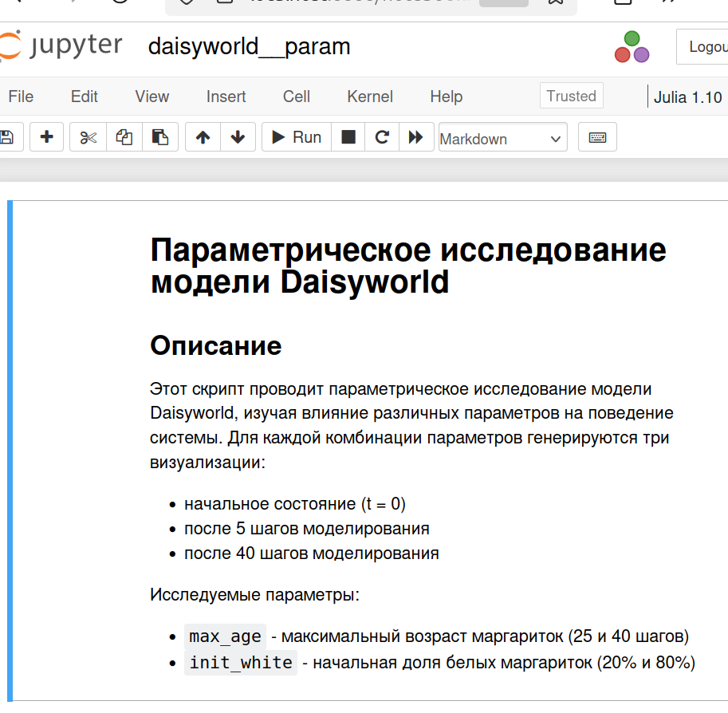{#fig-019 width=70%}

## Выполнение лабораторной работы

Я создала файл scripts/daisyworld-count__param.jl и скопировала скрипт код, который мне дали и запускала его. Этот скрипт выполняет параметрическое исследование динамики популяции он запускает моделирование Daisyworld в течение 1000 шагов с различными комбинациями параметров и сохраняет графики популяции для каждого из них([рис. @fig-020])

## Выполнение лабораторной работы

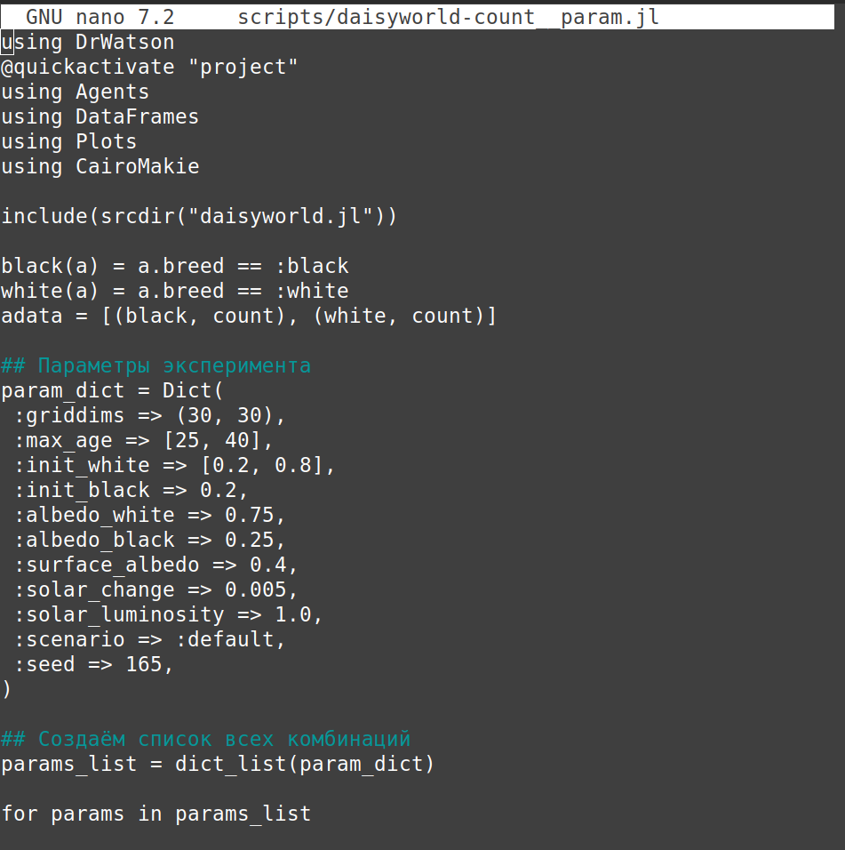{#fig-020 width=70%}

## Выполнение лабораторной работы

*Рассматривая четыре графика рядом, мы можем видеть, как максимальный возраст и начальные условия влияют на популяционные циклы. Когда маргаритки живут дольше ("максимальный возраст = 40"), подъемы и спады происходят медленнее и плавнее линии на графике становятся шире и более изящными. Когда продолжительность жизни маргариток сокращается (`max_age = 25`), колебания становятся более быстрыми и неустойчивыми, а популяции быстрее меняют направление. Начальный процент в основном влияет на начало графика, если мы начинаем с большего количества белых ромашек (`init_white = 0.8`), белая линия начинается выше, а черная ниже, и наоборот. После нескольких сотен шагов все четыре графика начинают выглядеть довольно похоже. Все они следуют одному и тому же ритму, в котором черные и белые ромашки по очереди становятся все более многочисленными*

## Выполнение лабораторной работы

Запустив файл и посмотрев на результаты, я преобразовала его в литературный стиль([рис. @fig-021])

## Выполнение лабораторной работы

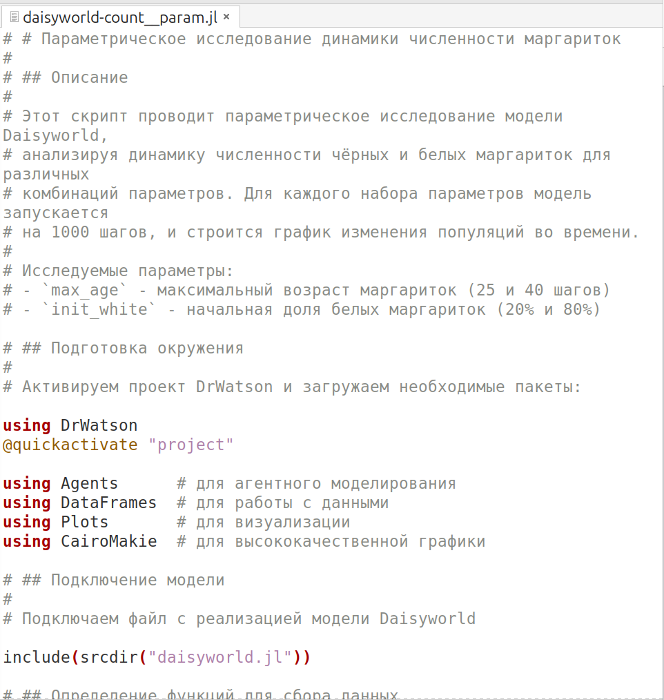{#fig-021 width=70%}

## Выполнение лабораторной работы

Я генерирую следующие файлы из литературного кода: чистый код, jupyter notebook и документация в формате Quarto. После этого я проверяю, чтобы убедиться, что все ячейки в файле jupyter notebook работают без ошибок([рис. @fig-022])

## Выполнение лабораторной работы

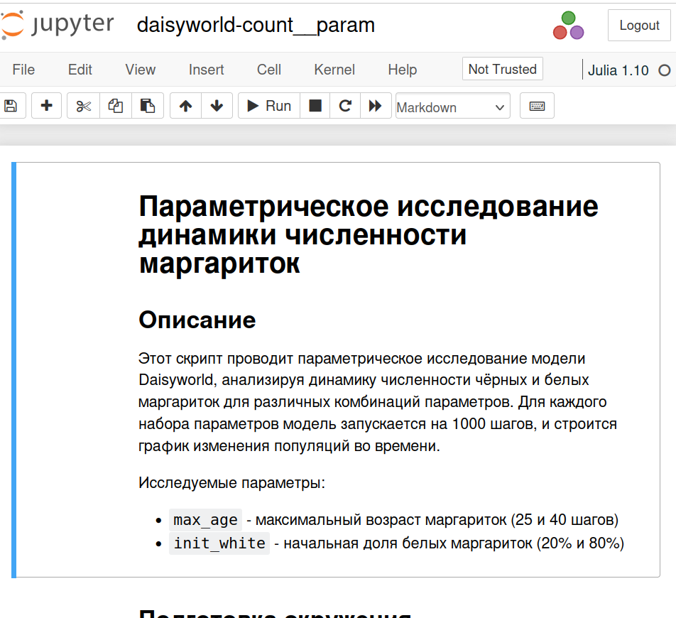{#fig-022 width=70%}

## Выполнение лабораторной работы

Я создала файл scripts/daisyworld-luminosity__param.jl и скопировала скрипт код, который мне дали и запускала его. Этот скрипт выполняет параметрическое исследование Daisyworld по сценарию :ramp он запускает моделирование с различными комбинациями параметров, в то время как яркость солнца увеличивается, а затем уменьшается:([рис. @fig-023])

## Выполнение лабораторной работы

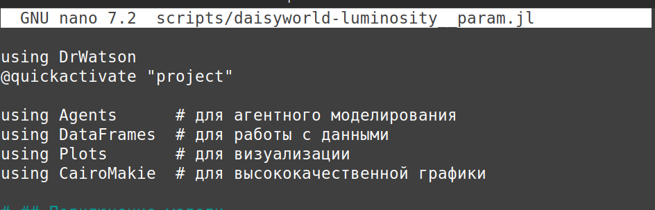{#fig-023 width=70%}

## Выполнение лабораторной работы

*Эти четыре графика показывают, что происходит, когда мы меняем продолжительность жизни маргариток и количество цветов каждого вида, а также время восхода и захода солнца.  Нижняя панель на каждом графике показывает яркость солнца, которая во всех экспериментах изменяется по одной и той же схеме: она повышается, некоторое время остается высокой, а затем снова снижается. Средняя панель показывает температуру, а верхняя - численность маргариток. Что действительно здорово, так это то, что независимо от того, какие параметры мы используем, температура (средняя панель) всегда остается более стабильной, чем можно было бы ожидать, учитывая, насколько сильно меняется температура на солнце. Когда солнце становится ярче, белых маргариток (синяя линия) становится больше, чтобы охладить обстановку; когда солнце становится тусклее, черных маргариток (красная линия) становится больше, чтобы согреть обстановку. Посмотрите на различия между графиками: когда маргаритки живут дольше (`max_age = 40`), температурная линия более плавная, а изменения численности более постепенные; когда маргаритки живут короче (`max_age = 25`), все реагирует быстрее, а линии более нервные. Начальный процент в основном влияет на начало, но через некоторое время все графики начинают выглядеть одинаково. Это говорит нам о том, что саморегуляция Daisyworld работает, несмотря ни на что*

## Выполнение лабораторной работы

Запустив файл и посмотрев на результаты, я преобразовала его в литературный стиль([рис. @fig-024])

## Выполнение лабораторной работы

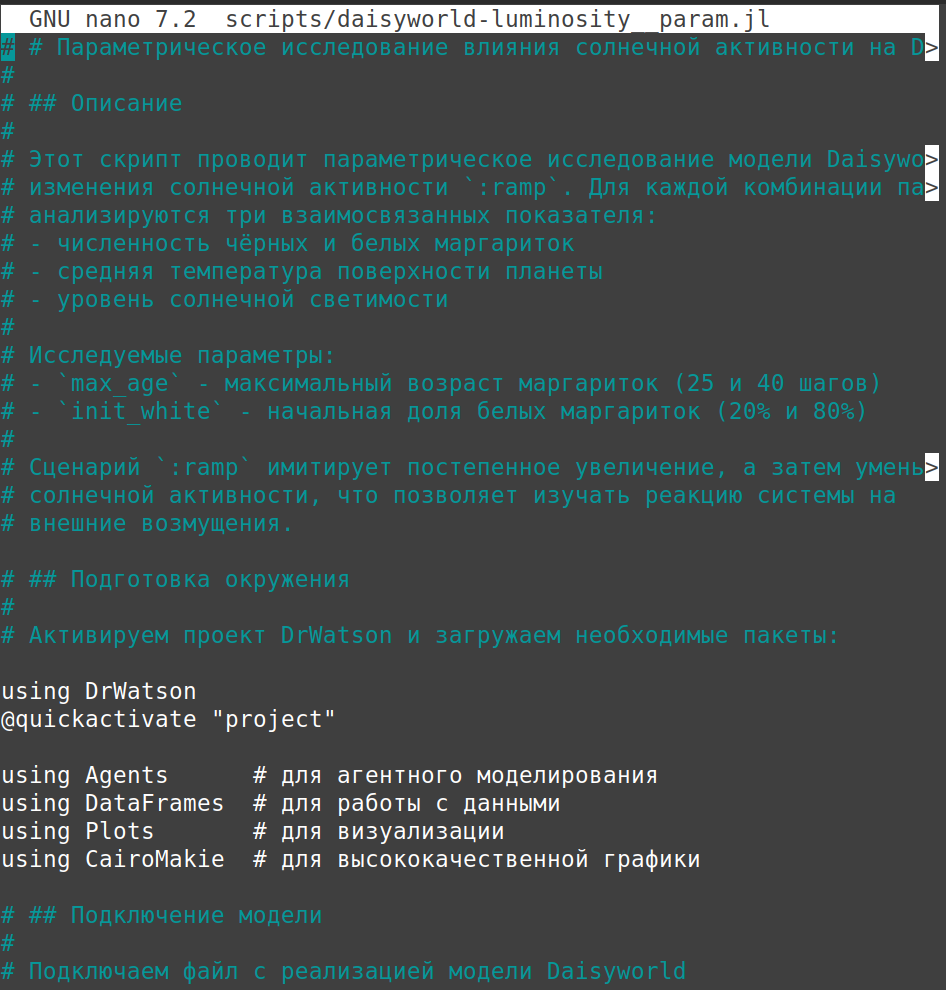{#fig-024 width=70%}

## Выполнение лабораторной работы

Я генерирую следующие файлы из литературного кода: чистый код, jupyter notebook и документация в формате Quarto. После этого я проверяю, чтобы убедиться, что все ячейки в файле jupyter notebook работают без ошибок([рис. @fig-025])

## Выполнение лабораторной работы

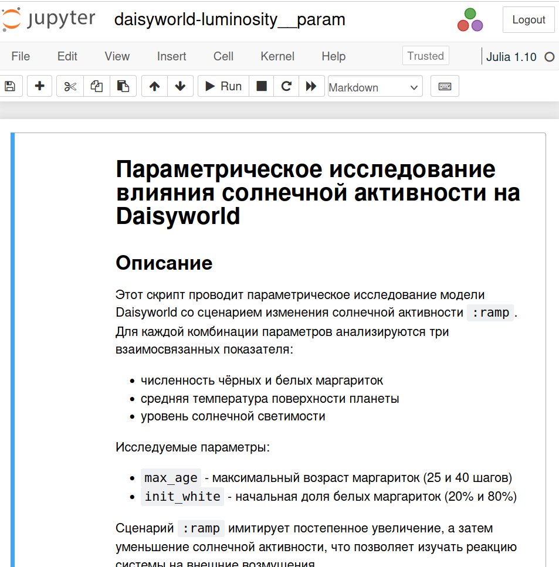{#fig-025 width=70%}

## Выводы

Выполнив эту лабораторную работу, я использовала агентную модель для моделирования daisyworld.
