---
## Author
author:
  name: Нджову Нелиа
  degrees: DSc
  orcid: 0000-0002-0877-7063
  email: 1032239033@rudn.ru
  affiliation:
    - name: Российский университет дружбы народов
      country: Российская Федерация
      postal-code: 117198
      city: Москва
      address: ул. Миклухо-Маклая, д. 15

## Title
title: "Отчёта по лабораторной работе 4"
subtitle: "Иммитационное моделирование"
license: "CC BY"

format:
  pdf:
    fig-format: png
    keep-tex: false
    latex-engine: xelatex
    latex-engine-opts:
      - "-shell-escape"
---

```{julia}
#| echo: false
#| include: false
using Pkg
Pkg.activate("/home/nelianjovu/work/study/2026-1/2026-1==study--simulationmod/2026-1--study--simulationmod/labs/lab04/project")
```
```{julia}
#| echo: false
#| include: false
using Plots
gr(fmt=:png)
ENV["GKSwstype"] = "100"
default(fmt=:png)
```

# Цель работы

Цель этой лабораторной работы использовать агентную модель для моделирования SIR модель.

# Задание

1. Базовый уровень

— Запустите модель с параметрами по умолчанию.
— Постройте график динамики численности S, I, R.
— Определите базовое репродуктивное число $R_0$ по формуле $R_0 = \frac{\beta}{\gamma}$, где $\gamma = \frac{1}{infection_period}$.
— Сравните с наблюдаемой динамикой.

2. Исследование порога

— Найдите минимальное значение $\beta$, при котором возникает эпидемия (пик I > 5% популяции).
— Сравните с теоретическим порогом $R_0 = 1.$.

3. Эффект гетерогенности

— Задайте разные значения $\beta$ для разных городов.
— Как это влияет на общую динамику?
— Постройте графики для каждого города отдельно.

4. Миграция

— Исследуйте влияние интенсивности миграции на скорость распространения инфекции из одного города в другие.
— При какой интенсивности время до пика минимально?

5. Карантинные меры
— Модифицируйте модель, добавив возможность закрытия города (обнуление миграции из него) при превышении порога заболеваемости.
— Оцените эффективность такой меры.

6. Оптимизация
— Используя оптимизацию, найдите параметры, которые минимизируют общее число умерших при сохранении пика заболеваемости ниже 30%.

# Теоретическое введение

Создадим агентную модель распространения инфекционного заболевания на основе классической компартментальной модели SIR (Susceptible-Infectious-Recovered). Модель будет реализована с использованием пакета Agents.jl. В отличие от классической модели на дифференциальных уравнениях, агентный подход позволит учесть индивидуальные характеристики, пространственную структуру и стохастичность процессов.

## Классическая модель SIR

Модель SIR, предложенная Кермаком и Маккендриком в 1927 году, описывает динамику эпидемии в популяции, разделённой на три группы:

— S (Susceptible) — восприимчивые к заболеванию индивиды;
— I (Infectious) — инфицированные, способные заражать восприимчивых;
— R (Recovered) — выздоровевшие (или умершие), получившие иммунитет и более не участвующие в распространении.

Классическая модель описывается системой обыкновенных дифференциальных уравнений:

$$
\frac{ds}{dt} = \frac{\beta*S*I}{N},
\frac{dI}{dt} = \frac{\beta*S*I}{N - \gamma*I},
\frac{dR}{dt} = \gamma*I
$$

где $\beta$ — коэффициент передачи инфекции, $\gamma$ — скорость выздоровления.

Ограничения классического подхода: Однородность популяции, Отсутствие пространственной структуры, Детерминированность и Непрерывность 

Преимущества агентного подхода: Агентное моделирование позволяет преодолеть эти ограничения:

— Каждый индивид моделируется отдельно с уникальными характеристиками.
— Взаимодействия происходят локально в пространстве или социальной сети.
— Процессы носят стохастический характер.
— Можно учитывать гетерогенность контактов, мобильность, меры контроля.

## Агенты

Каждый агент — человек, обладающий следующими свойствами:

— status::Symbol — состояние (:S, :I, :R);
— days_infected::Int — количество дней с момента заражения (для инфицированных).

## Пространство состояний

Агенты размещаются на графе, где узлы представляют локации (города, районы), а рёбра — возможные перемещения между ними. Такой подход позволяет моделировать метапопуляционную динамику и миграцию.

## Параметры модели

— Ns — вектор численности населения по локациям;
— β_und — вероятность передачи для невыявленных случаев;
— β_det — вероятность передачи для выявленных случаев;
— infection_period — длительность заболевания (дней);
— detection_time — время до выявления заболевания;
— death_rate — вероятность летального исхода;
— reinfection_probability — вероятность повторного заражения;
— migration_rates — матрица вероятностей миграции между локациями.

## Динамика

На каждом шаге (соответствует одному дню) для каждого агента выполняются следующие процессы:

— Миграция — агент может переместиться в другую локацию с вероятностью, заданной матрицей migration_rates.
— Передача инфекции — если агент инфицирован, он может заразить восприимчивых агентов в той же локации. Количество заражённых за день определяется пуассоновским процессом с интенсивностью, зависящей от статуса выявления ($\beta$_und или $\beta$_det).
— Обновление счётчика — для инфицированных увеличивается days_infected.
— Выздоровление или смерть — если days_infected достиг infection_period, агент либо выздоравливает (переходит в R), либо умирает (удаляется из модели) с вероятностью death_rate. Выздоровевшие могут быть повторно инфицированы с вероятностью reinfection_probability.

# Выполнение лабораторной работы

Я создала файл sir_model.jl и копировала в него скрипт из лабораторного руководства. скрипт определяет основную модель SIR (агенты, распространение болезней, миграция, выздоровление и смерть), которую все сценарии эксперимента используют в качестве механизма моделирования. Я запускаю его, и все работает идеально(рис.1).

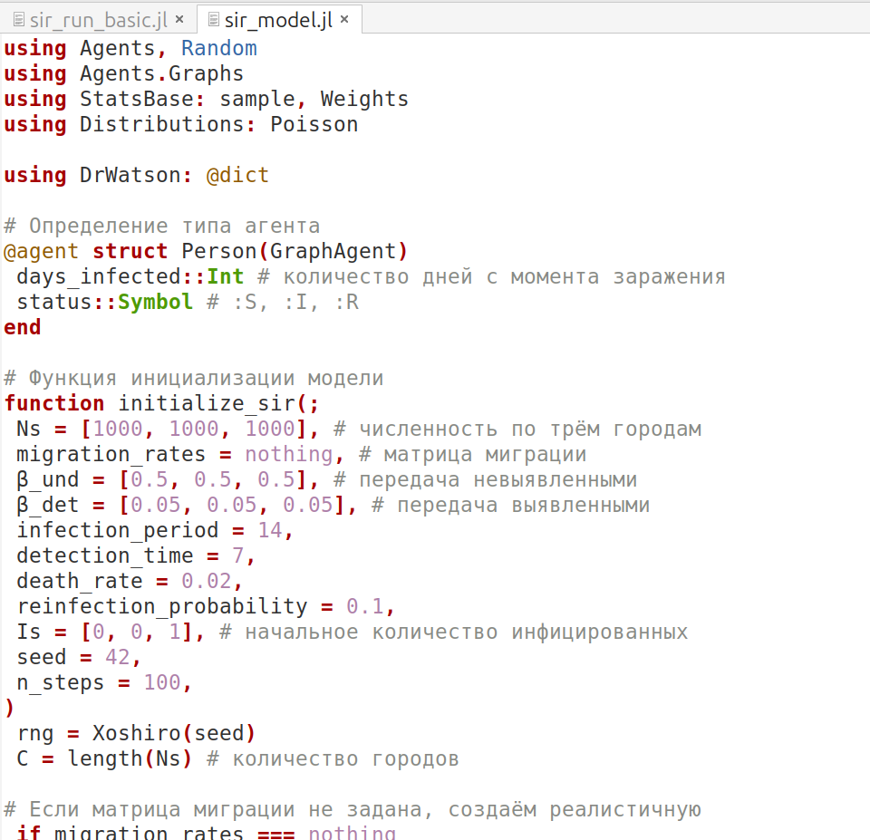{#fig-001 width=70%}

## 1. Базовый уровень

Я создала файл sir_run_basic.jl и копирую в него скрипт из лабораторного руководства. Скрипт запускает один эксперимент с фиксированными параметрами (по умолчанию) и сохраняет динамику численности агентов. Это служит для проверки работоспособности модели и получения базового понимания эпидемического процесса.(рис.2)

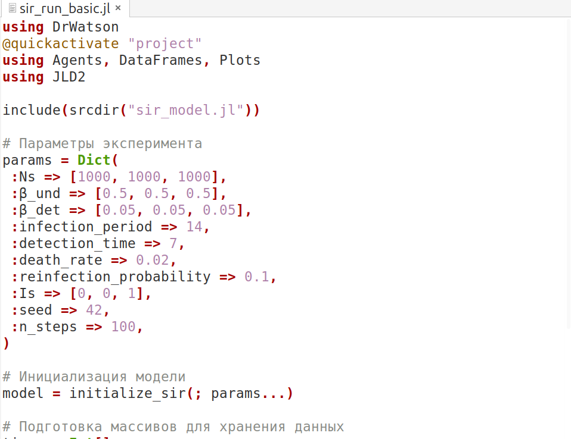{#fig-002 width=70%}

Я преобразую код в литературный стиль(рис.3)

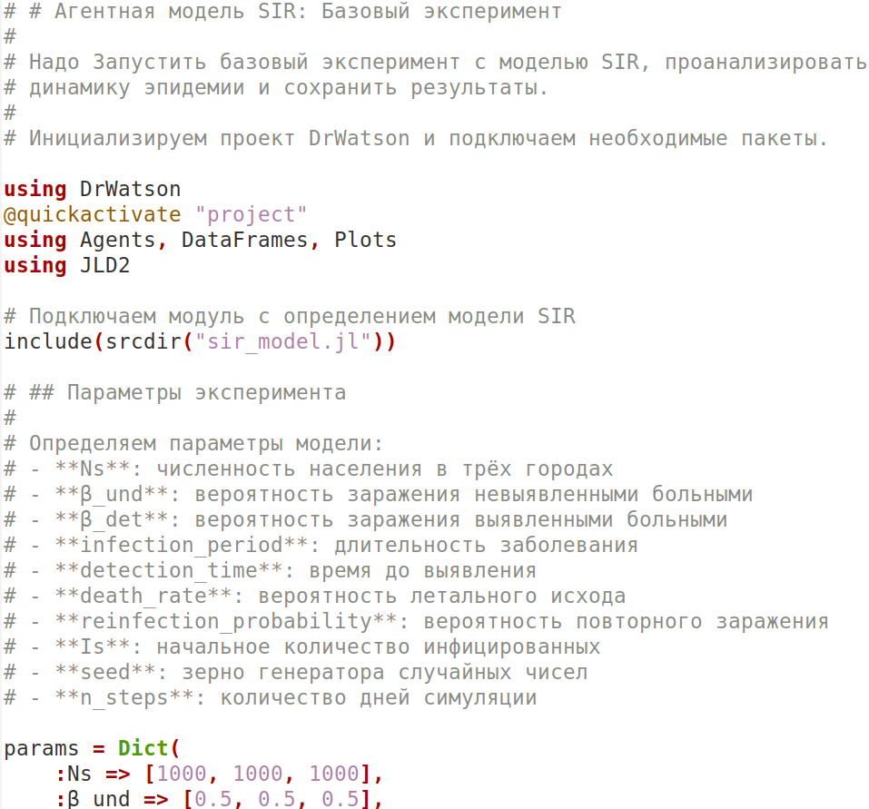{#fig-003 width=70%}

Я запустила его, и все заработало, я получила график ниже. На графике мы можем видеть, как работает модель sir: сначала инфицированных людей нет, но с течением времени заболевает все больше и больше людей, пока все они не будут инфицированы, некоторые не вылечатся, а другие не умрут(рис.4)

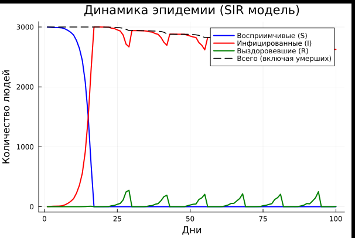{#fig-004 width=70%}

После этого я создала текст на основе литературного кода: чистого кода, записной книжки jupyter и документации в формате Quarto. Я запускала все ячейки в файле jupyter notebook, и все работает хорошо(рис.5)

{#fig-005 width=70%}

***Ниже приведен код, результаты расчетов и графики для кода в файле scripts/sir_run_basic.jl.qmd***



Я добавляю код для определения базового репродуктивного числа $R_0$ по формуле $R_0 = \frac{\beta}{\gamma}$, где $\gamma = {1}{infection_period}$(рис.6)

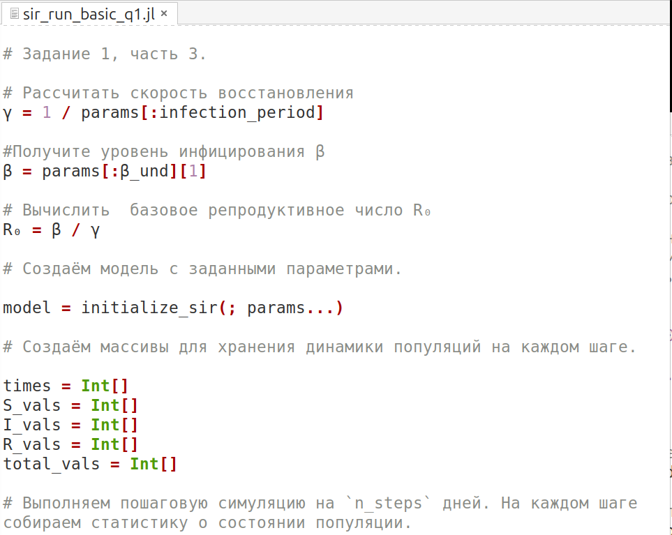{#fig-006 width=70%}

Результат для базового репродуктивного числа $R_0$ равен 7,0. Это означает, что один инфицированный человек заразит в среднем еще 7 человек из полностью восприимчивой популяции(рис.7)

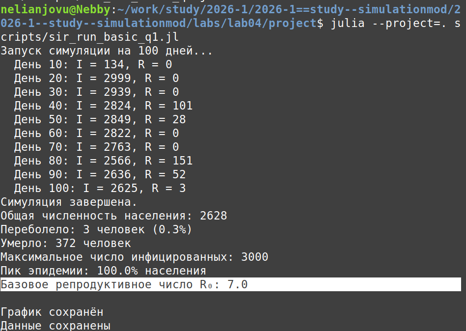{#fig-006 width=70%}

После этого я создала текст на основе литературного кода: чистого кода, записной книжки jupyter и документации в формате Quarto. Я запускала все ячейки в файле jupyter notebook, и все работает хорошо(рис.8)

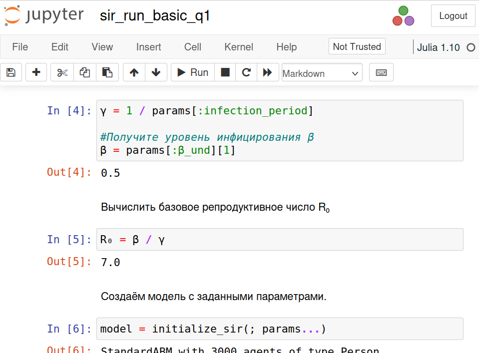{#fig-008 width=70%}

***Ниже приведен код, результаты расчетов и графики для кода в файле scripts/sir_run_basic_q1.jl.qmd***



Наблюдаемая динамика соответствует теоретическим ожиданиям. R₀ = 7 > 1 предсказывает крупную эпидемию, и моделирование показывает, что заражается почти все население. Пик эпидемии наступает быстро (17 дней), что характерно для высококонтагиозных заболеваний(рис.9)

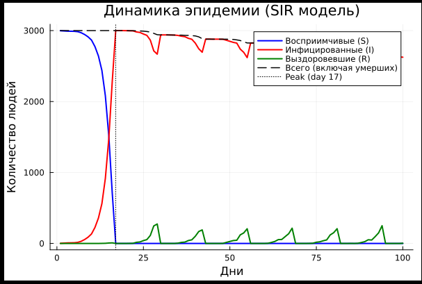{#fig-008 width=70%}

## 2. Исследование порога

Я создала файл sir_scan_beta.jl и копирую в него скрипт из лабораторного руководства. Скрипт исследует, как изменение базовой заразности ($\beta$_und и пропорционально $\beta$_det) влияет на эпидемические показатели: пик заболеваемости, долю переболевших, число умерших. Выполняется параметрическое сканирование с несколькими повторными прогонами для учёта стохастичности(рис.9)

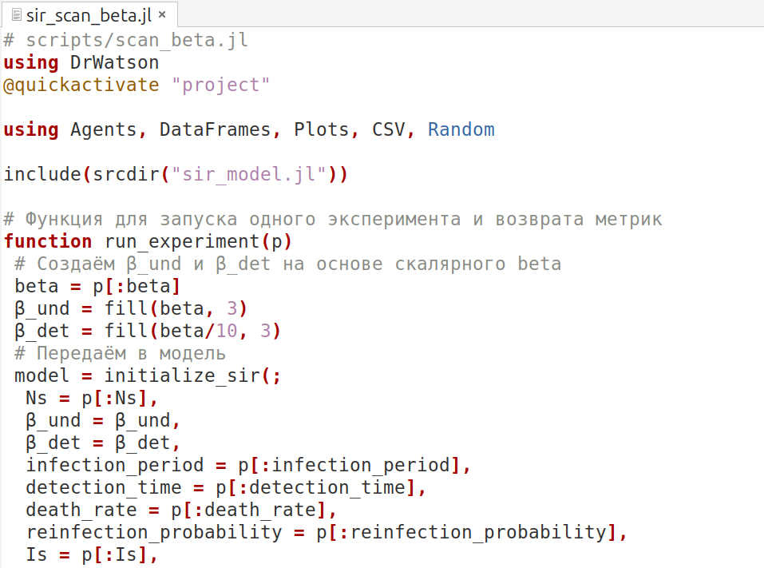{#fig-009 width=70%}

Я преобразую код в литературный стиль(рис.10)

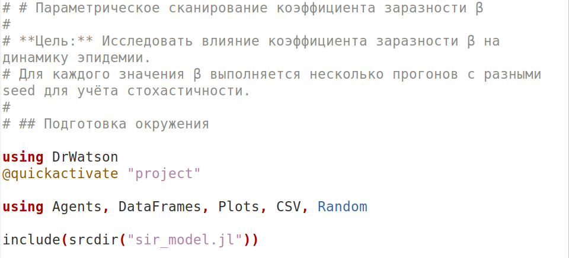{#fig-010 width=70%}

Я запустила его, и все заработало, я получила график ниже.На графике мы видим, что чем выше $\gamma$ (уровень инфицирования), тем больше людей заболевает и тем больше людей умирает.(рис.11)

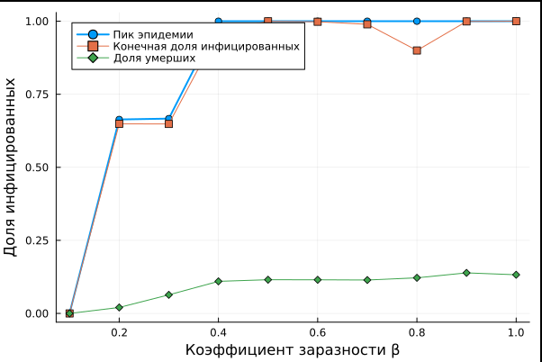{#fig-011 width=70%}

После этого я создала текст на основе литературного кода: чистого кода, записной книжки jupyter и документации в формате Quarto. Я запускала все ячейки в файле jupyter notebook, и все работает хорошо(рис.12)

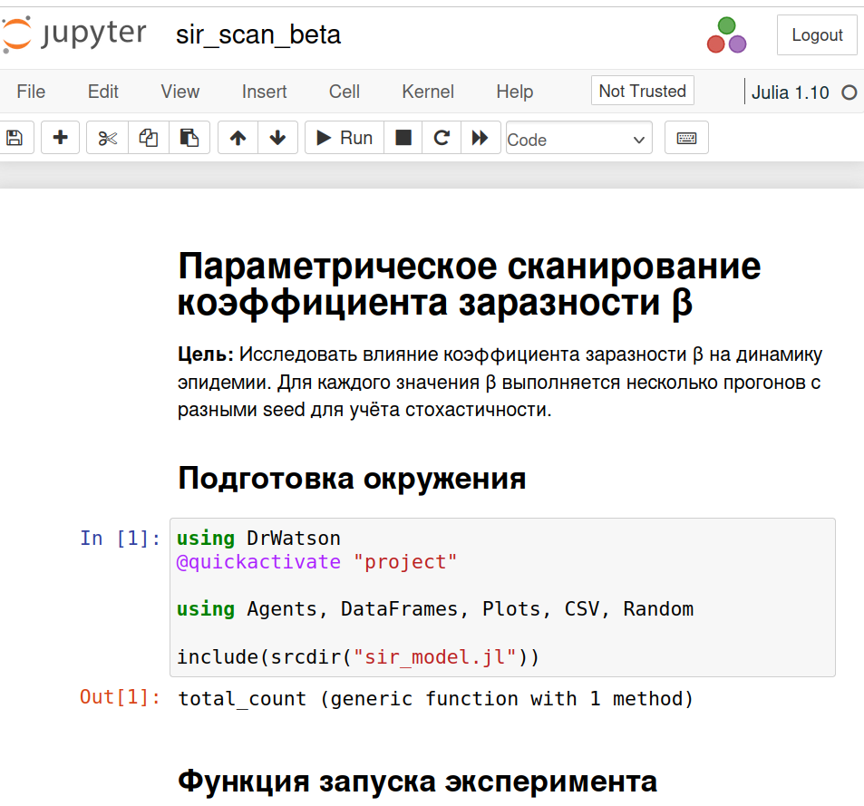{#fig-012 width=70%}

***Ниже приведен код, результаты расчетов и графики для кода в файле scripts/sir_scan_beta.jl.qmd***



Я добавляю код, чтобы найти минимальное значение $\beta$, при котором возникает эпидемия (пик I > 5% населения)(рис.13)

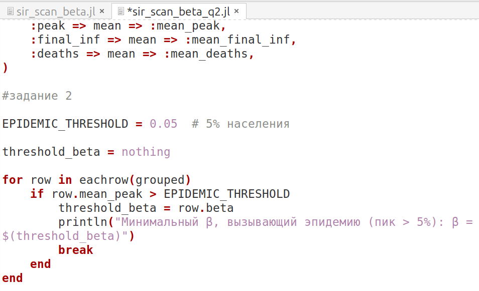{#fig-013 width=70%}

Теоретический порог ($\beta$ = 0,071) ниже, чем то, что показывает моделирование ($\beta$ ≈ 0,2). Это связано с тем, что: Стохастические эффекты (случайный шанс) - при первичном заражении только 1 человека инфекция может прекратиться, даже если r₀ > 1. Небольшое население (3000 человек) - дискретные эффекты имеют значение. Пространственная структура - 3 города, заражение начинается только в 1 городе. Таким образом, моделирование показывает более высокий эффективный порог, чем предсказывает математическая теория.(рис.14)

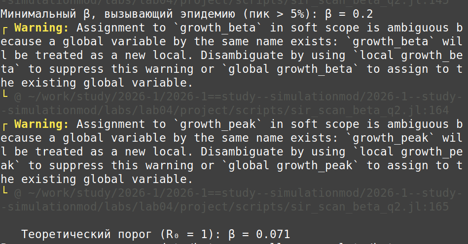{#fig-013 width=70%}

После этого я создала текст на основе литературного кода: чистого кода, записной книжки jupyter и документации в формате Quarto. Я запускала все ячейки в файле jupyter notebook, и все работает хорошо(рис.15)

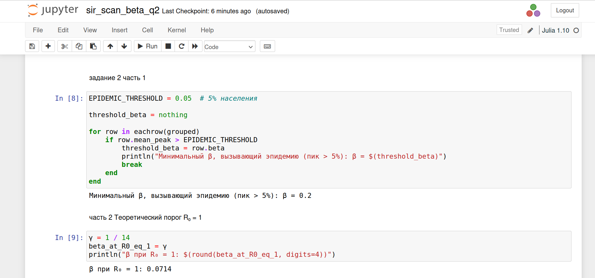{#fig-015 width=70%}

***Ниже приведен код, результаты расчетов и графики для кода в файле scripts/sir_scan_beta_q2.jl.qmd***



## 3. Эффект гетерогенности

Я установила разные значения для $\beta$ для разных городов(рис.16)

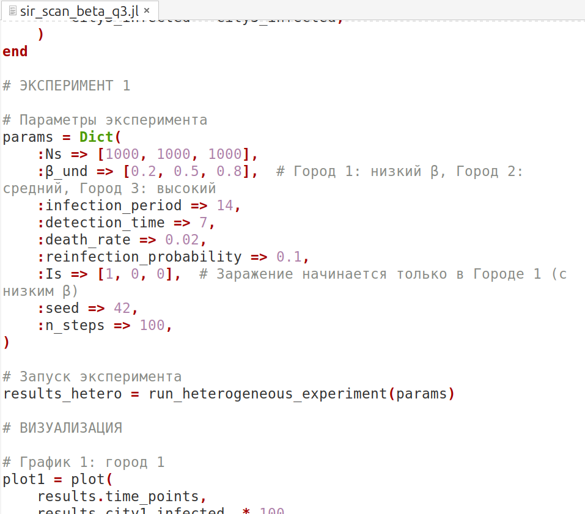{#fig-016 width=70%}

Неоднородность $\beta$ влияет на скорость распространения эпидемии. Когда заражение начинается в городе с высоким $\beta$ (0,8), эпидемия распространяется быстрее: пик приходится на 15-16-й день, а город с высоким $\beta$ достигает максимума раньше других. Когда инфекция начинается в городе с низким $\beta$ (0,2), распространение замедляется: все города достигают пика одновременно только на 23-й день. Таким образом, чем выше $\beta$ в городе, где начинается инфекция, тем быстрее эпидемия охватывает все население(рис.17;18;19;20;21 и 22)

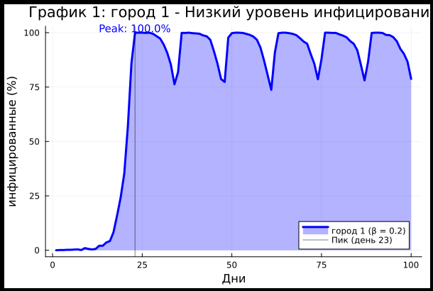{#fig-017 width=70%}

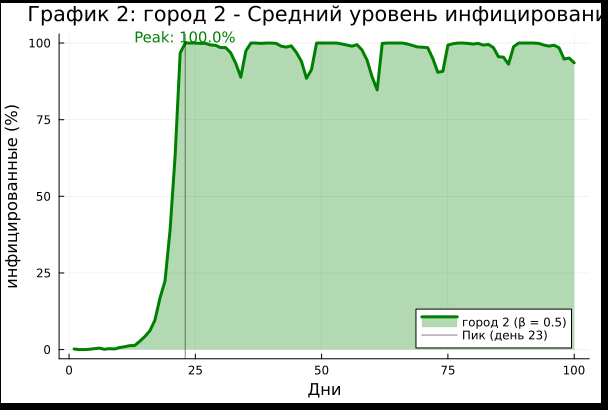{#fig-018 width=70%}

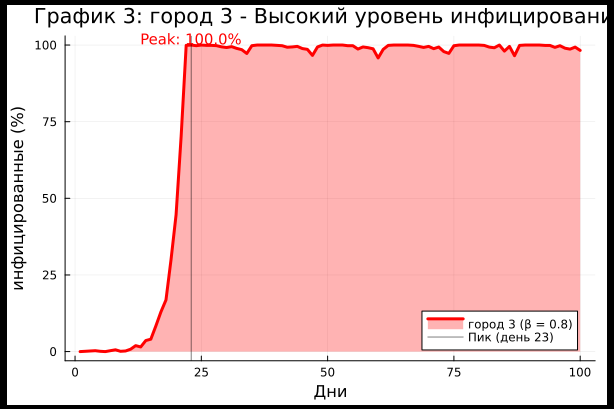{#fig-019 width=70%}

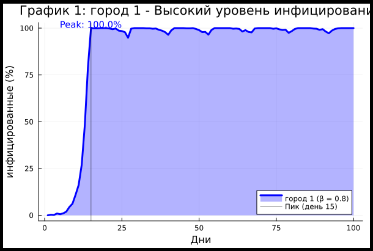{#fig-020 width=70%}

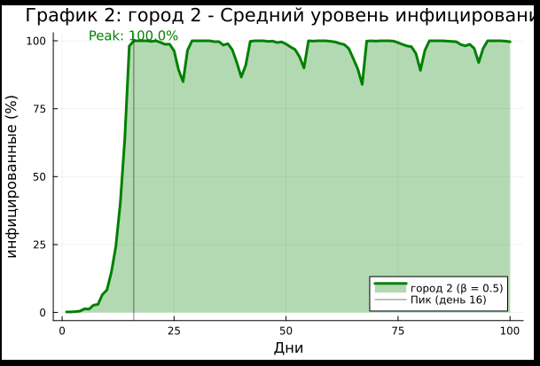{#fig-021 width=70%}

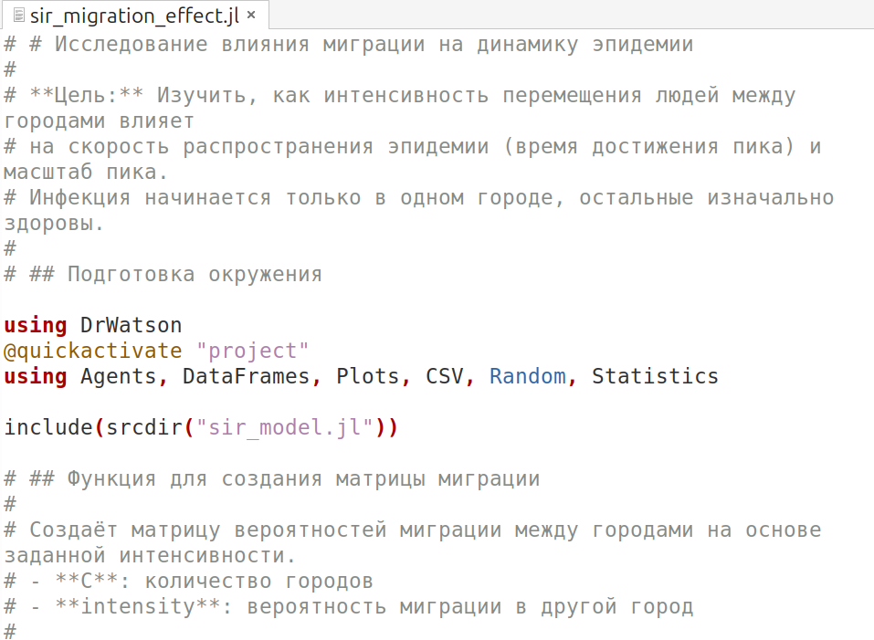{#fig-022 width=70%}

***Ниже приведен код, результаты расчетов и графики для кода в файле scripts/sir_scan_beta_q3.jl.qmd***



## 4. Миграция

Я создала файл sir_migration_effect.jl и копирую в него скрипт из лабораторного руководства. Скрипт исследует, как интенсивность перемещения людей между городами влияет на скорость распространения эпидемии (время достижения пика) и масштаб пика. Инфекция начинается только в одном городе, остальные изначально здоровы. Я преобразовала код в литературный стиль(рис.23)

{#fig-023 width=70%}

Я запустила его, и все заработало, я получила график ниже.На графике мы видим, что по мере увеличения миграции между городами эпидемия быстрее достигает своего пика и число заболевших на пике растет. Это показывает, что мобильность ускоряет распространение болезни.(рис.24)

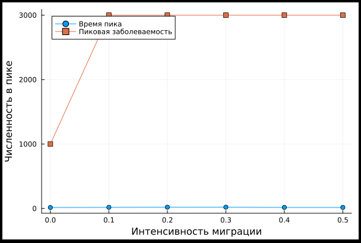{#fig-024 width=70%}

После этого я создала текст на основе литературного кода: чистого кода, записной книжки jupyter и документации в формате Quarto. Я запускала все ячейки в файле jupyter notebook, и все работает хорошо(рис.25)

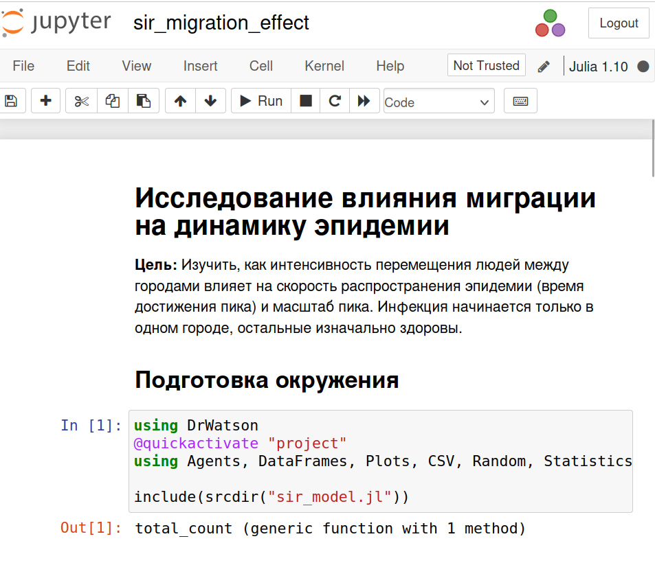{#fig-025 width=70%}

***Ниже приведен код, результаты расчетов и графики для кода в файле scripts/sir_migration_effect.jl.qmd***



При отсутствии миграции (0,0) пик заболеваемости наступает рано, но заболевает только 33,3% населения (только жители того города, где началось заражение).  При высокой миграции (0,5) пик заболеваемости наступает несколько позже (17 против 15 дней), но заражается 100% населения(рис.26)

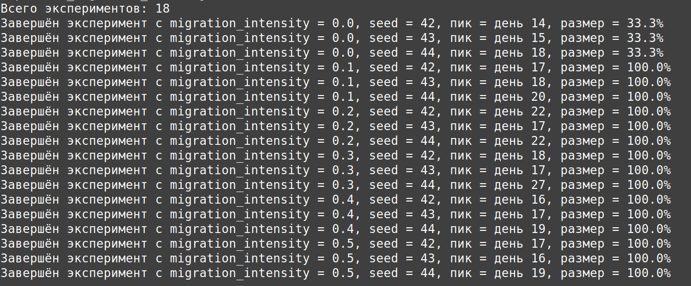{#fig-026 width=70%}

## 5. Карантинные меры

Я модифицирую модель, добавляя возможность закрытия города (сброса миграции из него) при превышении порога заболеваемости(рис.27)

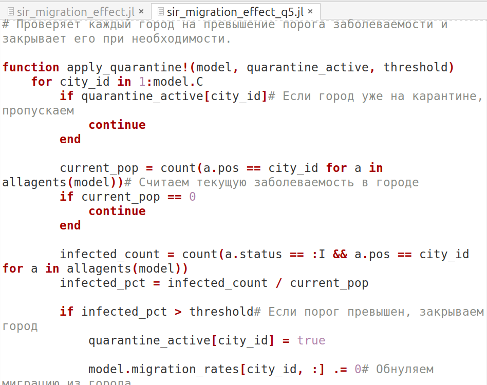{#fig-027 width=70%}

Глядя на график, мы видим, что карантин в некоторых случаях немного задерживает пик (до +13 дней), но не уменьшает его размер (по-прежнему на 100%)(рис.28)

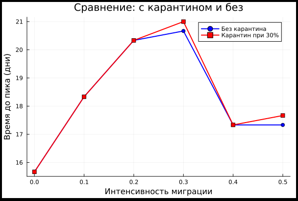{#fig-028 width=70%}

После этого я создала текст на основе литературного кода: чистого кода, записной книжки jupyter и документации в формате Quarto. Я запускала все ячейки в файле jupyter notebook, и все работает хорошо(рис.27)

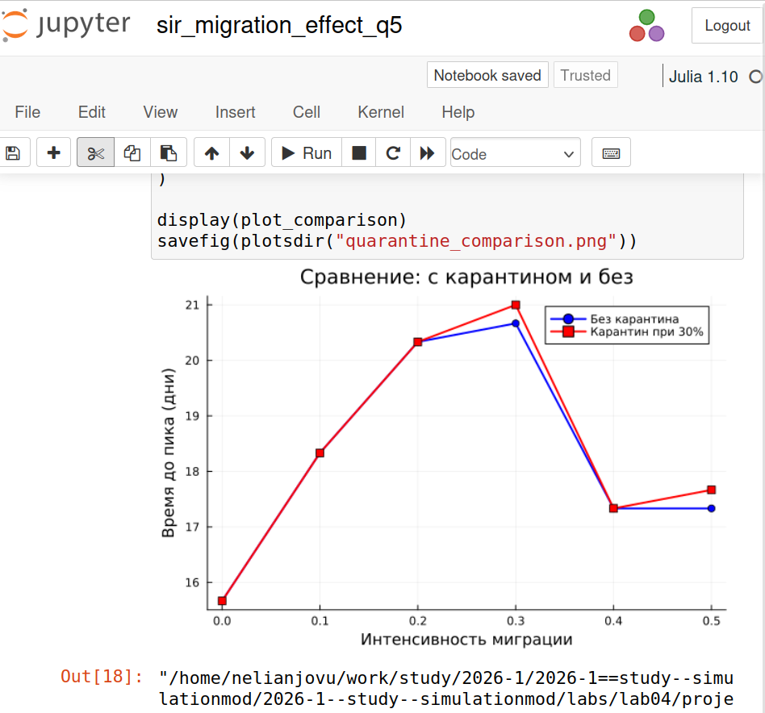{#fig-027 width=70%}

***Ниже приведен код, результаты расчетов и графики для кода в файле scripts/sir_migration_effect_q5.jl.qmd***



## 6. Оптимизация

Я создала файл sir_optimize_parameters.jl и копирую в него скрипт из лабораторного руководства. Скрипт Ищет оптимальные комбинации параметров, минимизирующие одновременно два критерия: пиковую заболеваемость и долю умерших. Использует эволюционный алгоритм (Borg MOEA) из пакета BlackBoxOptim.(рис.29)

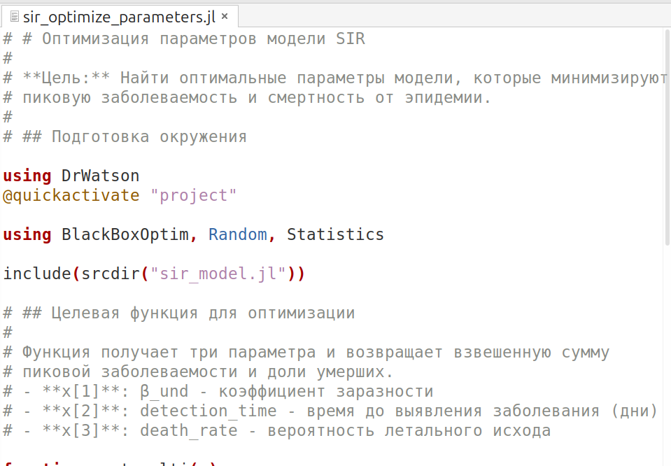{#fig-029 width=70%}

Я запустила его, и все заработало. Оптимальными параметрами, которые сводят к минимуму смертность при сохранении пиковой заболеваемости ниже 30%, являются: $\beta$ = 0,122 (низкая инфекционность, $R_0$ ≈ 1,7), время выявления = 7 дней и уровень смертности = 1,04%.  При таких параметрах пик эпидемии остается ниже 30%, а смертность приближается к 0%.(рис.30)

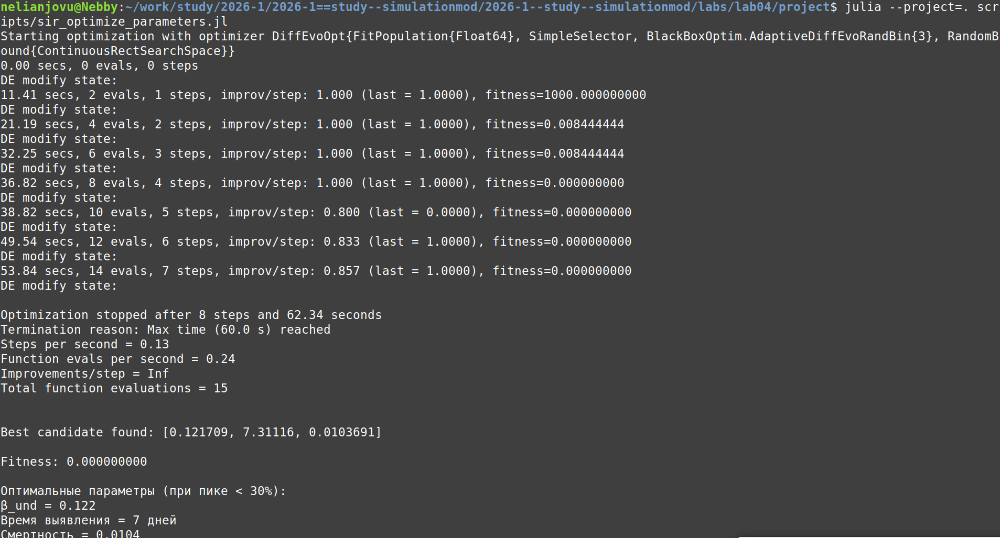{#fig-030 width=70%}

После этого я создала текст на основе литературного кода: чистого кода, записной книжки jupyter и документации в формате Quarto. Я запускала все ячейки в файле jupyter notebook, и все работает хорошо(рис.31)

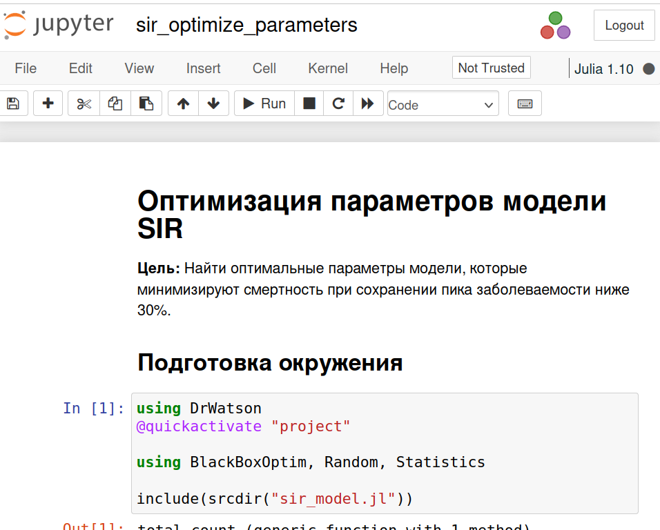{#fig-031 width=70%}

***Ниже приведен код, результаты расчетов и графики для кода в файле scripts/sir_optimize_parameters.jl.qmd***



## Результаты

Я создала файл sir_visualize_dynamics.jl и копирую в него скрипт из лабораторного руководства. Этот скрипт загружает результаты параметрического сканирования и строит единый составной график, объединяющий три панели: пик эпидемии и конечная доля инфицированных; число умерших; доля выздоровевших.(рис.32)

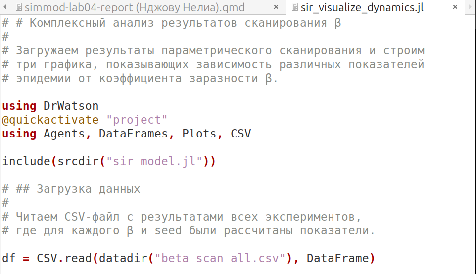{#fig-032 width=70%}

Я запустила его, и все заработало, я получила график ниже. График пиковой инфицированности в сравнении с $\beta$ показывает, сколько людей заболевает в самый неподходящий момент. График смертности в сравнении с $\beta$ показывает, сколько людей умирает. График окончательного выздоровления в сравнении с $\beta$ показывает, сколько людей выживают и приобретают иммунитет(рис.33)

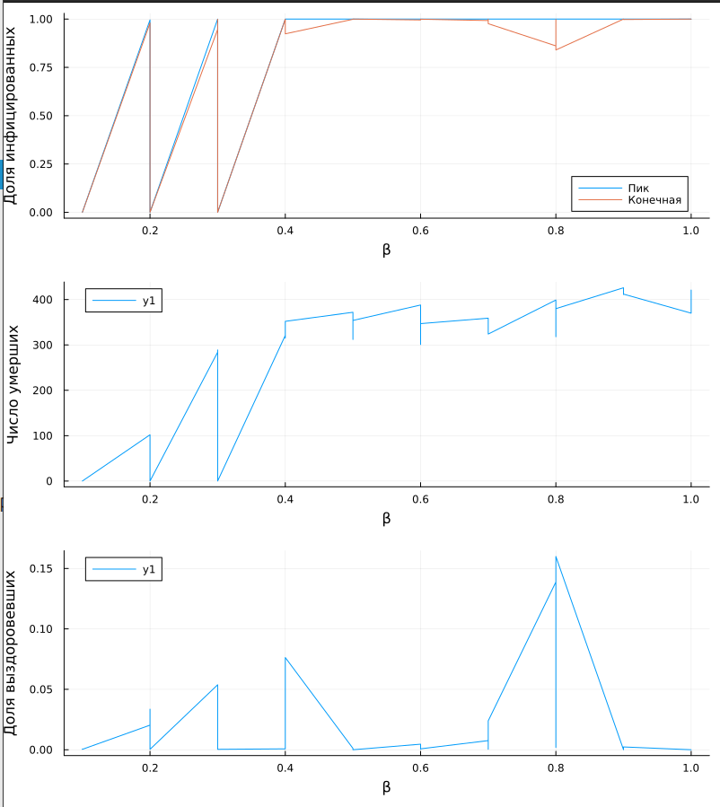{#fig-033 width=70%}

После этого я создала текст на основе литературного кода: чистого кода, записной книжки jupyter и документации в формате Quarto. Я запускала все ячейки в файле jupyter notebook, и все работает хорошо(рис.34)

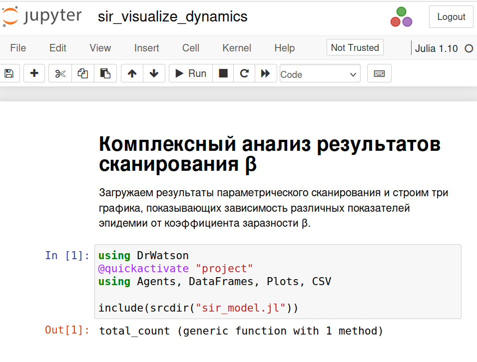{#fig-034 width=70%}

***Ниже приведен код, результаты расчетов и графики для кода в файле scripts/sir_visualize_dynamics.jl.qmd***



# Выводы

Выполнив эту лабораторную работу, я использовала агентную модель для моделирования SIR модель.Я провла несколько экспериментов, изменив параметры и окружающую среду
