---
author:
  name: Нджову Нелиа
  degrees: DSc
  orcid: 0000-0002-0877-7063
  email: 1032239033@rudn.ru
  affiliation:
    - name: Российский университет дружбы народов
      country: Российская Федерация
      postal-code: 117198
      city: Москва
      address: ул. Миклухо-Маклая, д.15

title: "Презентация по лабораторной работе 5"
subtitle: "Иммитационное моделирование"
license: "CC BY"
lang: ru

format:
  beamer: 
    pdf-engine: lualatex
    include-in-header: 
      - text: |
          \usepackage{fontspec}
          \setmainfont{DejaVu Serif}
          \setsansfont{DejaVu Sans}
          \setmonofont{DejaVu Sans Mono}
  revealjs: default
---

```{julia}
#| echo: false
#| include: false
using Pkg
Pkg.activate("/home/nelianjovu/work/study/2026-1/2026-1==study--simulationmod/2026-1--study--simulationmod/labs/lab03/project")
```

## Цель работы

Цель этой лабораторной работы - моделирования Аппарат сетей петри.

## Задание

1. Код модели

2. Базовые эксперименты

3. Анимация процесса

4. Итоговый отчёт

## Сети Петри

Сеть Петри есть математический аппарат для моделирования дискретных систем. в которых процессы происходят параллельно и асинхронно. Она позволяет выявлять такие проблемы, как взаимная блокировка (deadlock). Графически она представляется как двудольный ориентированный граф двух типов вершин:

- Позиции (Places) суть пассивные элементы, описывающие состояние системы. Внутри позиции могут находиться фишки (tokens, неотрицательное целое число, указывающее на количество ресурсов)

- Переходы (Transitions) суть активные элементы, описывающие события или действия системы. Они могут срабатывать, изменяя состояние модели.

- Дуги соединяют позиции с переходами и показывают, какие ресурсы нужны для события и какие появляются после него.

## Сети Петри

**Правило срабатывания перехода:** Переход может сработать, если каждая его входная позиция содержит хотя бы одну фишку. При срабатывании из входных позиций фишки удаляются, а в выходные добавляются. Этот процесс меняет маркировку сети, то есть её текущее состояние.

Сети Петри бывают детерминированными (описываются дифференциальными уравнениями) и стохастическими (используют алгоритм Гиллеспи, где время и выбор перехода определяются случайным образом).

## Задача «Обедающие философы»

Это классическая задача, иллюстрирующая проблему синхронизации в параллельных системах.

**Постановка задачи:** За круглым столом сидят N философов (обычно 5). Перед каждым тарелка с едой. Между каждыми двумя соседними философами лежит одна вилка. Всего вилок столько же, сколько философов.

**Правила:** Чтобы поесть, философу нужны две вилки — левая и правая. Если вилок нет, философ ждёт. Поев, философ кладёт вилки обратно и возвращается к размышлениям.

**Проблема взаимной блокировки (deadlock):** Если все философы одновременно возьмут левую вилку, то каждый будет держать одну вилку и ждать правую, которая занята соседом. В результате никто не может есть — система замирает. Это и есть deadlock.

**Решение (арбитр):** Чтобы предотвратить deadlock, вводится арбитр (официант), который разрешает есть не более чем N‑1 философам одновременно. Это гарантирует, что хотя бы один философ всегда сможет взять обе вилки, и система не блокируется.

## 1. Код модели

Я сначала создала файл src/DiningPhilosophers.jl.Потом скопировала заданный скрипт в него. Скрипт содержить основные функции модели. Я запускала и все работала хорошо(рис.1)

## 1. Код модели

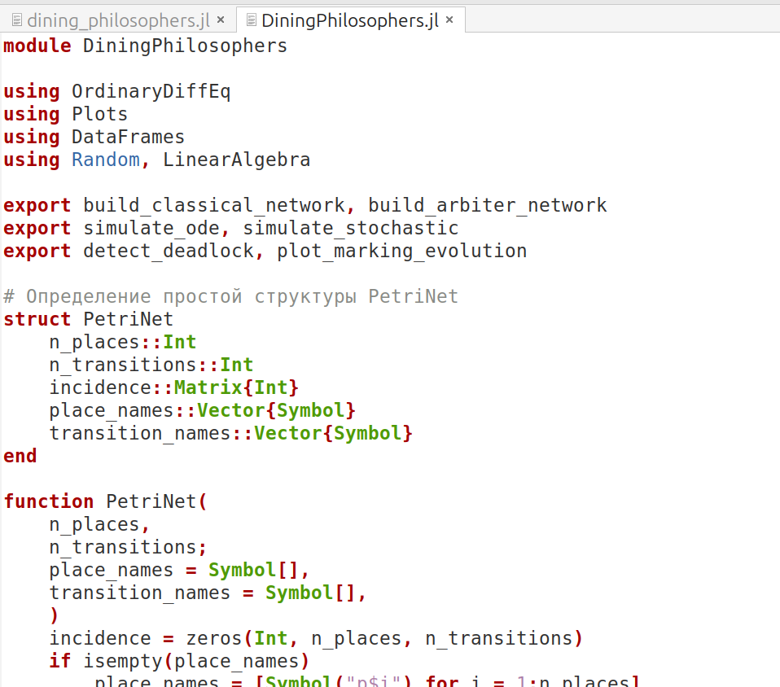{#fig-001 width=70%}

## 2. Базовые эксперименты

Я создала файл scripts/dining_philosophers.jl.Потом скопировала заданный скрипт в него. Скрипт выполняет основное моделирование и сравнение двух вариантов сети Петри: классическая модель (без арбитра), в которой возможна взаимная блокировка (deadlock). И модифицированная модель с арбитром, которая должна предотвращать deadlock. Я преобразавала код в литературный стиль и запускала.(рис.2)

## 2. Базовые эксперименты

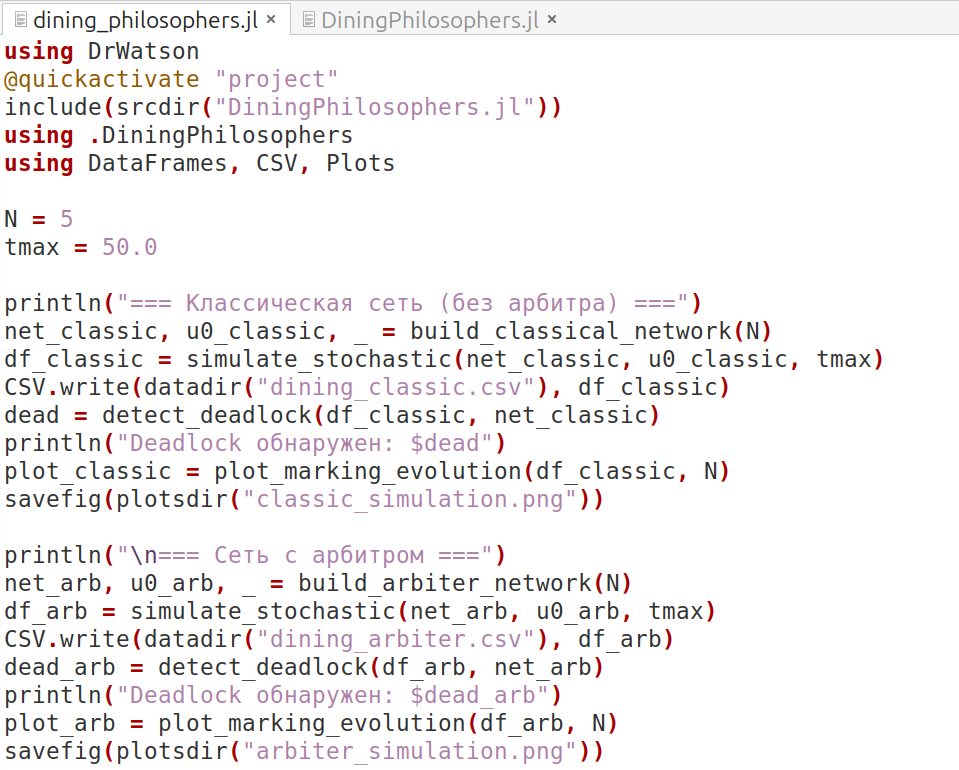{#fig-002 width=70%}

## 2. Базовые эксперименты

После запуск, я получила две графики classic_simulation.png и arbiter_simulation.png. Мы увидим четыре панели (Think, Hungry, Eat, Fork) с динамикой для каждого философа.В классическом симуляторе произошла взаимоблокировка, но в режиме арбитра этого не произошло(рис 3 и 4)

## 2. Базовые эксперименты

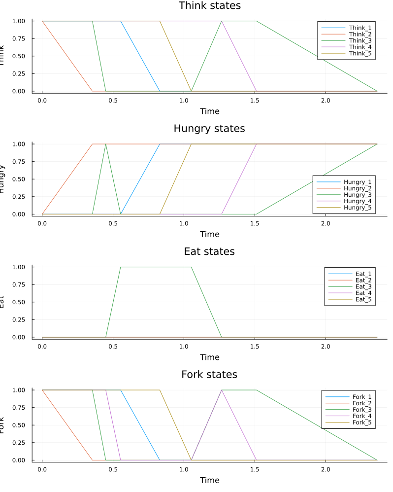{#fig-003 width=70%}

## 2. Базовые эксперименты

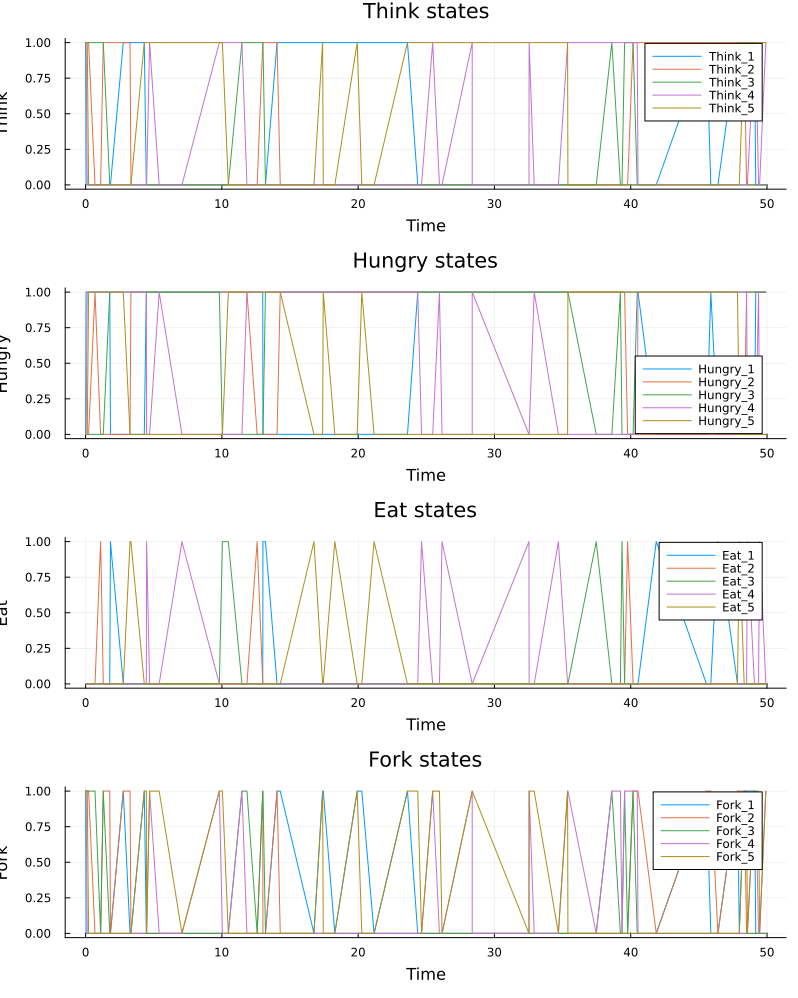{#fig-004 width=70%}

## 2. Базовые эксперименты

Я генерировала файл jupyter, запускала все ячейки и всё работал хорошо.(рис.5)

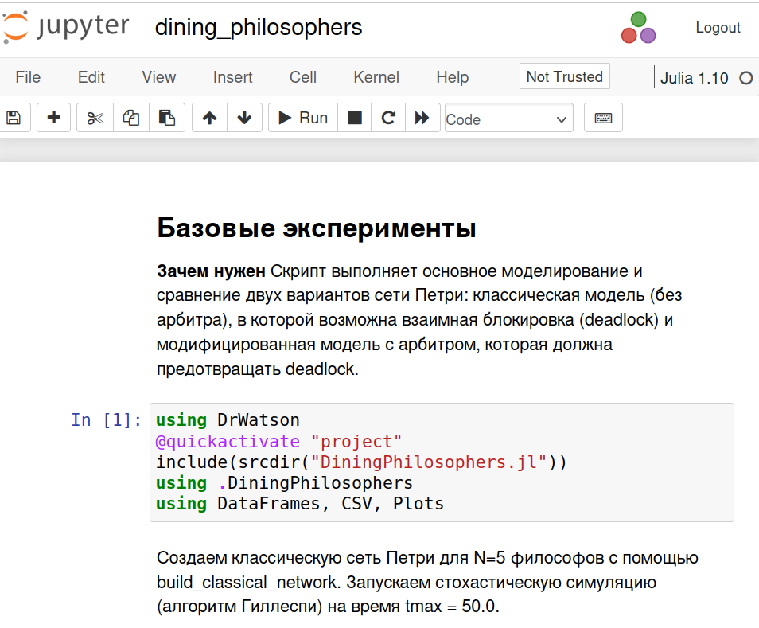{#fig-005 width=70%}

## 2. Базовые эксперименты

Я изменила количество философов в эксперименте, я использовала N = 2 и N = 10. И в обоих экспериментах тупик возник в классическом моделировании, но не в произвольном моделировании(рис.6)

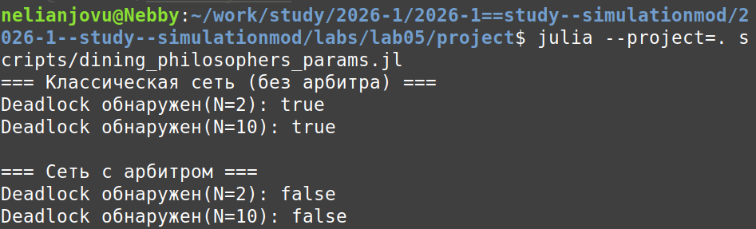{#fig-006 width=70%}

## 2. Базовые эксперименты

Я генерировала файл jupyter, запускала все ячейки и всё работал хорошо.(рис.7)

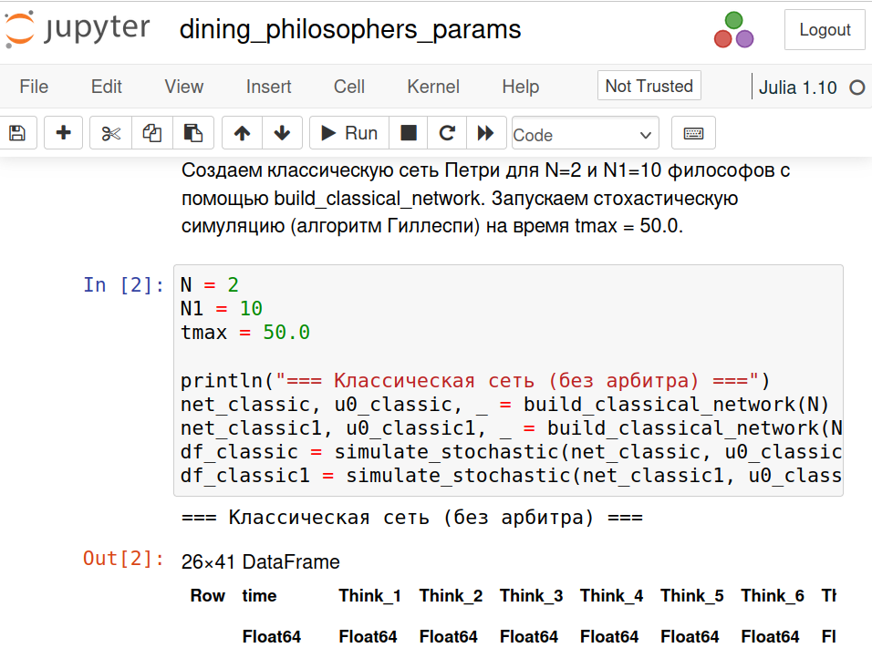{#fig-007 width=70%}

## 3. Анимация процесса

Я создала файл scripts/dining_philosophers_animation.jl.Потом скопировала заданный скрипт в него. Скрипт используется для наглядной демонстрации динамики работы сети Петри во времени. Анимация позволяет увидеть, как меняется маркировка (фишки) в каждой
позиции, и особенно наглядно показывает возникновение deadlock в классической модели(рис.8)

## 3. Анимация процесса

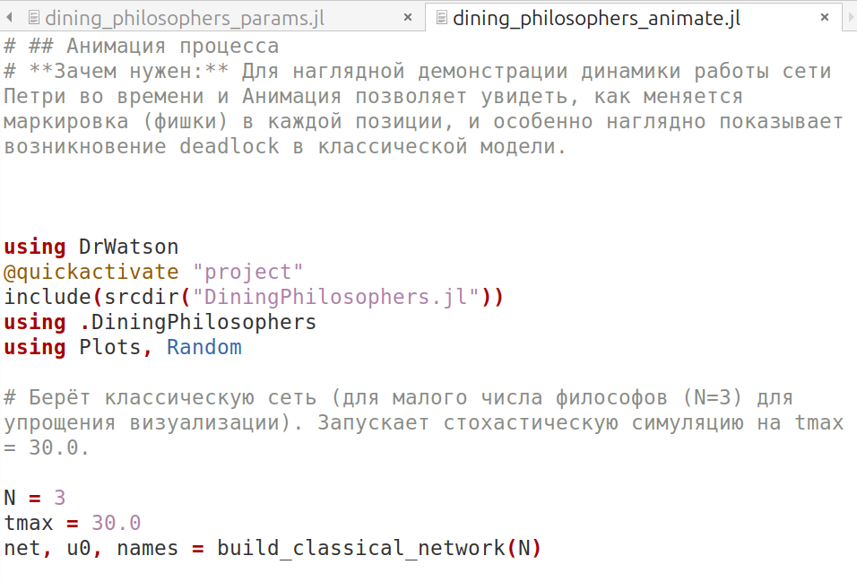{#fig-008 width=70%}

## 4. Итоговый отчёт

Я создала файл scripts/dining_philosophers_report.jl.Потом скопировала заданный скрипт в него. Скрипт используется для сравнительного анализа двух моделей (с арбитром и без) по одному ключевому показателю — числу философов, находящихся в состоянии «Ест» (Eat_i). Скрипт генерирует сводный график.(рис.9)

## 4. Итоговый отчёт

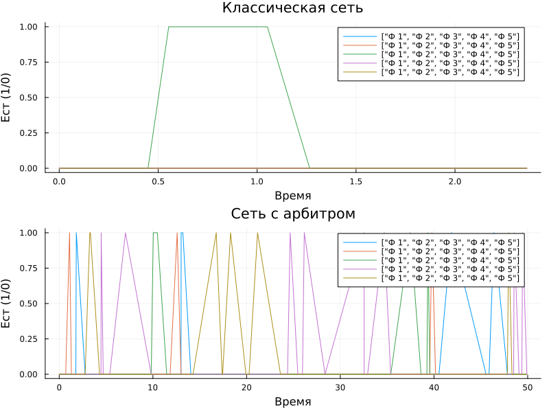{#fig-009 width=70%}

## 4. Итоговый отчёт

Я преобразовала код в литературный стиль, генерировала файл jupyter и выполнила все ячейки(рис.10)

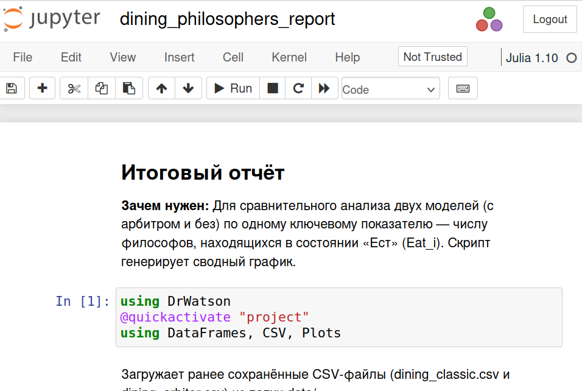{#fig-010 width=70%}

## 4. Итоговый отчёт

Я изменила скрипт, чтобы он работал при N = 2 и N = 10(рис. 11 и 12)

## 4. Итоговый отчёт

.png){#fig-011 width=70%}

## 4. Итоговый отчёт

.png){#fig-012 width=70%}

## 4. Итоговый отчёт

Я преобразовала код в литературный стиль, генерировала файл jupyter и выполнила все ячейки(рис.13)

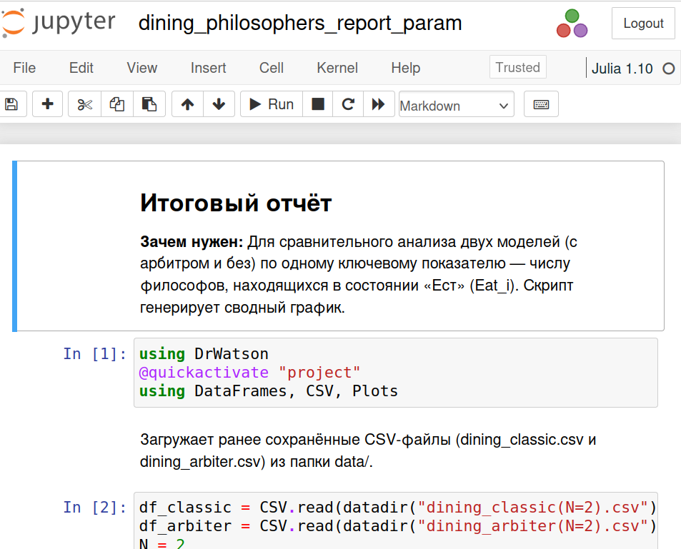{#fig-013 width=70%}

## Выводы

Выполняя эту лабораторную работу, научилась моделировать аппарат сетей Петри.
