---
author:
  name: Нджову Нелиа
  degrees: DSc
  orcid: 0000-0002-0877-7063
  email: 1032239033@rudn.ru
  affiliation:
    - name: Российский университет дружбы народов
      country: Российская Федерация
      postal-code: 117198
      city: Москва
      address: ул. Миклухо-Маклая, д.15

title: "Презентация по лабораторной работе 6"
subtitle: "Иммитационное моделирование"
license: "CC BY"
lang: ru

format:
  beamer: 
    pdf-engine: lualatex
    include-in-header: 
      - text: |
          \usepackage{fontspec}
          \setmainfont{DejaVu Serif}
          \setsansfont{DejaVu Sans}
          \setmonofont{DejaVu Sans Mono}
  revealjs: default
---

```{julia}
#| echo: false
#| include: false
using Pkg
Pkg.activate("/home/nelianjovu/work/study/2026-1/2026-1==study--simulationmod/2026-1--study--simulationmod/labs/lab03/project")
```

## Цель работы

Цель этой лабораторной работы - Реализация основных моделей в подходе сетей Петри.

## Задание

1. Основная программа

2. Базовый прогон модели

3. Коэффициент заражения $\beta$

4. Анимация детерминированной динамики

5. Итоговый отчёт

## Теоретическое введение

Реализована модель эпидемии SIR (Susceptible–Infectious–Recovered) с использованием сетей Петри. Модель описывает переходы между тремя состояниями:

— S (восприимчивые) — могут заразиться;

— I (инфицированные) — заражают других и выздоравливают;

— R (выздоровевшие / с иммунитетом) — больше не участвуют в эпидемии.

Сеть Петри содержит два перехода:

— infection: S + I → I + I (скорость $\beta$);
— recovery: I → R (скорость $\gamma$).

## 1. Основная программа

Я создала файл src/SIRPetri.jl и скопировала заданный скрипт в него. Скрипт реализует вычислительную логику модели. Скрипт содержатся несколько основые функции. Функция build_sir_network для построения сети Петри, функция simulate_deterministic для детерминированной симуляции, функция simulate_stochastic для стохастической симуляции, функция sir_ode для вспомогательной функция ОДУ, функция для визуализации и функция для визуализации сети Петри. Я запускала и все работала хорошо(рис.1)

## 1. Основная программа

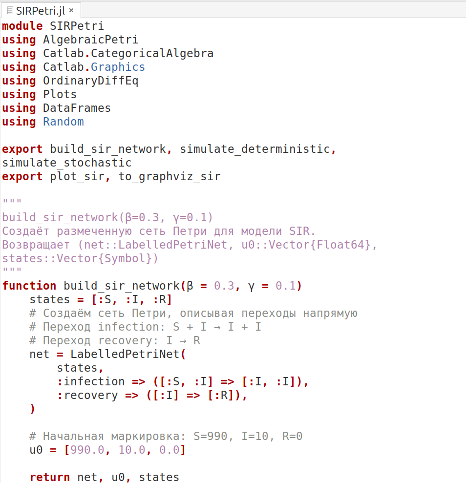{#fig-001 width=70%}

## 2. Базовый прогон модели

Я создала фаий scripts/sirpetri_run.jl и скопировала заданный скрипт в него. Скрипт выполняет один базовый эксперимент с фиксированными параметрами β = 0.3, γ = 0.1, запуская два типа симуляции: детерминированную (решение ОДУ) и стохастическую (алгоритм Гиллеспи). Я преобразовала скрипт в литератуный стиль и запускала его(рис.2)

## 2. Базовый прогон модели

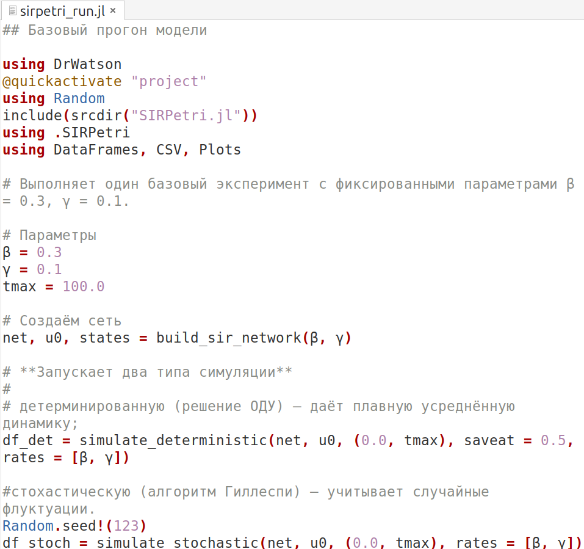{#fig-002 width=70%}

## 2. Базовый прогон модели

После запуск, получила два графика. Детерминированный график показывает классический пик эпидемии: рост I максимум, затем спад до нуля; R растёт и выходит на плато, S падает. Стохастический график может иметь шумы и, возможно, немного отличаться по времени пика и амплитуде – это демонстрирует влияние случайности(рис 3 и 4)

## 2. Базовый прогон модели

{#fig-003 width=70%}

## 2. Базовый прогон модели

{#fig-004 width=70%}

## 2. Базовый прогон модели

Я генерировала файл jupyter, запускала все ячейке и все сработала без ощибок(рис.5)

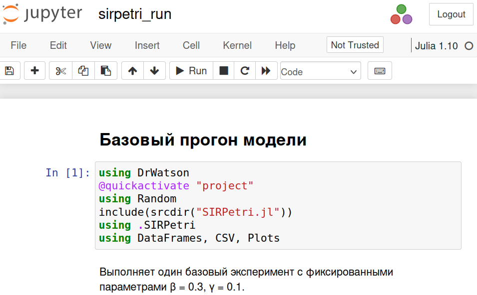{#fig-005 width=70%}

## 2. Базовый прогон модели

Я добавила несколько параметров, чтобы посмотреть, как будет выглядеть график(рис.6)

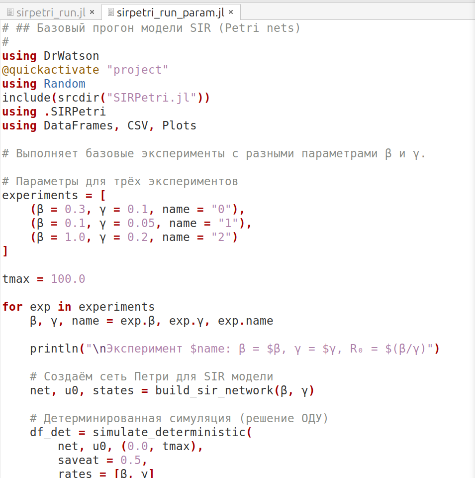{#fig-006 width=70%}

## 2. Базовый прогон модели

Для обе типы симуляции, ничего сильно меняется, просто время пика(рис.7, 8, 9, 10, 11, 12)

## 2. Базовый прогон модели

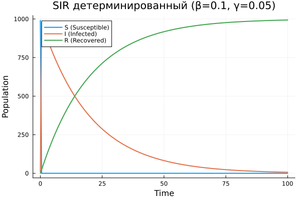{#fig-007 width=70%}

## 2. Базовый прогон модели

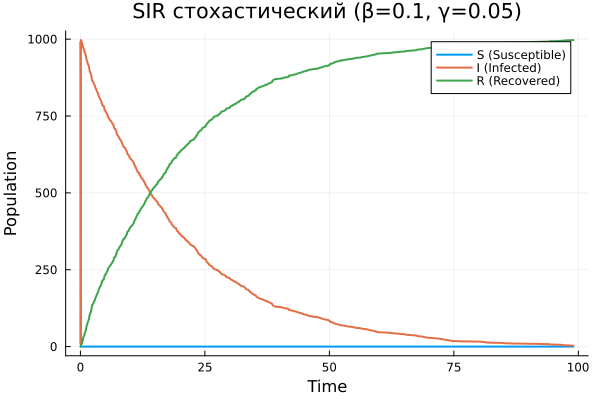{#fig-008 width=70%}

## 2. Базовый прогон модели

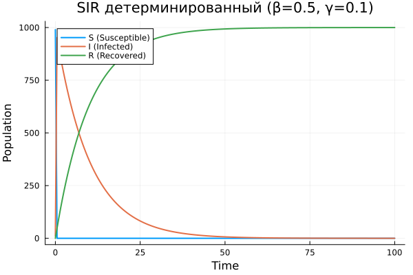{#fig-009 width=70%}

## 2. Базовый прогон модели

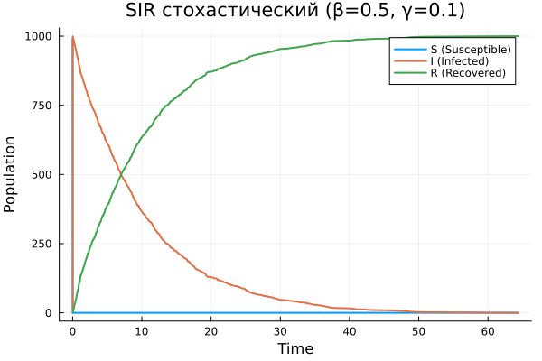{#fig-010 width=70%}

## 2. Базовый прогон модели

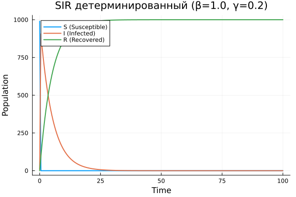{#fig-011 width=70%}

## 2. Базовый прогон модели

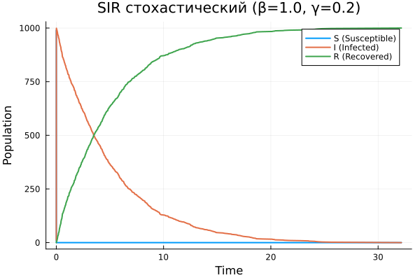{#fig-012 width=70%}

## 2. Базовый прогон модели

Я генерировала файл jupyter, запускала все ячейке и все сработала без ощибок(рис.13)

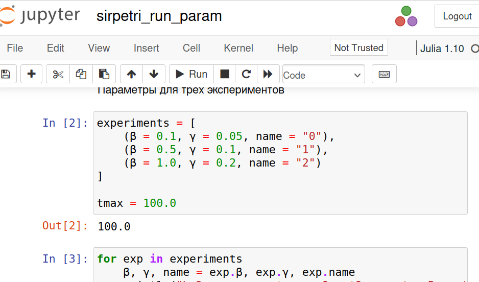{#fig-013 width=70%}

## 3. Коэффициент заражения $\beta$

Я создала фаий scripts/sirpetri_scan_parameters.jl и скопировала заданный скрипт в него. Скрипт Исследуется чувствительность модели к изменению параметра $\beta$ (скорости заражения). Для каждого значения $\beta$ из диапазона 0.1:0.05:0.8 запускается детерминированная симуляция (γ = 0.1 фиксирован) и вычисляются: максимальное число инфицированных (пик эпидемии) – peak_I и конечное число выздоровевших – final_R. Я преобразовала скрипт в литератуный стиль и запускала его(рис.14)

## 3. Коэффициент заражения $\beta$

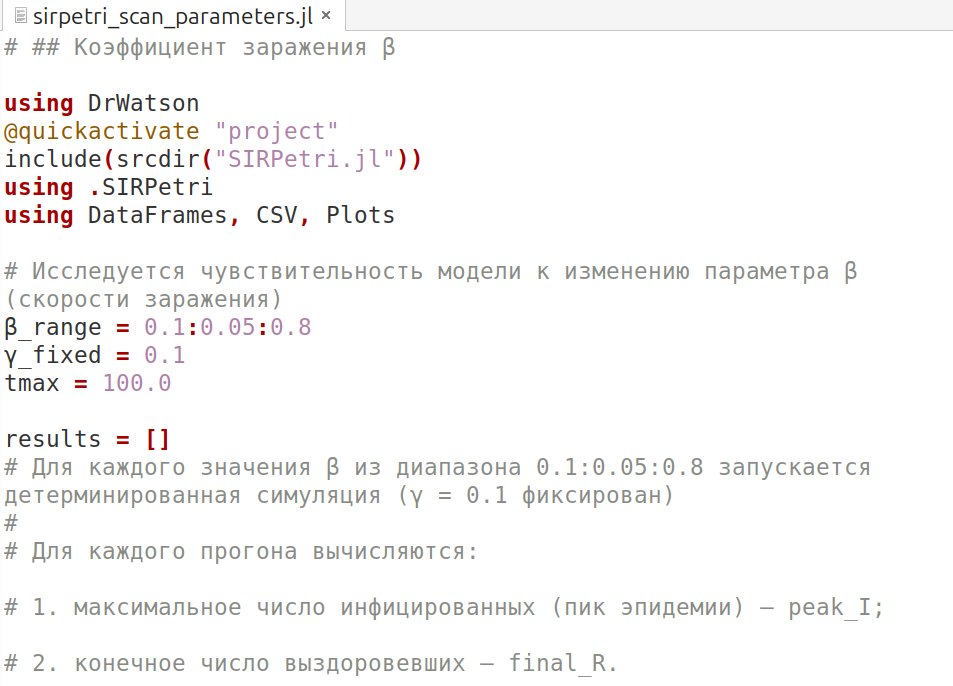{#fig-014 width=70%}

## 3. Коэффициент заражения $\beta$

После запуск, получила график. На графике показано, что при всех тестируемых значениях $\beta$ инфекция распространяется почти по всей популяции, что соответствует конечному значению R ≈ N. В результате в этом моделировании не наблюдается порогового значения. Пиковое число инфицированных индивидуумов изменяется незначительно при изменении $\beta$(рис 15)

## 3. Коэффициент заражения $\beta$

{#fig-015 width=70%}

## 3. Коэффициент заражения $\beta$

Я генерировала файл jupyter, запускала все ячейке и все сработала без ощибок(рис.16)

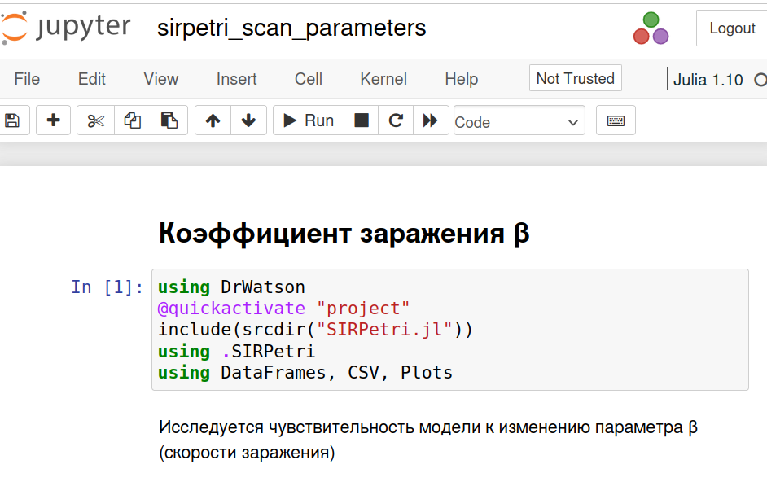{#fig-016 width=70%}

## 4. Анимация детерминированной динамики

Я создала фаий scripts/sirpetri_animate.jl и писала скрипт в него. Скрипт создаёт GIF-анимацию, показывающую, как со временем меняется количество людей в каждой из трёх групп (S, I, R). Анимация позволяет наглядно увидеть распространение эпидемии, пик и спад.(рис.17)

## 4. Анимация детерминированной динамики

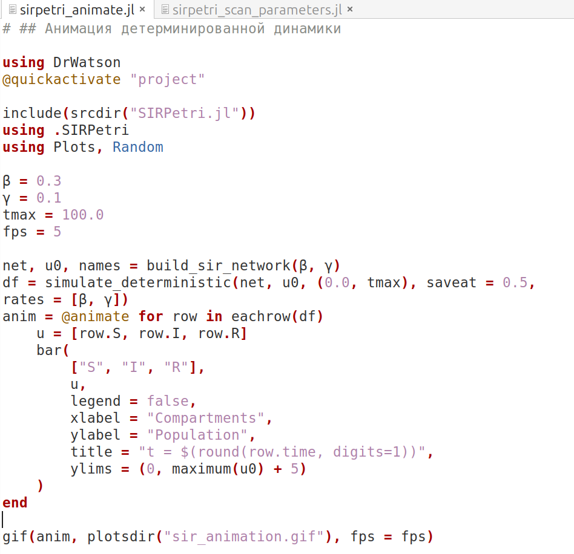{#fig-017 width=70%}

## 4. Анимация детерминированной динамики

После запуск, получила GIF. В момент времени t = 0 популяция почти полностью восприимчива, имеется лишь небольшое число инфицированных и ни одного выздоровевшего человека. Это представляет собой начальную стадию распространения болезни, с которой развивается эпидемия.

## 5. Итоговый отчёт

Я создала фаий scripts/sirpetri_report.jl и скопировала заданный скрипт в него. Скрипт загружает ранее сохранённые результаты (sir_det.csv, sir_stoch.csv, sir_scan.csv) и строит сравнительные графики для итогового отчёта: Сравнение детерминированной и стохастической динамики инфицированных I(t) и зависимость пика I от β (результат сканирования). Я преобразовала скрипт в литератуный стиль и запускала его(рис.18)

## 5. Итоговый отчёт

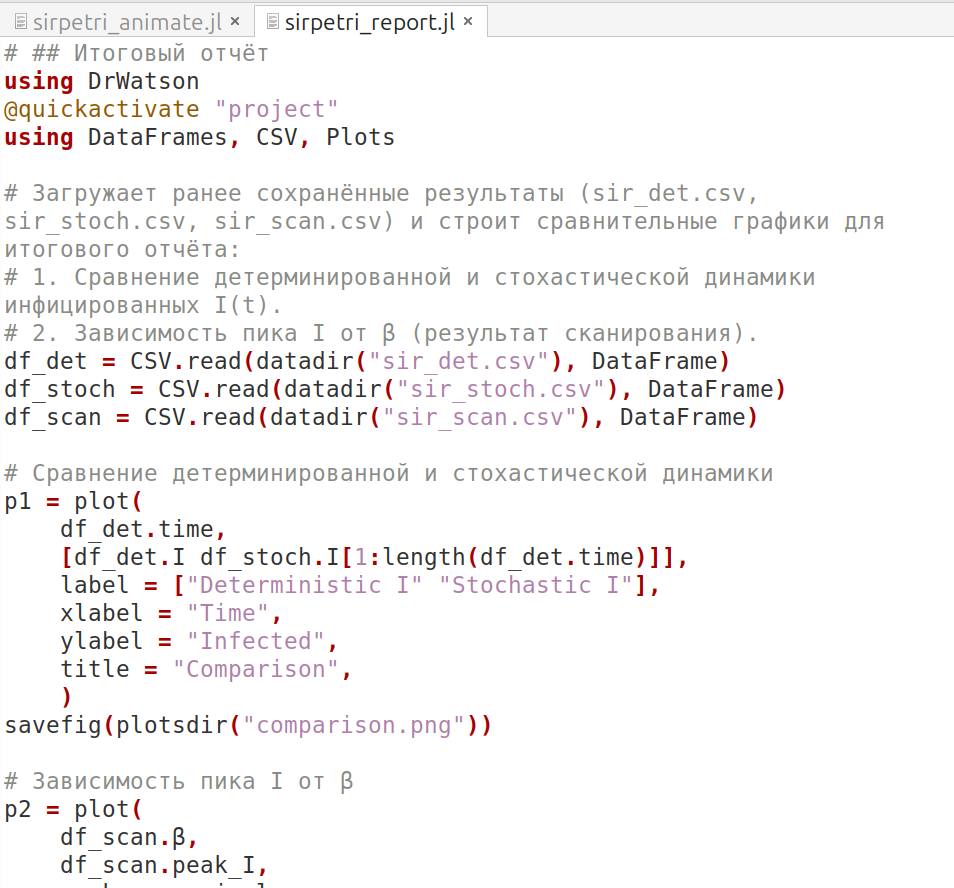{#fig-018 width=70%}

## 5. Итоговый отчёт

После запуск, получила два графики. Сравнение детерминированной и стохастической кривых I(t) показывает, насколько велик разброс, вызванный случайностью. При большом размере популяции они близки. График чувствительности позволяет количественно оценить, как изменение заразности β влияет на тяжесть эпидемии (пик I). Это важно для принятия решений (например, меры по снижению β)(рис 19 и 20)

## 5. Итоговый отчёт

{#fig-019 width=70%}

## 5. Итоговый отчёт

{#fig-020 width=70%}

## 5. Итоговый отчёт

Я генерировала файл jupyter, запускала все ячейке и все сработала без ощибок(рис.21)

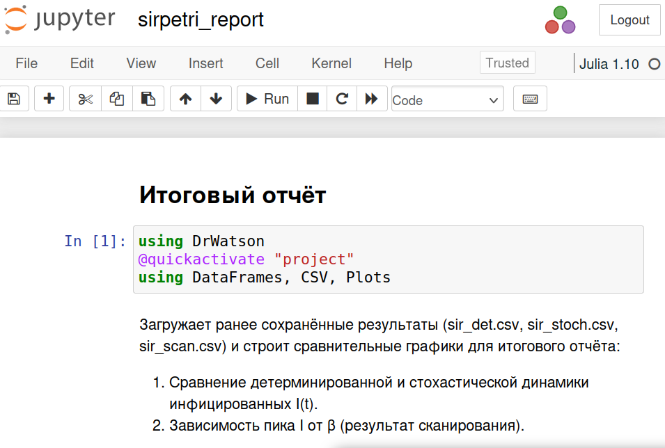{#fig-021 width=70%}

## Выводы

В этой лабораторной работы, реализовали основные модели(модель SIR) в подходе сетей Петри.
