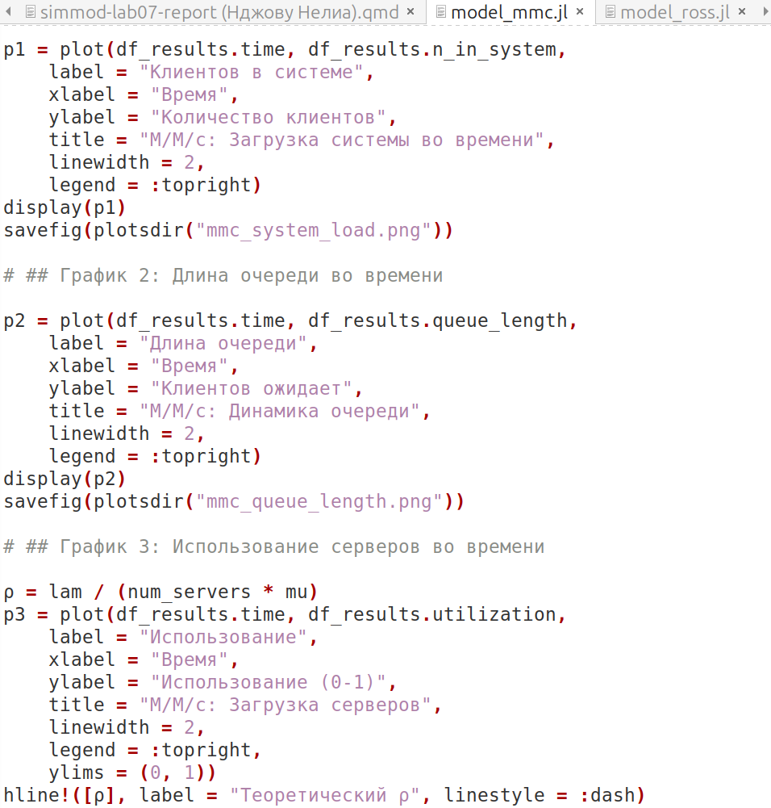
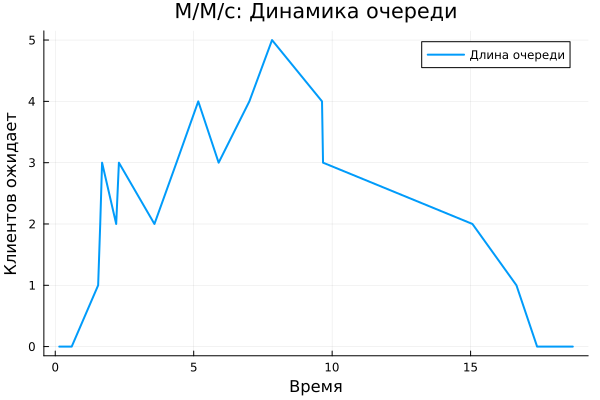
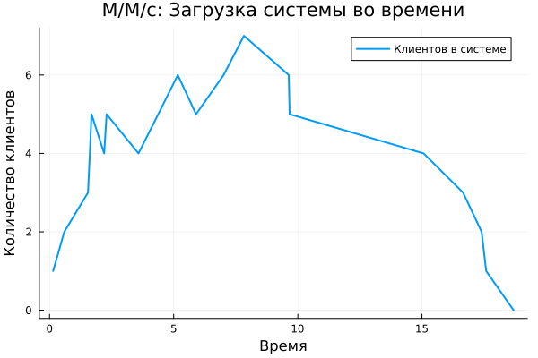
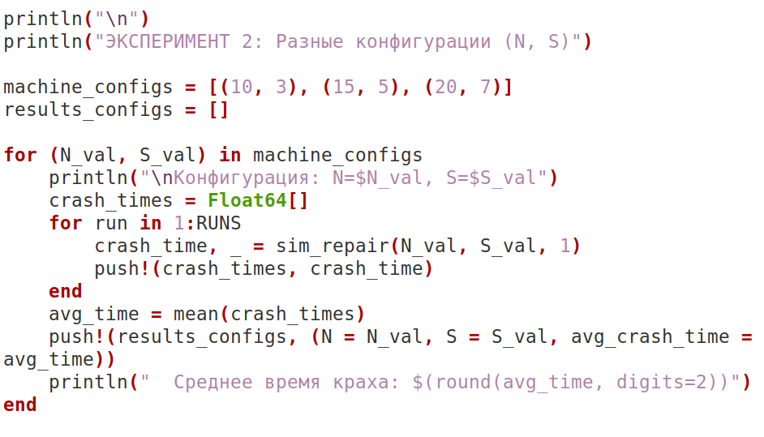
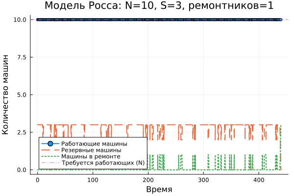
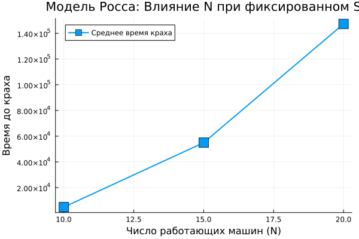
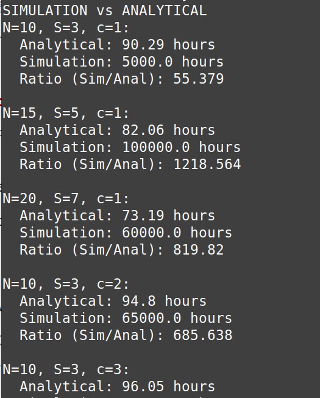

---
author:
  name: Нджову Нелиа
  degrees: DSc
  orcid: 0000-0002-0877-7063
  email: 1032239033@rudn.ru
  affiliation:
    - name: Российский университет дружбы народов
      country: Российская Федерация
      postal-code: 117198
      city: Москва
      address: ул. Миклухо-Маклая, д.15

title: "Презентация по лабораторной работе 7"
subtitle: "Иммитационное моделирование"
license: "CC BY"
lang: ru

format:
  beamer: 
    pdf-engine: lualatex
    include-in-header: 
      - text: |
          \usepackage{fontspec}
          \setmainfont{DejaVu Serif}
          \setsansfont{DejaVu Sans}
          \setmonofont{DejaVu Sans Mono}
  revealjs: default
---

```{julia}
#| echo: false
#| include: false
using Pkg
Pkg.activate("/home/nelianjovu/work/study/2026-1/2026-1==study--simulationmod/2026-1--study--simulationmod/labs/lab03/project")
```

## Цель работы

Цель этой лабораторной работы - работа дискретно-событийного молирования

## Задание

1. Модель M/M/c

2. Модель Росса

## Теоретическое введение

**Модель M/M/c**

Модель M/M/c(по классификации Кендалла) - это система массового обслуживания со следующими свойствами:

-  M(Markovian) - входящий поток пуассоновский, интервалы между прибытиями распределены экспоненциально с параметром λ.

- M - время обслуживание каждой заявки распределено экспоненциально с параметром μ.

- c - количество идентичных обслуживающих приборов(каналов), работающих параллельно.

**Модель Росса**

Модель представляет собой классический пример системы массового обслуживания с конечной популяцией, резервом и ремонтом.

## 1. Модель M/M/c

Я создала файл scripts/model_mmc.jl и скопировала заданный скрипт в него. Скрипт создает 10 клентов в очереди из 2 серверов и выводит время прибытия, начала обслуживания и отправления в консоль. Я запускала код и все сработала хорошо(рис.1).

{#fig-001 width=70%}

## 1. Модель M/M/c

После этого я перевожу код в структуру DrWatson(рис.2)

{#fig-001 width=70%}

## 1. Модель M/M/c

Затем я добавляю необходимую визуализацию(рис.3)

{#fig-001 width=70%}

## 1. Модель M/M/c

На первом графике показано количество клиентов в очереди, из графика видно, что наибольшее количество клиентов в очереди находилось в интервале 5-10 единиц времени(рис.4)

## 1. Модель M/M/c

{#fig-001 width=70%}

## 1. Модель M/M/c

Второй график, который я добавил, был графиком количества клиентов в системе, из графика, аналогичного первому, мы можем видеть, что наибольшее количество клиентов находится в пределах 5-10 единиц времени(рис.5)

## 1. Модель M/M/c

{#fig-001 width=70%}

## 1. Модель M/M/c

Третий график предназначен для проверки того, насколько загружен сервер по сравнению с теоретическим порогом (ρ), из графика мы видим, что сервер загружен больше, чем ожидалось(рис.6)

## 1. Модель M/M/c

{#fig-001 width=70%}

## 2. Модель Росса

Я создала файл scripts/model_mmc.jl и скопировала заданный скрипт в него. Скрипт реализует систему ремонта машины с использованием запасных частей из учебника Росса. Если машина выходит из строя, она немедленно заменяется на запасную, а неисправная машина ремонтируется мастером, если запасная машина недоступна, система выходит из строя. Я запускала код и все сработала хорошо(рис.7).

{#fig-001 width=70%}

## 2. Модель Росса

После этого я перевожу код в структуру DrWatson и добавляю несколько ремонтников(рис.8)

{#fig-001 width=70%}

## 2. Модель Росса

Я экспериментирую с системой, используя разное количество машин(рис.9)

{#fig-001 width=70%}

## 2. Модель Росса

Затем я добавляю необходимую визуализацию(рис.10)

{#fig-001 width=70%}

## 2. Модель Росса

На первом из которых показано количество работающих машин, запасных, ремонтируемых машин и необходимых ремонтников(рис.11)

## 2. Модель Росса

{#fig-001 width=70%}

## 2. Модель Росса

Из второго графика видно, что количество ремонтников влияет на среднее время простоя. Чем больше число ремонтников, тем больше времени требуется системе для выхода из строя(рис.12)

## 2. Модель Росса

{#fig-001 width=70%}

## 2. Модель Росса

На третьем графике показано, как количество работающих машин влияет на среднее время сбоя: чем больше количество работающих машин, тем больше времени требуется системе для выхода из строя(рис.13)

## 2. Модель Росса

{#fig-001 width=70%}

## 2. Модель Росса

Когда я сравнила результаты с аналитическим методом, выяснилось, что при моделировании сбой происходит гораздо дольше, чем при аналитическом(рис.14)

{#fig-001 width=70%}

## Выводы

В этой лабораторной работы, мы работали с дискретно-событийном молированием
