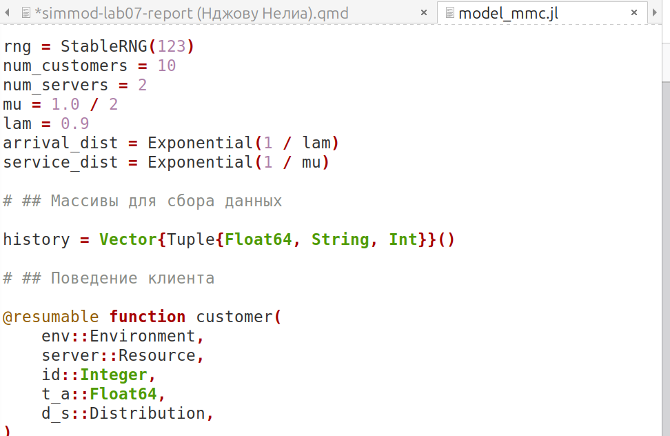
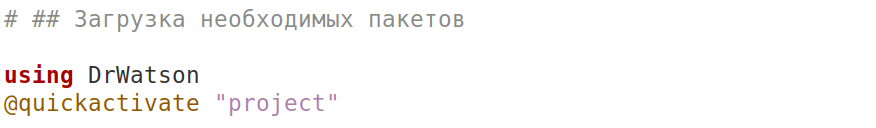
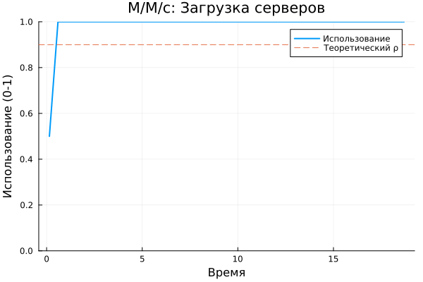
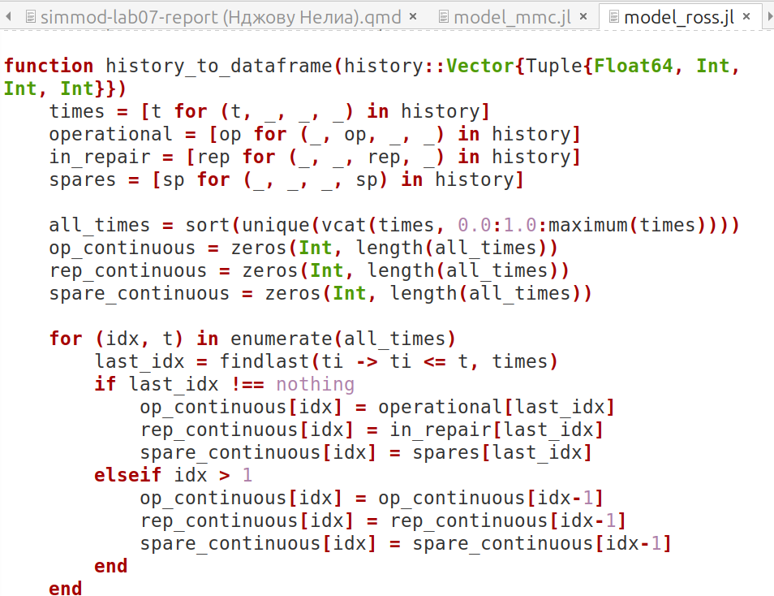
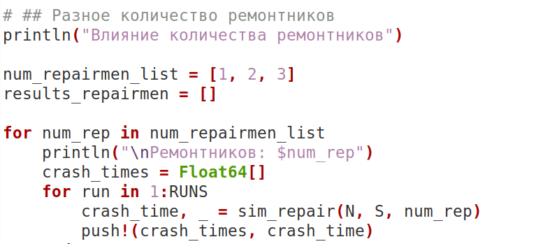
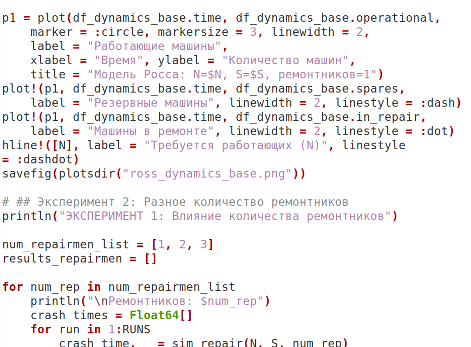
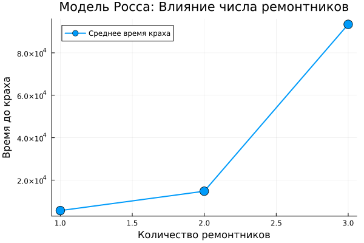

---
## Author
author:
  name: Нджову Нелиа
  degrees: DSc
  orcid: 0000-0002-0877-7063
  email: 1032239033@rudn.ru
  affiliation:
    - name: Российский университет дружбы народов
      country: Российская Федерация
      postal-code: 117198
      city: Москва
      address: ул. Миклухо-Маклая, д. 15

## Title
title: "Отчёта по лабораторной работе 7"
subtitle: "Иммитационное моделирование"
license: "CC BY"
---

```{julia}
#| echo: false
#| include: false
using Pkg
Pkg.activate("/home/nelianjovu/work/study/2026-1/2026-1==study--simulationmod/2026-1--study--simulationmod/labs/lab07/project")
```

# Цель работы

Цель этой лабораторной работы - работа дискретно-событийного молирования

# Задание

1. Модель M/M/c

2. Модель Росса

# Теоретическое введение

**Модель M/M/c**

Модель M/M/c(по классификации Кендалла) - это система массового обслуживания со следующими свойствами:

-  M(Markovian) - входящий поток пуассоновский, интервалы между прибытиями распределены экспоненциально с параметром λ.

- M - время обслуживание каждой заявки распределено экспоненциально с параметром μ.

- c - количество идентичных обслуживающих приборов(каналов), работающих параллельно.

*Основные параметры*

- Интенсивность входящего потока(λ) - Среднее число заявок в единицу времени. Интервалы прибытия ~ Exp(1/λ)

- Интенсивность обслуживания(одного канала)(μ) - Среднее число заявок, обслуживаемых одним прибором в единицу времени. Длительность обслуживания ~ Exp(1/μ)

- Число каналов(c) - Количество параллельных серверов

- Загрузка системы на одним канал(traffic intensity)(ρ = λ/(c·μ)) - Условие стационарности: ρ < 1

*Отличия от модели M/M/1*

|Характеристика|M/M/1|M/M/c|
|-------------:|:----|-----:|
|Число каналов|1|с(с > 1)|
|Поведение заявки|Ждёт единственный канал|Ждёт любой свободный канал из с|
|Условие стационарности|λ < μ|λ < сμ|
|Формулы для $W_q$|ρ/μ(1-ρ)|Более сложные|
|Вероятность ождания|Равна ρ|Определяется формулой Эрланта|

**Модель Росса**

Модель представляет собой классический пример системы массового обслуживания с конечной популяцией, резервом и ремонтом.

*Формальная постановка задачи*

— В системе находятся N идентичных машин, которые постоянно работают и могут выходить из строя.

— S машин находятся в резерве и готовы немедленно заменить любую отказавшую.

— Одно ремонтное устройство (ремонтник), которое может одновременно ремонтировать только одну машину.

— Когда работающая машина ломается, происходит следующее:

    — Немедленно берётся одна резервная машина (если она есть) и запускается в работу вместо сломавшейся.

    — Сломанная машина отправляется в ремонт.

    — Если резерва нет, система падает (crash). Моделирование заканчивается.

— После ремонта машина пополняет пул резервных (становится исправной и ждёт).

— Требуется оценить среднее время до падения системы E[T] при заданных распределениях наработки до отказа и времени ремонта.

*Марковская модель*

Данная система может быть описана как марковский процесс с непрерывным временем и конечным числом состояний. Состояние можно определить как число работоспособных машин (работающих плюс резервных) или число машин в ремонте.

Пусть k — число исправных машин, 0 <= k <= N + S. Классический подход из учебника Росса: состояние — число исправных машин, а число работающих всегда равно N, если есть хотя бы N исправных.

Состояния:

— i — число исправных машин, i = 0, 1, … , N + S.

— Число работающих машин всегда min(N, i).

— Число резервных машин — max(0, i − N).

— Число машин в ремонте — N + S − i.

Интенсивности переходов:

— При отказе машины (если есть работающая) число исправных машин уменьшается на 1. Интенсивность: min(N, i)λ (если i >= 1).

— При завершении ремонта число исправных увеличивается на 1. Интенсивность: μ, если есть хотя бы одна машина в ремонте (т.е. i < N + S). Ремонтник один, поэтому интенсивность постоянна, когда очередь на ремонт не пуста.

Система падает, когда число исправных машин i = N − 1 (если ещё есть работающая) или i = N. Падение происходит в момент отказа, когда нет резерва. Это соответствует переходу из состояния N (0 резерва, все N машин работают) в неработоспособное состояние. В момент отказа одной из N машин при i = N запасных нет, следовательно, система падает. Значит, падение наступает при первом достижении состояния i = N − 1 (при переходе i = N → N − 1).

Аналитически среднее время до отказа можно найти, решив систему линейных уравнений для средних времен достижения поглощающего состояния.

# Выполнение лабораторной работы

## 1. Модель M/M/c

Я создала файл scripts/model_mmc.jl и скопировала заданный скрипт в него. Скрипт создает 10 клентов в очереди из 2 серверов и выводит время прибытия, начала обслуживания и отправления в консоль. Я запускала код и все сработала хорошо(рис.1).

{#fig-001 width=70%}

После этого я перевожу код в структуру DrWatson(рис.2)

{#fig-001 width=70%}

Затем я добавляю необходимую визуализацию(рис.3)

{#fig-001 width=70%}

На первом графике показано количество клиентов в очереди, из графика видно, что наибольшее количество клиентов в очереди находилось в интервале 5-10 единиц времени(рис.4)

{#fig-001 width=70%}

Второй график, который я добавил, был графиком количества клиентов в системе, из графика, аналогичного первому, мы можем видеть, что наибольшее количество клиентов находится в пределах 5-10 единиц времени(рис.5)

{#fig-001 width=70%}

Третий график предназначен для проверки того, насколько загружен сервер по сравнению с теоретическим порогом (ρ), из графика мы видим, что сервер загружен больше, чем ожидалось(рис.6)

{#fig-001 width=70%}

**Ниже приведен код, результаты расчетов и графики для кода в файле scripts/model_mmc.qmd**



## 2. Модель Росса

Я создала файл scripts/model_mmc.jl и скопировала заданный скрипт в него. Скрипт реализует систему ремонта машины с использованием запасных частей из учебника Росса. Если машина выходит из строя, она немедленно заменяется на запасную, а неисправная машина ремонтируется мастером, если запасная машина недоступна, система выходит из строя. Я запускала код и все сработала хорошо(рис.7).

{#fig-001 width=70%}

После этого я перевожу код в структуру DrWatson и добавляю несколько ремонтников(рис.8)

{#fig-001 width=70%}

Я экспериментирую с системой, используя разное количество машин(рис.9)

{#fig-001 width=70%}

Затем я добавляю необходимую визуализацию(рис.10)

{#fig-001 width=70%}

На первом из которых показано количество работающих машин, запасных, ремонтируемых машин и необходимых ремонтников(рис.11)

{#fig-001 width=70%}

Из второго графика видно, что количество ремонтников влияет на среднее время простоя. Чем больше число ремонтников, тем больше времени требуется системе для выхода из строя(рис.12)

{#fig-001 width=70%}

На третьем графике показано, как количество работающих машин влияет на среднее время сбоя: чем больше количество работающих машин, тем больше времени требуется системе для выхода из строя(рис.13)

{#fig-001 width=70%}

Когда я сравнила результаты с аналитическим методом, выяснилось, что при моделировании сбой происходит гораздо дольше, чем при аналитическом(рис.14)

{#fig-001 width=70%}

**Ниже приведен код, результаты расчетов и графики для кода в файле scripts/model_ross.qmd**



# Выводы

В этой лабораторной работы, мы работали с дискретно-событийном молированием
