---
author:
  name: Нджову Нелиа
  degrees: DSc
  orcid: 0000-0002-0877-7063
  email: 1032239033@rudn.ru
  affiliation:
    - name: Российский университет дружбы народов
      country: Российская Федерация
      postal-code: 117198
      city: Москва
      address: ул. Миклухо-Маклая, д.15

title: "Презентация по лабораторной работе 8"
subtitle: "Иммитационное моделирование"
license: "CC BY"
lang: ru

format:
  beamer: 
    pdf-engine: lualatex
    include-in-header: 
      - text: |
          \usepackage{fontspec}
          \setmainfont{DejaVu Serif}
          \setsansfont{DejaVu Sans}
          \setmonofont{DejaVu Sans Mono}
  revealjs: default
---

```{julia}
#| echo: false
#| include: false
using Pkg
Pkg.activate("/home/nelianjovu/work/study/2026-1/2026-1==study--simulationmod/2026-1--study--simulationmod/labs/lab03/project")
```

## Цель работы

Цель этой лабораторной работы - Изучить дискретно-событийный подход к имитационному моделированию на примере классической модели распространения инфекции SIR. Реализовать стохастическую дискретно-событийную модель в виде программного комплекса на языке Julia. Провести анализ влияния параметров, сравнить со стохастической и детерминированной версиями, оценить производительность и модифицировать модель.

## Задание

1. Структура программы 

2. Скрипт запуска

3. Анализ чувствительности к параметрам

4. Детерминированная длительность болезни

5. Оценка производительности

6. Сохранение результатов в CSV

7. Добавление демографических событий

8. Вакцинация

9. Модель SEIR

## Теоретическое введение

Модель SIR - это фундаментальная сегментарная модель в эпидемиологии, которая описывает распространение инфекционного заболевания в замкнутой популяции.

Модель делит все население (N) на три отдельные, взаимоисключающие группы:

- S (Восприимчивые): люди, которые здоровы, но могут заразиться.

- I (Инфекционные): люди, которые в настоящее время больны и могут передать болезнь восприимчивым людям.

- R (выздоровевшие): люди, которые выздоровели (и считаются невосприимчивыми) или умерли. Они больше не участвуют в процессе передачи.

Общая численность населения постоянна: N=S+I+R.

## 1. Структура программы 

Я создала файл src/Sir_model.jl и скопировала заданный скрипт в него. Скрипт реализует ядро модели SIR с дискретными событиями. Он определяет структуры данных, логику поведения агентов и функции управления симуляцией. Я запускала код и все хорошо сработал.(рис.1)

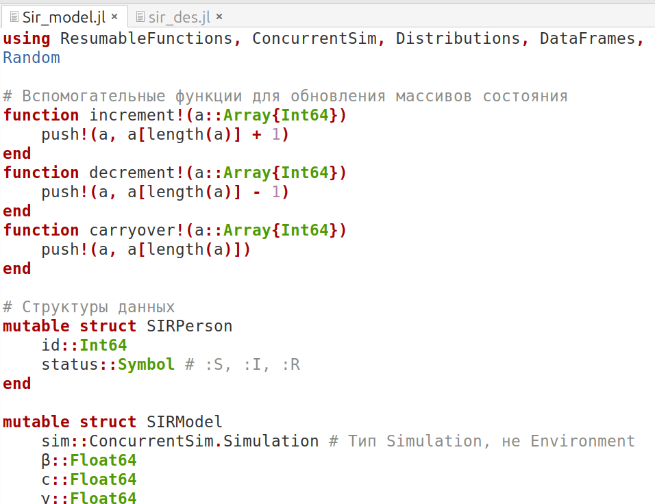{#fig-001 width=70%}

## 2. Скрипт запуска

Я создала файл scripts/sir_des.jl и скопировала заданный скрипт в него. Этот скрипт загружает ядро sir_model.jl, устанавливает параметры моделирования, запускает моделирование SIR с дискретными событиями и генерирует график динамики S, I и R с течением времени.(рис.2)

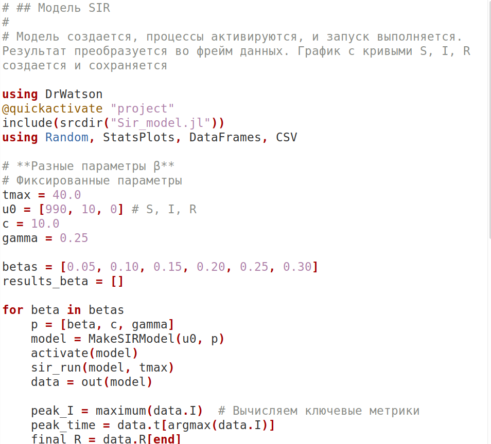{#fig-002 width=70%}

## 2. Скрипт запуска

Я запускала код и все хорошо сработал, получила график ниже(рис.3)

{#fig-003 width=70%}

## 3. Анализ чувствительности к параметрам

Я создала файл scripts/sensitivity_beta.jl, scripts/sensitivity_c.jl и scripts/sensitivity_gamma.jl. В этих файлах, я писала код, похоже с заданный скрипт но с разными значениями $\beta$ - вероятность передачи инфекции при одном контакте между заразным и восприимчивым (безразмерная величина, от 0 до 1), c - среднее число контактов (достаточно тесных для передачи инфекции) одного человека в единицу времени и $\gamma$ - скорость выздоровления (доля инфицированных, выздоравливающих в единицу времени) соответственно. Я проанализировала пик заражения, время пика и конечное количество выздоровевших людей для каждого значения $\beta$

## 3. Анализ чувствительности к параметрам

По мере того, как $\beta$ увеличивает пик заражения, число выздоровевших увеличивается, а время пика уменьшается(рис.4)

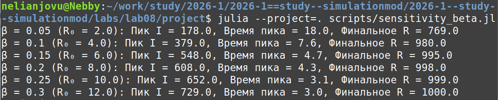{#fig-003 width=70%}

## 3. Анализ чувствительности к параметрам

По мере того, как c увеличивает, пик заражения и число выздоровевших увеличивается, а время пика уменьшается(рис.5)

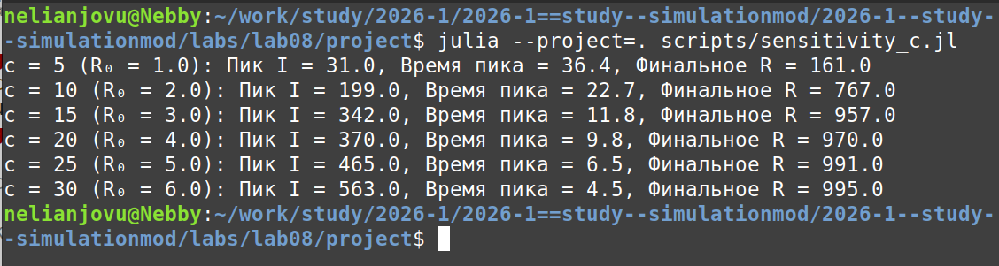{#fig-003 width=70%}

## 3. Анализ чувствительности к параметрам

По мере того, как $\gamma$ увеличивает, пик заражения и число выздоровевших уменьшается, а время пика, сначала увеличивается а потом уменьшается(рис.6)

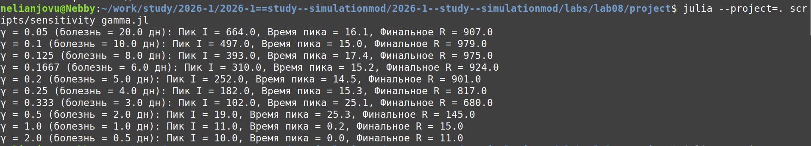{#fig-003 width=70%}

## 4. Детерминированная длительность болезни

Я заменяю экспоненциальное время восстановления на фиксированное значение 1/γ(рис.7)

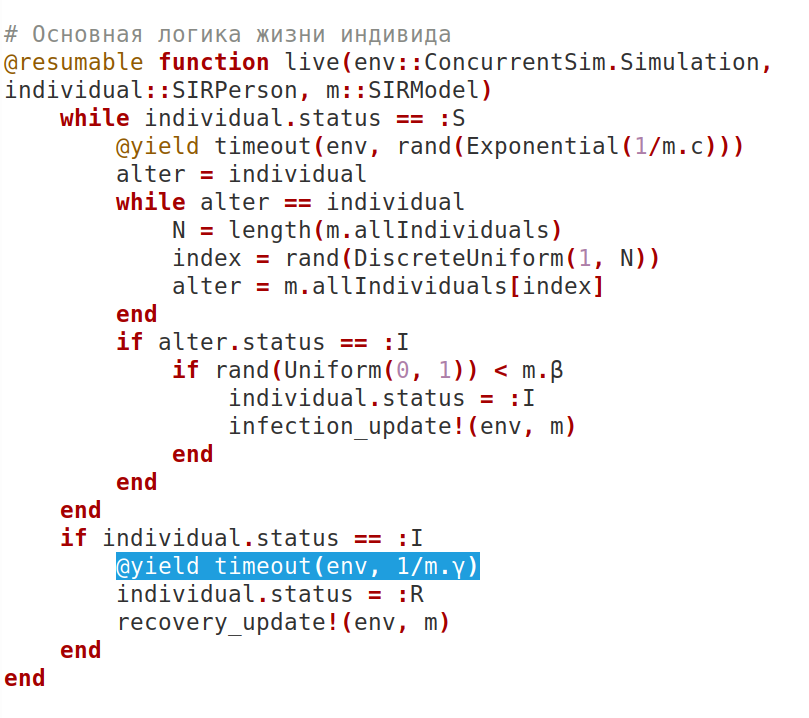{#fig-003 width=70%}

## 4. Детерминированная длительность болезни

Я сравниваю детерминированную версию со стохастической версией. Что касается стохастической модели, то мы можем видеть, что она немного грубовата, поскольку отражает реальность происходящего. Что касается детерминированной модели, то она немного сглажена, поскольку показывает вычислительную модель, основанную на средних значениях и уравнениях.(рис.8)

## 4. Детерминированная длительность болезни

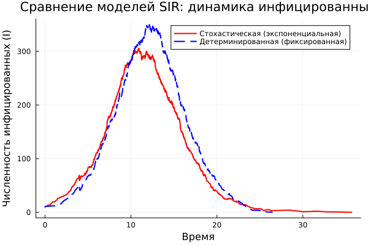{#fig-003 width=70%}

## 5. Оценка производительности

Используя макрос @benchmark, я измеряю время выполнения sir_run для популяции из 10 000 человек(рис.9)

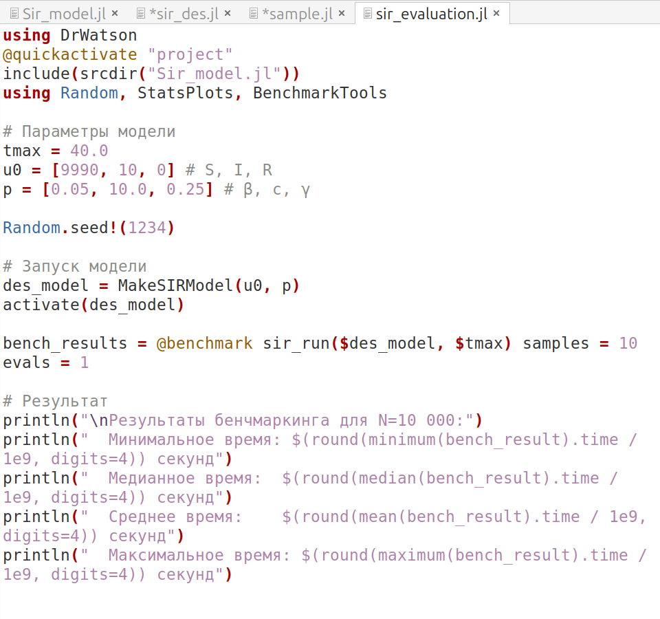{#fig-003 width=70%}

## 5. Оценка производительности

Модель была протестирована на популяции из 10 000 особей в течение 40 единиц времени. Моделирование завершилось в среднем менее чем за 0,01 секунды, продемонстрировав, что реализация на основе ConcurrentSim является высокоэффективной для популяций такого размера(рис.10)

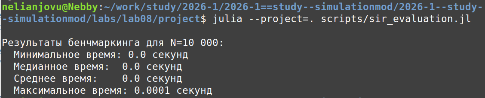{#fig-003 width=70%}

## 6. Сохранение результатов в CSV

Я добавляю автоматическое сохранение итоговой таблицы в каталог data/sims/ с уникальным именем, содержащим параметры запуска(рис.11)

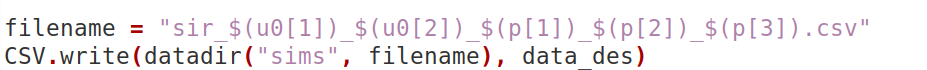{#fig-003 width=70%}

## 6. Сохранение результатов в CSV

Код сработал, и файл был сохранен(рис.12)

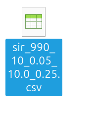{#fig-003 width=70%}

## 7. Добавление демографических событий

Я расширяю модель, добавляя к жизненному циклу индивидуума возможность смерти (с постоянной интенсивностью $\mu$) и рождения новых восприимчивых особей. Смерть удаляет индивидуума из популяции, рождение добавляет нового в состояние : S.(рис 13)

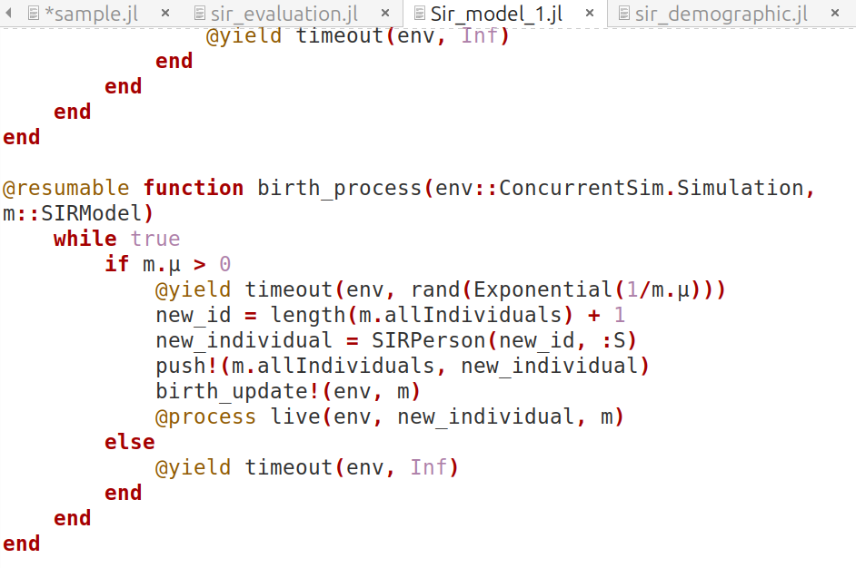{#fig-003 width=70%}

## 7. Добавление демографических событий

В отличие от стандартной модели SIR, в модели с демографией количество выздоровевших людей увеличивается, а затем снова начинает уменьшаться. Это связано с тем, что выздоровевшие люди могут умереть от естественных причин(рис.14)

## 7. Добавление демографических событий

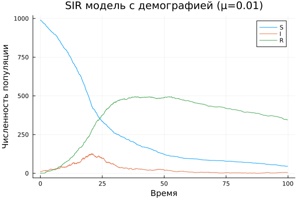{#fig-003 width=70%}

## 8. Вакцинация

Я внедряю стратегию вакцинации(рис.15)

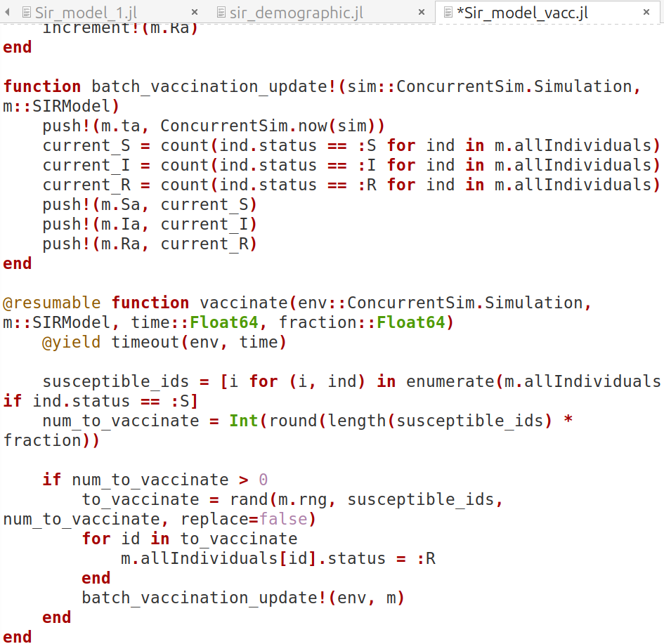{#fig-003 width=70%}

## 8. Вакцинация

На графике мы видим, что в определенный момент времени некоторые из восприимчивых мгновенно переносят R. Для предотвращения эпидемии необходимо вакцинировать около 50% населения(рис.16)

## 8. Вакцинация

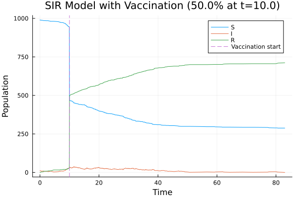{#fig-016 width=70%}

## 9. Модель SEIR

Разница между sir и seir в том, что для sir это восприимчивость - заражение - выздоровление. Как только вы заразитесь, вы можете заразить других. В модели seir есть дополнительный этап, который заключается в e - воздействии, в этом случае, как только вы подвергаетесь воздействию, требуется время, чтобы вы заразились и были восстановлены.

## 9. Модель SEIR

Я ввожу период ожидания (статус :E)(рис.17)

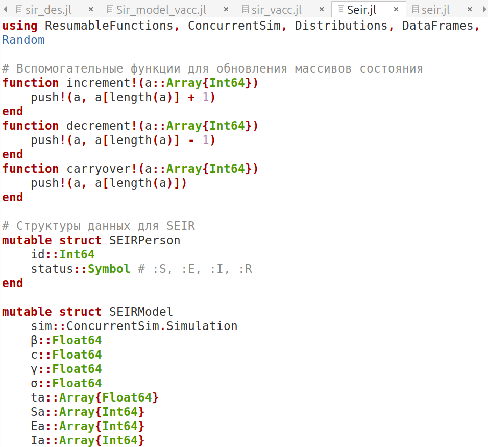{#fig-016 width=70%}

## 9. Модель SEIR

При тех же параметрах, что и в модели sir, болезнь распространяется гораздо медленнее, и в модели seir эпидемии практически отсутствуют.(рис.18)

## 9. Модель SEIR

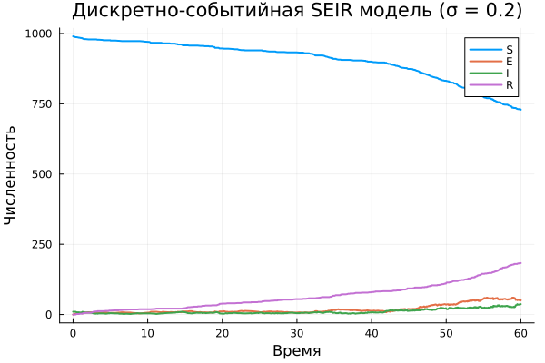{#fig-016 width=70%}

## Выводы

В этой лабораторной работе, я изучила дискретно-событийный подход к моделированию на примере классической модели распространения инфекции SIR, как реализовать стохастическую дискретно-событийную модель в Julia и как анализировать влияние параметров, сравнивать их со стохастическими и детерминированными версиями, оценивать производительность и модифицировать систему

## Список литературы{.unnumbered}

1. Кулябов Д.С. simulation-modeling-lab.pdf. 8 Реализация основных моделей в дискретно-сщбытийном подходе.
[Электронный ресурс]
